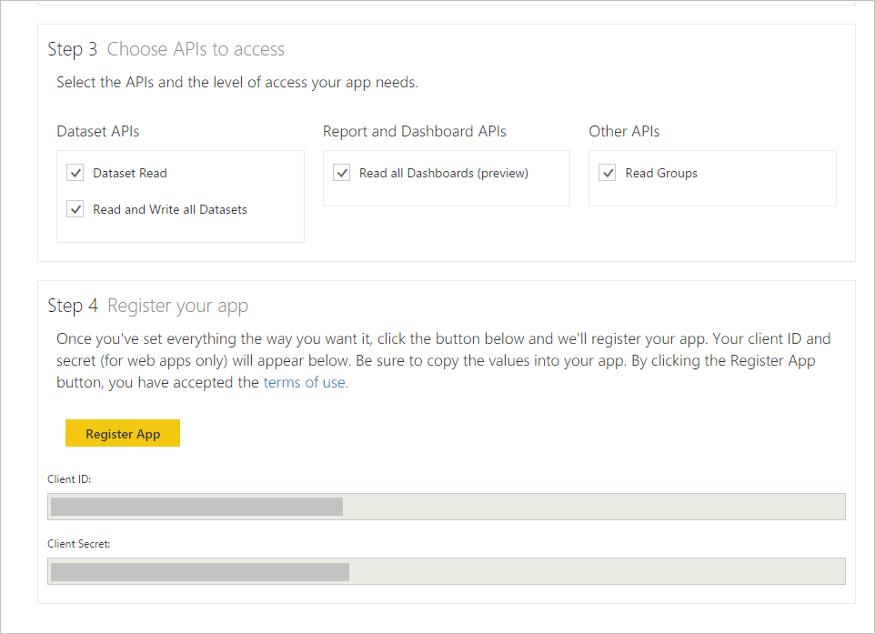

<properties
   pageTitle="註冊 web 應用程式"
   description="註冊 web 應用程式"
   services="powerbi"
   documentationCenter=""
   authors="guyinacube"
   manager="mblythe"
   backup=""
   editor=""
   tags=""
   qualityFocus="no"
   qualityDate=""/>

<tags
   ms.service="powerbi"
   ms.devlang="NA"
   ms.topic="article"
   ms.tgt_pltfrm="NA"
   ms.workload="powerbi"
   ms.date="08/23/2016"
   ms.author="asaxton"/>

# 註冊 web 應用程式

本文將說明如何在 Azure Active Directory (Azure AD) 中註冊 Power BI web 應用程式。 若要讓您的應用程式存取 Power BI REST API，您必須註冊您的應用程式 **Azure Active Directory**。 這可讓您建立您的應用程式的身分識別，並指定 Power BI REST 資源的權限。 如需 Power BI 權限，請參閱 [Power BI 權限](powerbi-developer-power-bi-permissions.md)。

            **重要** 註冊 Power BI 應用程式，您需要先 [Azure Active Directory 和組織使用者](powerbi-developer-create-an-azure-active-directory-tenant.md), ，和 [Power BI 服務帳戶](powerbi-developer-sign-up-for-power-bi-service.md)。

若要註冊您的 web 應用程式的兩種方式︰ 使用 Power BI 應用程式註冊工具或 Azure 管理入口網站上。 Power BI 應用程式註冊工具是最簡單的選項，因為有幾個欄位來填入。 如果您想要變更您的應用程式，這可以透過 Azure 管理入口網站。

## Web 應用程式向 Power BI 應用程式註冊工具
您必須註冊您的 web 應用程式中 **Azure Active Directory** 來建立您的應用程式的身分識別並指定 Power BI REST 資源的權限。 當您註冊 web 應用程式時，您會收到 **用戶端識別碼** 和 **用戶端密碼**。   **用戶端識別碼** 應用程式用於向要求權限的使用者識別自己。 用戶端密碼 **金鑰** 供 web 應用程式用來安全地識別本身以 **Power BI 服務**。

以下是如何註冊您的 web 應用程式與 **Power BI 應用程式註冊工具**:

1.  請移至 dev.powerbi.com/apps。
2.  在 **Power BI 應用程式註冊工具**, ，請依照下列四個步驟︰

            **步驟 1** -選擇 **登入** 來登入您 Azure AD 的帳戶。 您會看到您在 [歡迎使用列的名稱。

            **步驟 2** – 輸入您的應用程式的相關資訊。

  * 
            **應用程式名稱**︰ 應用程式的名稱。
  * 
            **應用程式類型**︰ 選擇 [原生應用程式。
  * 
            **重新導向 URI**: web 應用程式重新導向 uri 會提供 AAD 更多詳細資料就會進行驗證之特定應用程式。 範例 **重新導向 URI** 看起來像這樣︰ http://localhost/redirect。
  * 
            **首頁**︰ 首頁或登入您的 web 應用程式頁面。

            **步驟 3** – 選擇 Api 來存取。 如需 Power BI 的存取權限的詳細資訊，請參閱 [Power BI 權限](powerbi-developer-power-bi-permissions.md)。

            **步驟 4** -若要註冊您的應用程式，請按 **註冊應用程式**。 在 Azure AD 中註冊應用程式之後，您會得到 **用戶端識別碼** 和 **用戶端密碼** 索引鍵。 請確定您複製的用戶端識別碼和用戶端密碼金鑰。 您稍後可以取得用戶端識別碼或用戶端密碼金鑰 **Azure 管理入口網站**。 請參閱 [如何在 Azure 管理入口網站取得的用戶端識別碼](#clientID) 和 [如何取得用戶端秘密金鑰](#clientSecret)。

您現在可以使用您的用戶端識別碼和用戶端密碼，您的應用程式。 下一節說明如何註冊 web 應用程式，與 **Azure 管理入口網站**。

## 註冊使用 Azure 管理入口網站的 web 應用程式
當您註冊 web 應用程式時，您會收到 **用戶端識別碼** 和用戶端密碼 **金鑰**。  **用戶端識別碼** 應用程式用於向要求權限的使用者識別自己。 用戶端密碼 **金鑰** 供 web 應用程式用來安全地識別本身以 **Power BI 服務**。

若要了解如何驗證 web 應用程式使用 Azure AD **用戶端識別碼** 和用戶端密碼 **金鑰**, ，請參閱 [驗證 web 應用程式](powerbi-developer-authenticate-a-web-app.md)。

以下是如何註冊用戶端應用程式︰

1. 接受 [Microsoft Power BI API 條款](https://powerbi.microsoft.com/api-terms)。
2. 登入 https://manage.windowsazure.com 在 Microsoft Azure 訂閱。
3. 在左側的服務面板中，選擇 [ **ACTIVE DIRECTORY**。
4. 按一下任何一個 active directory。

    

5. 按一下 [ **應用程式**。

    

6. 按一下 [ **新增**。

    

7.  在 **告訴我們您的應用程式**, ，輸入 **名稱**, ，然後選擇 [ **WEB 應用程式和/或 WEB API** 類型，然後按一下 [ **下一步** 圖示。

    

8. 在 **應用程式屬性**, ，輸入 **登入 URL** 和 **應用程式識別碼 URI**。  **登入 URL** 是 web 應用程式 url，例如 https://localhost:44307。  **應用程式識別碼 URI** 您的 Azure 租用戶 URI 後面應用程式名稱。 例如 https://yourtenant.onmicrosoft.com/YourWebApp。

    

9.  按一下 [ **完成** 圖示。
10. 在 [應用程式] 頁面中，選擇 [ **設定**。  **設定** 頁面具有 **用戶端識別碼** 和 **金鑰** 應用程式。

    

11. Web 應用程式，您需要用戶端密碼 **金鑰**。 在 **金鑰** 區段中，選取持續時間。 之後會顯示金鑰 **儲存** 它。 請確定您複製的機碼。否則，金鑰將無法使用日後巡覽至 [組態] 頁面時。

12. 在 **組態** 頁面上，按一下 **新增應用程式**。
13. 在 **其他應用程式的權限**, ，選擇 [ **Power BI 服務**。

    

    
            **重要** 如果看不到 **Power BI 服務** 中 **其他應用程式的權限** ] 清單中，您需要註冊 [Power BI 服務](https://www.powerbi.com/)。 若要註冊 Power BI 服務，您必須至少一個組織的使用者 Azure Active Directory (AAD) 租用戶中。 如果您沒有 Azure Active Directory (AAD) 租用戶，請參閱 [建立 Azure Active Directory 租用戶](powerbi-developer-create-an-azure-active-directory-tenant.md) Azure AD 租用戶中建立 Azure AD 租用戶和組織使用者。

14. 按一下 [ **完成** 位於頁面右下角的圖示。
15. 在 **其他應用程式的權限** 群組、 下拉式清單中  

            **委派權限**, ，然後選擇您的應用程式可以呼叫哪些作業。 如需 Power BI 權限的詳細資訊，請參閱 [Power BI 權限](powerbi-developer-power-bi-permissions.md)。

    

16. 按一下 **[儲存]**。

    
                ** 重要 ** web 應用程式，您需要用戶端密碼 **金鑰**。 用戶端密碼 **金鑰** 顯示之後 **儲存** 它。 請確定您複製的機碼。否則，金鑰將無法使用日後巡覽至 [組態] 頁面時。

## 如何取得用戶端應用程式識別碼
當您註冊 web 應用程式時，您會收到 **用戶端識別碼**。   **用戶端識別碼** 應用程式用於向要求權限的使用者識別自己。

以下是如何取得用戶端應用程式識別碼︰

1. 登入 https://manage.windowsazure.com 在 Microsoft Azure 訂閱。
2. 在左側的服務面板中，選擇 [ **ACTIVE DIRECTORY**。
3. 選擇任何一個 active directory。
4. 按一下 [ **應用程式**。
5. 選擇一個應用程式。
6. 在 [應用程式] 頁面中，選擇 [ **設定**。
7. 在 **設定** 頁面中，複製 **用戶端識別碼**。

    

## 如何取得用戶端密碼

Web 應用程式，您需要用戶端密碼 **金鑰**。 當您註冊 web 應用程式時，Azure AD 會產生金鑰 （請參閱上方步驟 11）。 在 **金鑰** 區段中，選取持續時間。 儲存之後，會顯示金鑰。 請確定您複製的機碼。否則，金鑰將無法使用日後巡覽至 [組態] 頁面時。

## 請參閱

[Power BI 權限](powerbi-developer-power-bi-permissions.md)  
[Azure Active Directory 租用戶和組織使用者](powerbi-developer-create-an-azure-active-directory-tenant.md)  
[Power BI 服務帳戶](powerbi-developer-sign-up-for-power-bi-service.md)  
[驗證 web 應用程式](powerbi-developer-authenticate-a-web-app.md)  
[Power BI REST API 概觀](powerbi-developer-overview-of-power-bi-rest-api.md)  
更多的問題嗎？ [試用 Power BI 社群](http://community.powerbi.com/)