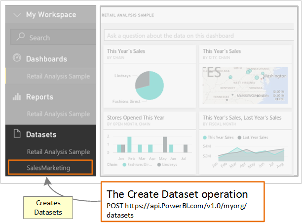

<properties
   pageTitle="建立資料集"
   description="逐步解說-將資料發送到儀表板-Power BI 儀表板中建立資料集"
   services="powerbi"
   documentationCenter=""
   authors="guyinacube"
   manager="mblythe"
   backup=""
   editor=""
   tags=""
   qualityFocus="monitoring"
   qualityDate="04/15/2016"/>

<tags
   ms.service="powerbi"
   ms.devlang="NA"
   ms.topic="get-started-article"
   ms.tgt_pltfrm="NA"
   ms.workload="powerbi"
   ms.date="08/23/2016"
   ms.author="asaxton"/>

# 步驟 3︰ 建立 Power BI 儀表板中的資料集

逐步解說的這篇文章屬於 [資料推送至儀表板](powerbi-developer-walkthrough-push-data.md)。

在 **步驟 2** 的推播資料到儀表板， [取得驗證存取權杖](powerbi-developer-walkthrough-push-data-get-token.md), ，你的權杖來向 **Azure AD**。 在此步驟中，您可以使用語彙基元呼叫 [建立資料集](https://msdn.microsoft.com/library/mt203562.aspx) 作業。

若要讓其他資源的呼叫，您使用的 url，找出資源，以及 JavaScript 物件標記法 (JSON) 字串，其中描述資料集，傳送到 Power BI 服務資源。 REST 資源會識別您想要使用的 Power BI 服務的一部分。 資料推送至儀表板，目標資源是 **儀表板資料集**。 識別資料集的 URL 是 https://api.PowerBI.com/v1.0/myorg/datasets。 如果您要推入群組中的資料，則 url 會是 https://api.PowerBI.com/v1.0/myorg/groups/ {group_id} / 資料集。

若要驗證 Power BI REST 作業，您新增從中取得的權杖 [取得驗證存取權杖](powerbi-developer-walkthrough-push-data-get-token.md) 要求標頭︰

當您呼叫 [建立資料集](https://msdn.microsoft.com/library/mt203562.aspx) 作業，儀表板中建立新的資料集。



以下是如何建立 Power BI 儀表板中的資料集。

## 建立 Power BI 儀表板中的資料集

>
            **請注意**︰ 開始使用之前，請確定您已經依照先前的步驟中 [資料推送至儀表板](powerbi-developer-walkthrough-push-data.md) 逐步解說。

1. 在主控台應用程式專案中建立 [步驟 2-取得驗證的存取權杖](powerbi-developer-walkthrough-push-data-get-token.md), ，加入 **using System.Net;**, ，和 **using System.IO;** program.cs。
2. 在 Program.cs 中，加入下列程式碼。
3. 執行主控台應用程式，並登入您的 Power BI 帳戶。 您應該會看到 **建立資料集** 主控台視窗中。 此外，您可以登入您的儀表板，以查看新的資料集。

**範例資料發送到儀表板**

將此程式碼加入至 Program.cs。

- 在靜態 void Main (string [] args):

    ```
    static void Main(string[] args)
    {
        //Get an authentication access token
        token = GetToken();

        //Create a dataset in a Power BI dashboard
        CreateDataset();
    }
    ```

- 新增 CreateDataset() 方法︰

    ```
    #region Create a dataset in a Power BI dashboard
    private static void CreateDataset()
    {
        //TODO: Add using System.Net and using System.IO

        //Push data into a Power BI dashboard

        string powerBIDatasetsApiUrl = "https://api.powerbi.com/v1.0/myorg/datasets";
        //POST web request to create a dataset.
        //To create a Dataset in a group, use the Groups uri: https://api.PowerBI.com/v1.0/myorg/groups/{group_id}/datasets
        HttpWebRequest request = System.Net.WebRequest.Create(powerBIDatasetsApiUrl) as System.Net.HttpWebRequest;
        request.KeepAlive = true;
        request.Method = "POST";
        request.ContentLength = 0;
        request.ContentType = "application/json";

        //Add token to the request header
        request.Headers.Add("Authorization", String.Format("Bearer {0}", token));

        //Create dataset JSON for POST request
        string datasetJson = "{\"name\": \"SalesMarketing\", \"tables\": " +
            "[{\"name\": \"Product\", \"columns\": " +
            "[{ \"name\": \"ProductID\", \"dataType\": \"Int64\"}, " +
            "{ \"name\": \"Name\", \"dataType\": \"string\"}, " +
            "{ \"name\": \"Category\", \"dataType\": \"string\"}," +
            "{ \"name\": \"IsCompete\", \"dataType\": \"bool\"}," +
            "{ \"name\": \"ManufacturedOn\", \"dataType\": \"DateTime\"}" +
            "]}]}";

        //POST web request
        byte[] byteArray = System.Text.Encoding.UTF8.GetBytes(datasetJson);
        request.ContentLength = byteArray.Length;

        //Write JSON byte[] into a Stream
        using (Stream writer = request.GetRequestStream())
        {
            writer.Write(byteArray, 0, byteArray.Length);

            var response = (HttpWebResponse)request.GetResponse();

            Console.WriteLine(string.Format("Dataset {0}", response.StatusCode.ToString()));

            Console.ReadLine();
        }
    }
    #endregion
    ```

下一個步驟顯示如何以 [取得資料集，以便將資料列加入至 Power BI 資料表](powerbi-developer-walkthrough-push-data-get-datasets.md)。

以下是 [完整程式碼清單](#code)。

[下一步 >](powerbi-developer-walkthrough-push-data-get-datasets.md)

## 請參閱
- [取得要加入至 Power BI 資料表的資料列的資料集](powerbi-developer-walkthrough-push-data-get-datasets.md)
- [取得驗證存取權杖](powerbi-developer-walkthrough-push-data-get-token.md)
- [建立資料集](https://msdn.microsoft.com/library/mt203562.aspx)
- [將資料發送到 Power BI 儀表板](powerbi-developer-walkthrough-push-data.md)
- [Power BI REST API 概觀](powerbi-developer-overview-of-power-bi-rest-api.md)
- [Power BI REST API 參考](https://msdn.microsoft.com/library/mt147898.aspx)

<a name="code"/>
## 完整程式碼清單

    using System;
    using Microsoft.IdentityModel.Clients.ActiveDirectory;
    using System.Net;
    using System.IO;

    namespace walkthrough_push_data
    {
        class Program
        {
            private static string token = string.Empty;

            static void Main(string[] args)
            {

                //Get an authentication access token
                token = GetToken();

                //Create a dataset in a Power BI dashboard
                CreateDataset();

            }

            #region Get an authentication access token
            private static string GetToken()
            {
                // TODO: Install-Package Microsoft.IdentityModel.Clients.ActiveDirectory -Version 2.21.301221612
                // and add using Microsoft.IdentityModel.Clients.ActiveDirectory

                //The client id that Azure AD created when you registered your client app.
                string clientID = "{Client_ID}";

                //RedirectUri you used when you register your app.
                //For a client app, a redirect uri gives Azure AD more details on the application that it will authenticate.
                // You can use this redirect uri for your client app
                string redirectUri = "https://login.live.com/oauth20_desktop.srf";

                //Resource Uri for Power BI API
                string resourceUri = "https://analysis.windows.net/powerbi/api";

                //OAuth2 authority Uri
                string authorityUri = "https://login.windows.net/common/oauth2/authorize";

                //Get access token:
                // To call a Power BI REST operation, create an instance of AuthenticationContext and call AcquireToken
                // AuthenticationContext is part of the Active Directory Authentication Library NuGet package
                // To install the Active Directory Authentication Library NuGet package in Visual Studio,
                //  run "Install-Package Microsoft.IdentityModel.Clients.ActiveDirectory" from the nuget Package Manager Console.

                // AcquireToken will acquire an Azure access token
                // Call AcquireToken to get an Azure token from Azure Active Directory token issuance endpoint
                AuthenticationContext authContext = new AuthenticationContext(authorityUri);
                string token = authContext.AcquireToken(resourceUri, clientID, new Uri(redirectUri)).AccessToken;

                Console.WriteLine(token);
                Console.ReadLine();

                return token;
            }

            #endregion


            #region Create a dataset in a Power BI dashboard
            private static void CreateDataset()
            {
                //TODO: Add using System.Net and using System.IO

                //Push data into a Power BI dashboard

                string powerBIDatasetsApiUrl = "https://api.powerbi.com/v1.0/myorg/datasets";
                //POST web request to create a dataset.
                //To create a Dataset in a group, use the Groups uri: https://api.PowerBI.com/v1.0/myorg/groups/{group_id}/datasets
                HttpWebRequest request = System.Net.WebRequest.Create(powerBIDatasetsApiUrl) as System.Net.HttpWebRequest;
                request.KeepAlive = true;
                request.Method = "POST";
                request.ContentLength = 0;
                request.ContentType = "application/json";

                //Add token to the request header
                request.Headers.Add("Authorization", String.Format("Bearer {0}", token));

                //Create dataset JSON for POST request
                string datasetJson = "{\"name\": \"SalesMarketing\", \"tables\": " +
                    "[{\"name\": \"Product\", \"columns\": " +
                    "[{ \"name\": \"ProductID\", \"dataType\": \"Int64\"}, " +
                    "{ \"name\": \"Name\", \"dataType\": \"string\"}, " +
                    "{ \"name\": \"Category\", \"dataType\": \"string\"}," +
                    "{ \"name\": \"IsCompete\", \"dataType\": \"bool\"}," +
                    "{ \"name\": \"ManufacturedOn\", \"dataType\": \"DateTime\"}" +
                    "]}]}";

                //POST web request
                byte[] byteArray = System.Text.Encoding.UTF8.GetBytes(datasetJson);
                request.ContentLength = byteArray.Length;

                //Write JSON byte[] into a Stream
                using (Stream writer = request.GetRequestStream())
                {
                    writer.Write(byteArray, 0, byteArray.Length);

                    var response = (HttpWebResponse)request.GetResponse();

                    Console.WriteLine(string.Format("Dataset {0}", response.StatusCode.ToString()));

                    Console.ReadLine();
                }
            }
            #endregion
        }
    }

更多的問題嗎？ [試用 Power BI 社群](http://community.powerbi.com/)