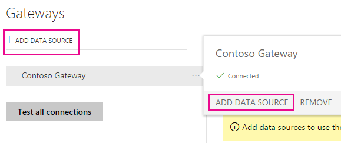
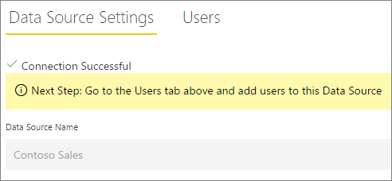
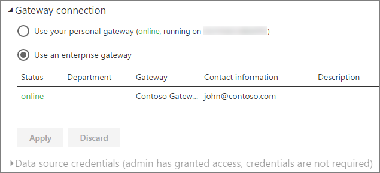

<properties
pageTitle="管理您的資料來源-匯入/排程重新整理"
description="如何管理內部部署資料閘道閘道和資料來源屬於該閘道。 本文旨在說明可用來排程匯入/重新整理資料來源。"
services="powerbi"
documentationCenter=""
authors="guyinacube"
manager="erikre"
backup=""
editor=""
tags=""
qualityFocus="monitoring"
qualityDate="05/16/2016"/>

<tags
ms.service="powerbi"
ms.devlang="NA"
ms.topic="article"
ms.tgt_pltfrm="na"
ms.workload="powerbi"
ms.date="10/01/2016"
ms.author="asaxton"/>
# 管理您的資料來源-匯入/排程重新整理

當您安裝內部部署資料閘道之後時，您必須加入可以搭配閘道使用的資料來源。 這篇文章將探討如何使用閘道器和用於排定的重新整理，相對於 DirectQuery 或即時連接的資料來源。

## 下載並安裝閘道

您可以從 Power BI 服務的閘道。 選取 **下載** > **資料閘道**, ，或移至 [閘道下載頁面](https://go.microsoft.com/fwlink/?LinkId=698861)。

## 新增閘道

若要新增閘道，只要 [下載](https://go.microsoft.com/fwlink/?LinkId=698863) 和您的環境中的伺服器上安裝 「 企業閘道 」。 安裝閘道之後，它會顯示在清單中下閘道 **管理閘道**。

> [AZURE.NOTE] 
            **管理閘道** 直到至少一個閘道的系統管理員，就不會顯示。 這種情形是藉由新增為系統管理員，或您安裝和設定閘道。

## 移除閘道

移除閘道也會刪除該閘道] 下的任何資料來源。  這也會中斷任何儀表板和依賴這些資料來源的報表。

1.  選擇齒輪圖示  右上角 > **管理閘道**。

2.  閘道 > **移除**

    

## 加入資料來源

您可以加入資料來源選取閘道器和按一下 **新增資料來源**, ，或移至閘道 > **新增資料來源**。

然後您可以選取 **資料來源類型** 從清單中。 所有列出的資料來源可用來與 「 企業閘道 」 排定的重新整理。 Analysis Services、 SQL Server 和 SAP HANA 可以用於排定的重新整理或 DirectQuery/即時連線。

然後要填滿包含來源資訊和認證來存取資料來源的資料來源的資訊。

> [AZURE.NOTE] 資料來源的所有查詢會使用這些認證來都執行。 如需詳細資訊，請參閱主要內部部署資料閘道文件，以深入了解如何 [認證](powerbi-gateway-onprem.md#credentials) 儲存。

您可以按一下 **新增** 填入的所有項目之後。  您現在可以使用此資料來源為排定的重新整理您的內部資料。 您會看到 *連線成功* 如果成功。

<!-- Shared Install steps Include -->
[AZURE.INCLUDE [gateway-onprem-datasources-include](../includes/gateway-onprem-datasources-include.md)]

### 進階設定

您可以設定您的資料來源的私密性等級。 這會控制如何 mashed 資料，設定。 這只用於排定的重新整理。 [進一步了解](https://support.office.com/article/Privacy-levels-Power-Query-CC3EDE4D-359E-4B28-BC72-9BEE7900B540)

## 移除資料來源

移除資料來源會中斷任何儀表板或仰賴特定的資料來源的報表。  

若要移除資料來源，請移至資料來源 > **移除**。

## 管理系統管理員

在系統管理員] 索引標籤的 [閘道，您可以加上移除，使用者可以管理閘道。 您只可以在此階段中新增使用者。 無法新增安全性群組。

## 管理使用者

[使用者] 索引標籤的資料來源，您可以加入，並移除使用者或安全性群組，可以使用此資料來源。

> [AZURE.NOTE] 使用者清單只可以發行報表的控制項。 報表擁有者可以建立儀表板或內容的組件，並與其他使用者所共用。

## 使用排定的重新整理資料來源

建立資料來源之後，它可使用其中一個 DirectQuery 的連線，或透過排定的重新整理。 

> [AZURE.NOTE] 伺服器和資料庫名稱必須符合 Power BI Desktop 與內部部署資料閘道器內的資料來源之間 ！

您的資料集與在閘道中的資料來源之間的連結根據您的伺服器名稱和資料庫名稱。 這些都必須相符。 比方說，如果您提供之 IP 位址的伺服器名稱，在 Power BI Desktop，您必須為資料來源的閘道設定中使用的 IP 位址。 如果您使用 *伺服器 \ 執行個體*, ，在 Power BI Desktop，您必須使用相同資料來源的閘道設定中。

如果您列出 **的使用者** ] 索引標籤設定閘道，以及伺服器和資料庫名稱比對中的資料來源，您會看到閘道使用排定的重新整理選項。

> [AZURE.WARNING] 如果您的資料集包含多個資料來源，必須在閘道中加入每個資料來源。 如果一或多個資料來源不會加入至閘道，您看不閘道為可進行排定的重新整理。

## 限制

- OAuth 是不支援的驗證配置與內部部署資料閘道。 您無法新增資料來源需要 OAuth。 如果您的資料集需要 OAuth 的資料來源，您將無法使用閘道進行排定的重新整理。

## 另請參閱

[內部資料閘道](powerbi-gateway-onprem.md)  
[內部資料閘道-深入](powerbi-gateway-onprem-indepth.md)  
[疑難排解內部部署資料閘道](powerbi-gateway-onprem-tshoot.md)  
更多的問題嗎？ [試用 Power BI 社群](http://community.powerbi.com/)