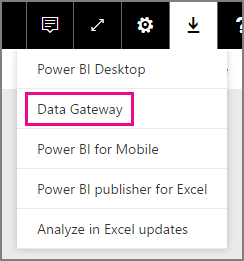
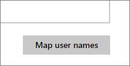
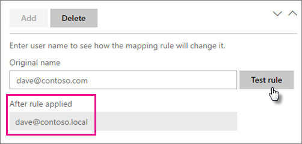

<properties
pageTitle="管理您的資料來源-Analysis Services"
description="如何管理內部部署資料閘道和資料來源屬於該閘道。 這是多維度和表格式模式的 Analysis Services。"
services="powerbi"
documentationCenter=""
authors="guyinacube"
manager="erikre"
backup=""
editor=""
tags=""
qualityFocus="monitoring"
qualityDate="06/09/2016"/>

<tags
ms.service="powerbi"
ms.devlang="NA"
ms.topic="article"
ms.tgt_pltfrm="na"
ms.workload="powerbi"
ms.date="10/12/2016"
ms.author="asaxton"/>
# 管理您的資料來源-Analysis Services

當您安裝內部部署資料閘道之後時，您必須加入可以搭配閘道使用的資料來源。 這篇文章將探討如何使用閘道器和資料來源。 排定的重新整理或即時連接，您可以使用 Analysis Services 資料來源。

<iframe width="560" height="315" src="https://www.youtube.com/embed/ownIGbcRAAU" frameborder="0" allowfullscreen></iframe>

## 下載並安裝閘道

您可以從 Power BI 服務的閘道。 選取 **下載** > **資料閘道**, ，或移至 [閘道下載頁面](https://go.microsoft.com/fwlink/?LinkId=698861)。

## Analysis Services 即時連接的限制

您可以使用即時連接對表格式或多維度執行個體。

|**伺服器版本**|**必要的 SKU**|
|---|---|
|2012 SP1 CU4 或更新版本|Business Intelligence 和 Enterprise SKU|
|2014|Business Intelligence 和 Enterprise SKU|
|2016|標準 SKU 或更高版本|

- 資料格層級的格式，並不支援轉譯功能。
- 動作和命名集不會公開至 Power BI，但您仍然可以連接到多維度 cube，其中也包含動作或命名集，並建立視覺效果和報表。

## 新增閘道

若要新增閘道，只要 [下載](https://go.microsoft.com/fwlink/?LinkId=698861) 和您的環境中的伺服器上安裝 「 企業閘道 」。 安裝閘道之後，它會顯示在清單中下閘道 **管理閘道**。

> [AZURE.NOTE] 
            **管理閘道** 直到至少一個閘道的系統管理員，就不會顯示。 這種情形是藉由新增為系統管理員，或您安裝和設定閘道。

## 移除閘道

移除閘道也會刪除該閘道] 下的任何資料來源。  這也會中斷任何儀表板和依賴這些資料來源的報表。

1.  選擇齒輪圖示  右上角 > **管理閘道**。

2.  閘道 > **移除**

    

## 加入資料來源

您可以加入資料來源選取閘道器和按一下 **新增資料來源**, ，或移至閘道 > **新增資料來源**。

然後您可以選取 **資料來源類型** 從清單中。 如果您要連接到多維度或表格式伺服器，請選取 [Analysis Services。

您接著要填入資料來源包含的資訊 **伺服器** 和 **資料庫**。  

 **Username** 和 **密碼** ，輸入將用於閘道連接到 Analysis Services 執行個體。 

> [AZURE.NOTE] 您輸入的 Windows 帳戶必須具有伺服器系統管理員權限，您要連接到執行個體。 如果設定此帳戶的密碼到期，使用者無法取得連接錯誤，如果密碼不更新資料來源。 如需詳細資訊，請參閱主要內部部署資料閘道文件，以深入了解如何 [認證](powerbi-gateway-onprem.md#credentials) 儲存。

您可以按一下 **新增** 填入的所有項目之後。  現在，您可以使用排定的重新整理此資料來源，或即時針對未在內部部署的 Analysis Services 執行個體的連接。  您會看到 *連線成功* 如果成功。

### 進階設定

您可以設定您的資料來源的私密性等級。 這會控制如何 mashed 資料，設定。 這只用於排定的重新整理。 它不適用於即時連線。 [進一步了解](https://support.office.com/article/Privacy-levels-Power-Query-CC3EDE4D-359E-4B28-BC72-9BEE7900B540)

## [取得資料] 體驗 Power BI 網站中的 Analysis Services

Analysis Services 的唯一選項是直接使用 Power BI 服務內的取得資料。 您可以連接到即時的 Analysis Services 資料來源，而不需要 Power BI Desktop 在閘道中設定。 您的帳戶必須列在 **使用者** 下閘道器，讓它顯示在清單中的資料來源] 索引標籤。 若要連接到資料來源，您可以執行下列程式碼。

1. 在 Power BI 服務中，選取 **取得資料**。

2. 選取 **資料庫**。

3. 選取 **SQL Server Analysis Services** > **連接**。

4. 從清單中選取資料來源。 此處會列出您可以存取任何 Analysis Services 資料來源。

5. 選取您想要連接到的模型。 然後選取 **連接**。

您會看到顯示的伺服器名稱的資料集。 然後，您可以選取該資料集，並開始在其上建立報表。 這會使用針對即時資料。

## Analysis services 的使用者名稱

每次使用者連線至 Analysis Services 的報表與互動的有效使用者名稱會傳遞至閘道，然後拖曳至您的內部部署 Analysis Services 伺服器。 電子郵件地址，您用來登入 Power BI，是我們會將傳遞至 Analysis Services 做為有效的使用者。 這會在連接屬性中傳遞 [EffectiveUserName](https://msdn.microsoft.com/library/dn140245.aspx#bkmk_auth)。 此電子郵件地址應該符合本機 Active Directory 網域中定義的 UPN。 UPN 是 Active Directory 帳戶的屬性。 然後該 Windows 帳戶必須已經存在於 Analysis Services 角色。 如果相符項目無法找到，在 Active Directory 中，將無法成功登入。 [進一步了解](https://msdn.microsoft.com/library/ms677605.aspx)

您也可以對應您的 Power BI 登入名稱與本機目錄 UPN。 [進一步了解](powerbi-gateway-enterprise-manage-ssas.md#map-user-names)

<iframe width="560" height="315" src="https://www.youtube.com/embed/Qb5EEjkHoLg" frameborder="0" allowfullscreen></iframe>

### 如何知道我 UPN 為何？

您可能不知道您 UPN 為何，以及您可能不是網域系統管理員。 您可以使用下列命令從您的工作站，以查明您帳戶的 UPN。

    whoami /upn

結果看起來類似電子郵件地址，但這是用來在您的網域帳戶的 UPN。 如果您使用的 Analysis Services 資料來源進行即時連線，而且如果這不符合您登入 Power BI 與電子郵件地址，您可能想要看看如何 [將使用者名稱對應](#map-user-names)。

## 將使用者名稱對應

<iframe width="560" height="315" src="https://www.youtube.com/embed/eATPS-c7YRU" frameborder="0" allowfullscreen></iframe>

Analysis Services 資料來源，您可以設定自訂的使用者主要名稱 (UPN) 規則。 如果您的 Power BI 服務登入名稱不符合您的本機目錄 UPN，這將協助您。 例如，如果您登入 Power BI 與 john@contoso.com，但您的本機目錄 UPN john@contoso.local，您可以設定對應規則，讓 john@contoso.local 傳遞至 Analysis Services。

若要取得 UPN 的對應畫面，請執行下列項目。

1. 移至 **齒輪圖示** ，然後選取 **管理閘道**。

2. 展開包含 Analysis Services 資料來源的閘道。 如果您尚未建立 Analysis Services 資料來源，您可以做的此時。

3. 選取資料來源，然後選取 **使用者** ] 索引標籤。

4. 選取 **將使用者名稱對應**。

    
    
然後，您會看到加入規則，以及針對指定的使用者測試的選項。

> [AZURE.NOTE] 貴用戶 inadvertantly 變更您不想要的使用者。 比方說，如果您 **（原始值） 來取代** 是 *@contoso.com* 和 **（新的名稱） 與** 是 *@contoso.local*, ，包含所有使用者的登入， *@contoso.com* 會再被取代 *@contoso.local*。 此外，如果您 **（原始名稱） 取代** 是 *dave@contoso.com* 和 **（新的名稱） 與** 是 *dave@contoso.local*, ，v-dave@contoso.com 登入的使用者會被傳送為 v dave*@contoso.local*。

目前僅提供規則 **有效的使用者名稱**。

### 使用對應規則

若要建立對應規則，請輸入一個值 **原始名稱** 和 **新名稱** ]，然後選取 **新增**。

|欄位|描述
|---|---|
|取代 （原來的名稱）|您登入 Power BI 與電子郵件地址。|
|（新的名稱）|您想要將它取代為的值。 取代的結果就是將傳遞至 *EffectiveUserName* Analysis Services 連接的屬性。|

當您在清單中選取項目時，您可以選擇重新使用排序 **> 形箭號圖示**, ，或 **刪除** 項目。

### 使用 Wildcard(*)

您可以使用萬用字元，代表您 **（原始名稱） 取代** 字串。 它僅適用於本身並不會與任何其他字串部分。 這可讓您採取所有使用者，並將單一值傳遞給資料來源。 當您希望所有使用者在您的組織您的本機環境中使用相同的使用者，這非常有用。

### 測試對應規則

您可以驗證功能的原始名稱將會取代輸入的值 **原始名稱** ，然後選取 **測試規則**。

> [AZURE.NOTE] 儲存規則都有幾分鐘的時間才能開始使用這些服務。 在瀏覽器中的規則會立即生效。

### 對應規則限制

- 對應是正在設定之特定資料來源。 它不是全域設定。 如果您有多個 Analysis Services 資料來源，您必須針對每個資料來源的使用者對應。

## 移除資料來源

移除資料來源會中斷任何儀表板或仰賴特定的資料來源的報表。  

若要移除資料來源，請移至資料來源 > **移除**。

## 管理系統管理員

在系統管理員] 索引標籤的 [閘道，您可以加上移除，使用者可以管理閘道。 您只可以在此階段中新增使用者。 無法新增安全性群組。

## 管理使用者

[使用者] 索引標籤的資料來源，您可以加入，並移除使用者或安全性群組，可以使用此資料來源。

> [AZURE.NOTE] 使用者清單只可以發行報表的控制項。 報表擁有者可以建立儀表板或內容的組件，並與其他使用者所共用。

## 使用資料來源

建立資料來源之後，它可使用其中一個即時的連線，或透過排定的重新整理。 

> [AZURE.NOTE] 伺服器和資料庫名稱必須符合 Power BI Desktop 與內部部署資料閘道器內的資料來源之間 ！

您的資料集與在閘道中的資料來源之間的連結根據您的伺服器名稱和資料庫名稱。 這些都必須相符。 比方說，如果您提供之 IP 位址的伺服器名稱，在 Power BI Desktop，您必須為資料來源的閘道設定中使用的 IP 位址。 如果您使用 *伺服器 \ 執行個體*, ，在 Power BI Desktop，您必須使用相同資料來源的閘道設定中。

這是即時連接和排定的重新整理的狀況。

### 使用即時連接的資料來源

您必須確定伺服器和資料庫名稱相符項目 Power BI Desktop 與設定的資料來源之間的閘道。 您也要確定您的使用者列在 **使用者** 為了發佈即時連接的資料集的資料來源] 索引標籤。 當您第一次匯入資料選取範圍，如即時連接，就會發生在 Power BI Desktop。

發行之後，從 Power BI Desktop 或 **取得資料**, ，您的報表應該開始工作。 可能需要幾分鐘的時間之後建立的閘道，可連接內的資料來源。

### 使用排定的重新整理資料來源

如果您列出 **使用者** ] 索引標籤設定閘道，以及伺服器和資料庫名稱比對中的資料來源，您會看到閘道使用排定的重新整理選項。

## 另請參閱

[內部資料閘道](powerbi-gateway-onprem.md)  
[內部資料閘道-深入](powerbi-gateway-onprem-indepth.md)  
[疑難排解內部部署資料閘道](powerbi-gateway-onprem-tshoot.md)  
更多的問題嗎？ [試用 Power BI 社群](http://community.powerbi.com/)