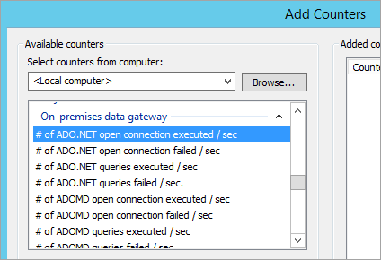

<properties
pageTitle="疑難排解內部部署資料閘道"
description="本文章提供方法讓您對內部部署資料閘道所遇到的問題進行疑難排解。 它提供可能的因應措施的已知的問題，以及工具，可協助您。"
services="powerbi"
documentationCenter=""
authors="guyinacube"
manager="erikre"
backup=""
editor=""
tags=""
qualityFocus="no"
qualityDate=""/>

<tags
ms.service="powerbi"
ms.devlang="NA"
ms.topic="article"
ms.tgt_pltfrm="na"
ms.workload="powerbi"
ms.date="09/21/2016"
ms.author="asaxton"/>
# 疑難排解內部部署資料閘道

以下會透過使用內部部署資料閘道器時，可能會遇到一些常見的問題。 

<!-- Shared Community & support links Include -->
[AZURE.INCLUDE [gateway-onprem-tshoot-support-links-include](../includes/gateway-onprem-tshoot-support-links-include.md)]

<!-- Shared Troubleshooting Install Include -->
[AZURE.INCLUDE [gateway-onprem-tshoot-install-include](../includes/gateway-onprem-tshoot-install-include.md)]

## 設定

### 如何重新啟動閘道

閘道執行 Windows 服務，因此您可以啟動及停止以多種方式。 例如，您可以以提高的權限，閘道正在執行，並接著執行其中一個命令在電腦上開啟命令提示字元︰

- 若要停止服務，執行這個命令︰

    '' net 停止 PBIEgwService ' '
    
- 若要啟動服務，執行此命令︰

    '' 網路啟動 PBIEgwService ' '

### 錯誤︰ 無法建立閘道。 請再試一次。

所有詳細資料可使用，但 Power BI 服務的呼叫傳回錯誤。 錯誤和活動識別碼，將會顯示。 會發生此問題的原因也不同。 您可以收集和檢閱記錄檔，如以取得更多詳細資料，如下所述。 

這也可能是由於 proxy 組態問題。 使用者介面現在允許進行 proxy 組態。 您可以進一步了解進行 [proxy 組態變更](powerbi-gateway-proxy.md)

### 錯誤︰ 無法更新閘道器詳細資料。  請再試一次。

從 Power BI 服務，已接收資訊至閘道。 資訊傳遞到本機的 windows 服務，但它無法傳回。 或者，對稱金鑰的產生失敗。 內部例外狀況將會顯示在 **顯示詳細資料**。 您可以收集和檢閱記錄檔，如以取得更多詳細資料，如下所述。 

### 錯誤︰ Power BI 服務報告無法存取本機閘道器。 請重新啟動閘道，然後再試一次。

在設定結束時，Power BI 服務則會再次呼叫驗證閘道。 Power BI 服務不會報告為閘道 *live*。 重新啟動 windows 服務，可能會允許的通訊，才會成功。 您可以收集和檢閱記錄檔，如以取得更多詳細資料，如下所述。 

### 在登入 Power BI 的指令碼錯誤

登入 Power BI 企業閘道器組態的一部分時，您可能會收到指令碼錯誤。 安裝下列的安全性更新來解決問題。 這可以透過 Windows Update 安裝。

[MS16-051: Internet Explorer 的安全性更新︰ 2016 5 月 10 日 (KB 3154070)](https://support.microsoft.com/kb/3154070)

### 閘道組態失敗，發生 null 參考例外狀況

您可能會遇到類似下列的錯誤。

        Failed to update gateway details.  Please try again.
        Error updating gateway configuration.

這將包含堆疊追蹤，而且該堆疊追蹤會可能包括下列。

        Microsoft.PowerBI.DataMovement.Pipeline.Diagnostics.CouldNotUpdateGatewayConfigurationException: Error updating gateway configuration. ----> System.ArgumentNullException: Value cannot be null.
        Parameter name: serviceSection

如果您從舊版的閘道升級，我們會保留在組態檔。 可能有遺漏的區段。 當閘道器嘗試讀取它時，所以我們會取得上述 null 參考例外狀況。

若要修正此問題，請執行下列項目。

1. 解除安裝閘道。

2. 刪除下列資料夾。

        c:\Program Files\on-premises data gateway

3. 重新安裝該閘道。

4. 選擇性地套用修復金鑰，才能還原現有的閘道。

## 資料來源

### 錯誤︰ 無法連線。 詳細資料: 「 無效的連接認證 」

內 **顯示詳細資料**, ，它應該會顯示從資料來源收到的錯誤訊息。 對於 SQL Server，您應該會看到如下所示。

    Login failed for user 'username'.

請確認您擁有正確的使用者名稱和密碼。 也請確認這些憑證可成功連接到資料來源。 請確定使用的帳戶是否符合 **驗證方法**。

### 錯誤︰ 無法連線。 詳細資料: 「 無法連接到資料庫 」

我們無法連線到伺服器，但不是提供的資料庫。 確認資料庫的名稱及使用者認證以存取該資料庫的適當權限。

內 **顯示詳細資料**, ，它應該會顯示從資料來源收到的錯誤訊息。 對於 SQL Server，您應該會看到如下所示。

    Cannot open database "AdventureWorks" requested by the login. The login failed. Login failed for user 'username'.

### 錯誤︰ 無法連線。 詳細資料: 「 發生未知的錯誤企業閘道 」

不同的原因可能會發生此錯誤。 請務必驗證您可以從主控閘道的機器連接到資料來源。 這可能是無法存取伺服器的結果。

內 **顯示詳細資料**, ，您會看到的錯誤代碼為 **DM_GWPipeline_UnknownError**。

您也可以查看事件記錄檔 > **應用程式及服務記錄檔** > **Power BI 企業閘道服務** 如需詳細資訊。

### 錯誤︰ 我們發現的錯誤時嘗試連接到 <server>。 詳細資料: 「 我們達到 「 企業閘道 」，但閘道器無法存取內部部署資料來源。 」

我們無法連接到指定的資料來源。 請務必驗證該資料來源所提供的資訊。

內 **顯示詳細資料**, ，您會看到的錯誤代碼為 **DM_GWPipeline_Gateway_DataSourceAccessError**。 

如果類似下面的基礎錯誤訊息，這表示您的資料來源使用的帳戶不是 Analysis Services 執行個體的伺服器管理員。 [進一步了解](powerbi-gateway-onprem-manage-ssas.md#add-a-data-source)

    The 'CONTOSO\account' value of the 'EffectiveUserName' XML for Analysis property is not valid.

如果類似下面的基礎錯誤訊息，這可能表示 Analysis Services 的服務帳戶可能已遺失 [語彙基元群組為全域-和-萬用](https://msdn.microsoft.com/library/windows/desktop/ms680300.aspx) (TGGAU) 目錄屬性。

    The user name or password is incorrect.

具有 windows 2000 前版相容性的存取權的網域必須啟用 TGGAU 屬性。 不過，最新建立的網域將不會預設啟用此屬性。 閱讀更多有關這 [這裡](https://support.microsoft.com/kb/331951)。

您可以透過下列方式加以確認。

1. 連接到 SQL Server Management Studio 中的 Analysis Services 機器。 在 「 進階的連接屬性，包括 EffectiveUserName 有問題的使用者和看到這會重現錯誤。

2. 您可以使用 dsacls Active Directory 工具，以驗證是否在所列屬性。 這是工具通常會找到網域控制站上。 您必須了解網域的辨別的名稱是針對帳戶，並將它傳遞至工具。

        dsacls "CN=John Doe,CN=UserAccounts,DC=contoso,DC=com"
    
    您想要看到類似下列結果中。

            Allow BUILTIN\Windows Authorization Access Group
                                          SPECIAL ACCESS for tokenGroupsGlobalAndUniversal
                                          READ PROPERTY

若要修正此問題，您必須啟用 TGGAU 用於 Analysis Services windows 服務帳戶。

**另一種可能的使用者名稱或密碼不正確**

如果 Analysis Services 伺服器是在不同的網域使用者，但沒有雙向信任關係建立也會發生此錯誤。

您必須使用網域系統管理員以確認網域之間的信任關係。

**若要查看企業閘道中的資料來源 '取得資料' Analysis Services 體驗從 Power BI 服務無法**

請確定您的帳戶會列在 **使用者** 的閘道器組態內的資料來源] 索引標籤。 如果您沒有存取權的閘道，請向閘道的系統管理員並要求他們確認。 在作業僅佔 **的使用者** 清單會列在 [Analysis Services 清單的資料來源。

## 資料集

### 錯誤︰ 沒有足夠的空間，這個資料列。

如果您有單一資料列大於 4 MB 的大小，會發生這項目。 您必須判斷資料列已從資料來源，並嘗試篩選出或減少該資料列的大小。

## 報告

### 報告無法存取資料來源，因為您沒有透過企業閘道器資料來源的存取。

這種情形通常因下列其中一個項目。 

1. 資料來源資訊不符合基礎資料集的功能。 伺服器和資料庫名稱必須符合定義的內部資料閘道和您在 Power BI Desktop 所提供的資料來源之間。 如果您使用 IP 位址在 Power BI Desktop，資料來源，讓內部部署資料閘道器，就必須使用的 IP 位址。

2. 資料來源可用上沒有任何組織內的閘道。 您可以設定資料來源的全新或現有的內部資料閘道。

### 錯誤︰ 資料來源存取錯誤。 請連絡閘道管理員。

如果正在使用這份報表使用即時的 Analysis Services 連接，您可能會遇到問題以值傳遞至 EffectiveUserName，或是有效，或是在 Analysis Services 的電腦上沒有權限。 一般而言，驗證問題是因為，傳入的 EffectiveUserName 的值不符合本機使用者主要名稱 (UPN)。

若要確認這一點，您可以執行下列程式碼。

1. 尋找有效的使用者名稱內 [閘道器記錄檔](#logs)。

2. 傳遞的值之後，驗證正確。 如果您的使用者，您可以看 UPN 應該是使用下列命令，從命令提示字元。 UPN 看起來類似電子郵件地址。

        whoami /upn

（選擇性） 您可以看到 Power BI 從 Azure Active Directory 取得。

1. 瀏覽至 [https://graphexplorer.cloudapp.net](https://graphexplorer.cloudapp.net)。

2. 選取 **登入** 右上角。

3. 執行下列查詢。 您會看到相當大的 JSON 回應。

        https://graph.windows.net/me?api-version=1.5

4. 尋找 **userPrincipalName**。 


如果您的 Azure Active Directory UPN 不符合您的本機 Active Directory UPN，您可以使用 [將使用者名稱對應](powerbi-gateway-enterprise-manage-ssas.md#map-user-names) 以有效的值取代它的功能。 或者，您可以使用您的租用戶管理員或本機 Active Directory 系統管理員，以取得您變更的 UPN。

<!-- Shared Troubleshooting Firewall/Proxy Include -->
[AZURE.INCLUDE [gateway-onprem-tshoot-firewall-include](../includes/gateway-onprem-tshoot-firewall-include.md)]

您可以找到資料中心區域，您是在執行下列動作︰

1. 選取 **嗎？** 在右上角的 Power BI 服務。

2. 選取 **解 Power BI**。

3. 您的資料區域會列在 **您的資料會儲存在**。

    

如果您仍然無法取得任何地方，您可以嘗試取得網路追蹤，使用類似的工具 [fiddler](#fiddler) 或 netsh，雖然這些都進階的收集方法，而且您可能需要協助分析收集的資料。 您可以連絡 [支援](https://support.microsoft.com) 以取得協助。

## 效能

<iframe width="560" height="315" src="https://www.youtube.com/embed/IJ_DJ30VNk4?showinfo=0" frameborder="0" allowfullscreen></iframe>

### 效能計數器

有一些可用來量測計閘道活動的效能計數器。 這些可以是活動的 helfup 瞭解，如果我們有很大的負載，而且可能需要進行新的閘道。 這些計數器不會反映項目花多少時間。

這些計數器可以透過 Windows 效能監視器工具的存取。



有這些計數器的一般分組。

|計數器類型|說明|
|---|---|
|ADO.NET|這用於 DirectQuery 的任何連線。|
|ADOMD|這會使用 Analysis Services 2014 及更早版本。|
|OLEDB|這會使用特定資料來源。 這包括 SAP HANA 和分析服務 2016年或更新版本。|
|交互式|這包括任何匯入的資料來源。 如果您正在排定重新整理或執行隨重新整理時，它將會經歷整合 （mashup） 引擎。|

以下是可用的效能計數器的清單。

|計數器|說明|
|---|---|
|# 開啟 ADO.NET 連線執行數 / 秒|每秒執行 （成功或失敗） 的 ADO.NET 開啟連接動作的數目。|
|# 開啟 ADO.NET 連線失敗 / 秒|每秒失敗的 ADO.NET 的開啟連接的動作數目。|
|# ADO.NET 查詢執行 / 秒|每秒執行 （成功或失敗） 的 ADO.NET 查詢數目。|
|# ADO.NET 查詢失敗數 / 秒|每秒所執行的查詢失敗的 ADO.NET 數目。|
|# 執行 / sec ADOMD 開啟連接|每秒執行 （成功或失敗） 的 ADOMD 開啟的連接動作數目。|
|# ADOMD 開啟的連接失敗 / 秒|每秒失敗的 ADOMD 開啟連接的動作數目。|
|# ADOMD 查詢執行 / 秒|每秒執行 （成功或失敗） 的 ADOMD 查詢數目。|
|# ADOMD 查詢失敗數 / 秒|每秒所執行的查詢失敗的 ADOMD 數目。|
|# 所有開啟的連接執行數 / 秒|每秒執行 （成功或失敗） 的開啟連接動作的數目。|
|# 所有開啟的連線失敗 / 秒|每秒所執行的開啟連接的失敗的動作的數目。|
|# 所有查詢執行 / 秒|每秒執行 （成功或失敗） 的查詢數目。|
|# ADO.NET 連接集區中的項目|ADO.NET 連接集區中的項目數目。|
|# OLEDB 連接集區中的項目|OLEDB 連接集區中的項目數目。|
|# 服務匯流排集區中的項目|服務匯流排集區中的項目數目。|
|# 交互式開啟的連接執行數 / 秒|每秒執行 （成功或失敗） 的交互式開啟的連接動作數目。|
|# 交互式開啟的連接失敗 / 秒|交互式開啟的連接動作每秒失敗的數目。|
|# 交互式查詢執行 / 秒|每秒執行 （成功或失敗） 的交互式查詢數目。|
|# 整合 （mashup） 查詢失敗數 / 秒|交互式失敗的每秒所執行的查詢|
|# 多個結果集 OLEDB 查詢失敗數 / 秒|每秒所執行的多個結果集失敗的 OLEDB 查詢數目。|
|# OLEDB 的多個結果集查詢執行 / 秒|OLEDB 數目每秒執行 （成功或失敗） 的多個結果集查詢。|
|# OLEDB 開啟的連接執行數 / 秒|每秒執行 （成功或失敗） 的 OLEDB 連接開啟動作的數目。|
|# OLEDB 開啟的連接失敗 / 秒|每秒失敗的 OLEDB 開啟連接的動作數目。|
|# OLEDB 查詢執行 / 秒|OLEDB 數目每秒執行 （成功或失敗） 的多個結果集查詢。|
|# OLEDB 查詢失敗數 / 秒|每秒所執行的查詢失敗的 OLEDB 多個結果集數目。|
|# OLEDB 單一結果集的查詢執行 / 秒|每秒執行 （成功或失敗） OLEDB 單一結果集的查詢數目。|
|# 查詢失敗數 / 秒|每秒所執行的查詢失敗的數目。|
|# 單一結果集 OLEDB 查詢失敗數 / 秒|每秒所執行的查詢失敗的 OLEDB 的單一結果集數目。|

### 檢閱緩慢執行的查詢

您可能會發現透過閘道的回應很慢。 這可能是 DirectQuery 查詢，或重新整理已匯入資料集時。 您可以啟用其他記錄輸出的查詢和其時間]，以協助您了解什麼項目執行速度過慢。 當您找到長時間執行查詢時，可能需要在資料來源以微調查詢效能的其他修改。 例如，調整 SQL Server 查詢的索引。

您必須修改兩個組態檔來判斷查詢的持續時間。 

#### Microsoft.PowerBI.DataMovement.Pipeline.GatewayCore.dll.config

內 *Microsoft.PowerBI.DataMovement.Pipeline.GatewayCore.dll.config* 檔案中，變更 `EmitQueryTraces` 值從 `False` 到 `True`。 這個檔案位於，根據預設，在 *C:\Program Files\On 內部資料閘道*。 啟用 `EmitQueryTraces` 就會開始記錄傳送從閘道到資料來源的查詢。

> [AZURE.IMPORTANT] 啟用 EmitQueryTraces 無法增加記錄大小大幅根據閘道使用方式。 在您完成檢閱記錄檔，您會想要 EmitQueryTraces 設定為 False。 不建議將此設定啟用長期來看。

```
<setting name="EmitQueryTraces" serializeAs="String">
    <value>True</value>
</setting>
```

**範例查詢項目**

```
DM.EnterpriseGateway Information: 0 : 2016-09-15T16:09:27.2664967Z DM.EnterpriseGateway 4af2c279-1f91-4c33-ae5e-b3c863946c41    d1c77e9e-3858-4b21-3e62-1b6eaf28b176    MGEQ    c32f15e3-699c-4360-9e61-2cc03e8c8f4c    FF59BC20 [DM.GatewayCore] Executing query (timeout=224) "<pi>
SELECT 
TOP (1000001) [t0].[ProductCategoryName],[t0].[FiscalYear],SUM([t0].[Amount])
 AS [a0]
FROM 
(
(select [$Table].[ProductCategoryName] as [ProductCategoryName],
    [$Table].[ProductSubcategory] as [ProductSubcategory],
    [$Table].[Product] as [Product],
    [$Table].[CustomerKey] as [CustomerKey],
    [$Table].[Region] as [Region],
    [$Table].[Age] as [Age],
    [$Table].[IncomeGroup] as [IncomeGroup],
    [$Table].[CalendarYear] as [CalendarYear],
    [$Table].[FiscalYear] as [FiscalYear],
    [$Table].[Month] as [Month],
    [$Table].[OrderNumber] as [OrderNumber],
    [$Table].[LineNumber] as [LineNumber],
    [$Table].[Quantity] as [Quantity],
    [$Table].[Amount] as [Amount]
from [dbo].[V_CustomerOrders] as [$Table])
)
 AS [t0]
GROUP BY [t0].[ProductCategoryName],[t0].[FiscalYear] </pi>"
```

#### Microsoft.PowerBI.DataMovement.Pipeline.GatewayCore.dll.config

內 *Microsoft.PowerBI.DataMovement.Pipeline.Diagnostics.dll.config* 檔案中，變更 `TraceVerbosity` 值從 `4` 到 `5`。 這個檔案位於，根據預設，在 *C:\Program Files\On 內部資料閘道*。 變更此設定就會開始記錄閘道器記錄檔的詳細資訊的項目。 這包括顯示持續期間的項目。

> [AZURE.IMPORTANT] 啟用 TraceVerbosity 5 會增加記錄大小大幅根據閘道使用方式。 在您完成檢閱記錄檔，您會想要設定 EmitQueryTraces `4`。 不建議將此設定啟用長期來看。

```
<setting name="TracingVerbosity" serializeAs="String">
    <value>5</value>
</setting>
```

<a name="activities"></a>
#### 活動類型

|Activty 類型|描述|
|---|---|
|MGEQ|透過 ADO.NET 所執行的查詢。 這包括 DirectQuery 資料來源。|
|MGEO|透過 OLEDB 所執行的查詢。 這包括 SAB HANA 和 Analysis Services 2016。|
|MGEM|從整合 （mashup） 引擎所執行的查詢。 這用於使用排定的重新整理或重新整理視匯入資料集。|

#### 判斷查詢的持續時間

若要判斷查詢資料來源所花費的時間，您可以執行下列程式碼。

1. 開啟閘道器記錄檔。

2. 搜尋 [活動型別](#activities) 來尋找查詢。 這個範例是 MGEQ。

3. 請記下的第二個 GUID，因為這是要求識別碼。 

4. 繼續搜尋 MGEQ，直到您找到的持續時間的 FireActivityCompletedSuccessfullyEvent 項目。 您可以確認項目有相同的要求識別碼。 持續時間會以毫秒為單位。

        DM.EnterpriseGateway Verbose: 0 : 2016-09-26T23:08:56.7940067Z DM.EnterpriseGateway baf40f21-2eb4-4af1-9c59-0950ef11ec4a    5f99f566-106d-c8ac-c864-c0808c41a606    MGEQ    21f96cc4-7496-bfdd-748c-b4915cb4b70c    B8DFCF12 [DM.Pipeline.Common.TracingTelemetryService] Event: FireActivityCompletedSuccessfullyEvent (duration=5004)
    
    > [AZURE.NOTE] FireActivityCompletedSuccessfullyEvent 是冗長的項目。 除非 TraceVerbosity 位於層級 5，將不會記錄此項目。

<!-- Shared Troubleshooting tools Include -->
[AZURE.INCLUDE [gateway-onprem-tshoot-tools-include](../includes/gateway-onprem-tshoot-tools-include.md)]

### 重新整理記錄

當排定的重新整理使用閘道 **重新整理記錄** 可以協助您了解哪些發生錯誤，以及提供有用的資料，如果您需要建立支援要求。 您可以檢視同時排程，以及在需要時重新整理。 以下是如何可以獲得 **重新整理記錄**。

1. 在 Power BI 瀏覽窗格中，在 **資料集**, ，選取的資料集 &gt; 開啟的功能表 &gt; **排程重新整理**。

    

2. 在 **設定...**&gt; **排程重新整理**, ，請選取 **重新整理記錄**。

    

    

## 請參閱

[Power BI 閘道設定 proxy 設定](powerbi-gateway-proxy.md)  
[內部資料閘道](powerbi-gateway-onprem.md)  
[內部資料閘道-深入](powerbi-gateway-onprem-indepth.md)  
[管理您的資料來源-Analysis Services](powerbi-gateway-enterprise-manage-ssas.md)  
[管理您的資料來源的 SAP HANA](powerbi-gateway-enterprise-manage-sap.md)  
[管理您的資料來源-SQL Server](powerbi-gateway-enterprise-manage-sql.md)  
[管理您的資料來源-匯入/排定的重新整理](powerbi-gateway-enterprise-manage-scheduled-refresh.md)  
更多的問題嗎？ [試用 Power BI 社群](http://community.powerbi.com/)