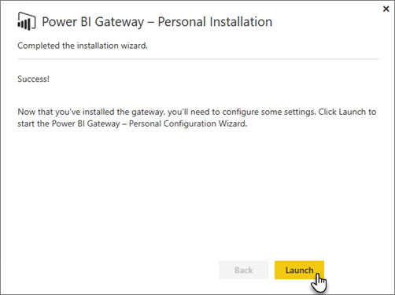

<properties
pageTitle="內部資料閘道"
description="這是內部部署資料閘道，Power bi 的概觀。 您可以使用此閘道使用 DirectQuery 資料來源。 您也可以使用此閘道以重新整理雲端與內部部署資料的資料集。"
services="powerbi"
documentationCenter=""
authors="guyinacube"
manager="mblythe"
backup=""
editor=""
tags=""
qualityFocus="no"
qualityDate=""/>

<tags
ms.service="powerbi"
ms.devlang="NA"
ms.topic="article"
ms.tgt_pltfrm="na"
ms.workload="powerbi"
ms.date="10/12/2016"
ms.author="asaxton"/>
# 內部資料閘道

內部資料閘道做為提供快速且安全的資料傳輸，內部部署資料 （不是在雲端中的資料） 和 Power BI、 Microsoft 流程、 邏輯應用程式及 PowerApps 服務之間的橋接器。

在此同時，您可以使用不同的服務使用單一閘道。 如果您使用 Power BI，因為 PowerApps，單一閘道，並用於兩者。 它是取決於您登入時使用的帳戶。

<!-- Shared Requirements Include -->
[AZURE.INCLUDE [gateway-onprem-requirements-include](../includes/gateway-onprem-requirements-include.md)]

### Analysis Services 即時連接的限制

您可以使用即時連接對表格式或多維度執行個體。

|**伺服器版本**|**必要的 SKU**|
|---|---|
|2012 SP1 CU4 或更新版本|Business Intelligence 和 Enterprise SKU|
|2014|Business Intelligence 和 Enterprise SKU|
|2016|標準 SKU 或更高版本|

- 資料格層級的格式，並不支援轉譯功能。
- 動作和命名集不會公開至 Power BI，但您仍然可以連接到多維度 cube，其中也包含動作或命名集，並建立視覺效果和報表。

<!-- Shared Install steps Include -->
[AZURE.INCLUDE [gateway-onprem-datasources-include](../includes/gateway-onprem-datasources-include.md)]
 
## 下載並安裝內部部署資料閘道

若要下載的閘道，請選取 **資料閘道** 下載項目] 功能表底下。 下載 [內部資料閘道](http://go.microsoft.com/fwlink/?LinkID=820925)。

<!-- Shared Install steps Include -->
[AZURE.INCLUDE [gateway-onprem-install-include](../includes/gateway-onprem-install-include.md)]

## 將閘道安裝在個人的模式 

> [AZURE.NOTE] 個人只適用於 Power BI。

個人閘道安裝之後，您必須啟動 **Power BI 閘道個人組態精靈**。

然後您必須登入 Power BI 註冊閘道與雲端服務。

您也必須提供 windows 使用者名稱和密碼來做為執行 windows 服務。 您可以指定不同的 Windows 帳戶，從您自己。 閘道服務將使用此帳戶來執行。

安裝完成後，您必須移至您在 Power BI 中的資料集，請確定您的內部部署資料來源為輸入的認證。

<a name="credentials">
## 在雲端中儲存加密的認證

當您新增資料來源的閘道時，您必須提供該資料來源的認證。 資料來源的所有查詢會使用這些認證來都執行。 認證會加密安全地儲存，使用非對稱式加密，如此一來，就無法解密在雲端中，再將它們儲存在雲端中。 認證傳送至執行內部就會解密的資料來源存取時為閘道的機器。

<!-- Account and Port information -->
[AZURE.INCLUDE [gateway-onprem-accounts-ports-more](../includes/gateway-onprem-accounts-ports-more.md)]

<!-- How the gateway works -->
[AZURE.INCLUDE [gateway-onprem-how-it-works-include](../includes/gateway-onprem-how-it-works-include.md)]

## 疑難排解

如果您無法安裝和設定閘道時，請務必參閱 [疑難排解 Power BI 閘道-企業](powerbi-gateway-enterprise-tshoot.md)。 如果您認為您的防火牆所遇到問題，請參閱 [防火牆或 proxy](powerbi-gateway-enterprise-tshoot.md#firewall-or-proxy) 疑難排解文件中的一節。

如果您認為您遇到 proxy 問題，閘道器，請參閱 [Power BI 閘道的 proxy 設定](powerbi-gateway-proxy.md)。

## 請參閱

[管理您的資料來源-Analysis Services](powerbi-gateway-enterprise-manage-ssas.md)  
[管理您的資料來源的 SAP HANA](powerbi-gateway-enterprise-manage-sap.md)  
[管理您的資料來源-SQL Server](powerbi-gateway-enterprise-manage-sql.md)  
[管理您的資料來源-Oracle](powerbi-gateway-onprem-manage-oracle.md)  
[管理您的資料來源-匯入/排定的重新整理](powerbi-gateway-enterprise-manage-scheduled-refresh.md)  
[深入的內部資料閘道](powerbi-gateway-onprem-indepth.md)  
[疑難排解內部部署資料閘道](powerbi-gateway-onprem-tshoot.md)  
[設定內部部署資料閘道器的 proxy 設定](powerbi-gateway-proxy.md)  
更多的問題嗎？ [試用 Power BI 社群](http://community.powerbi.com/)
