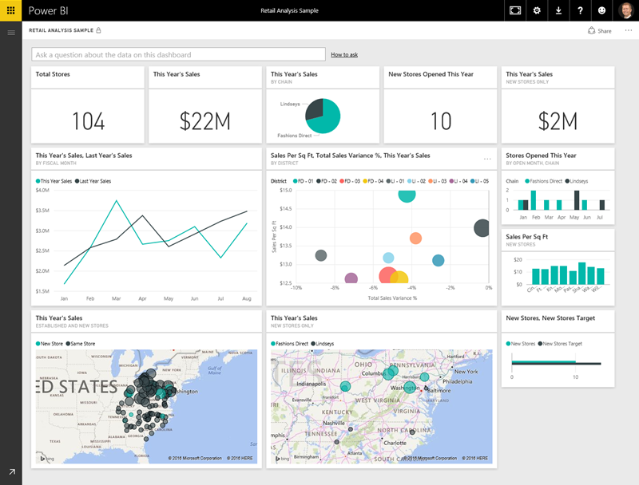
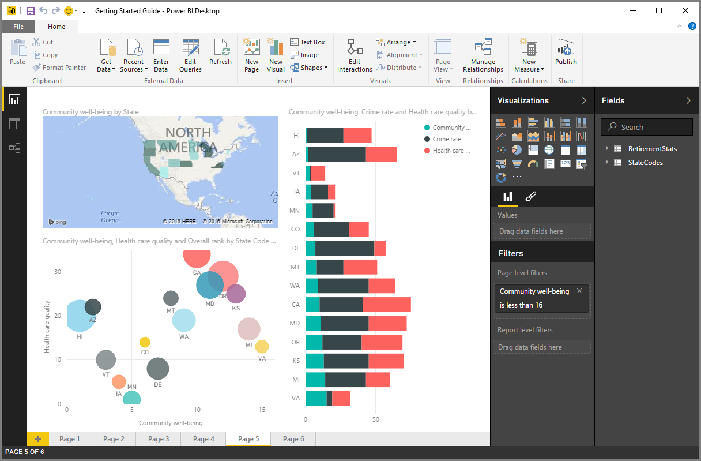
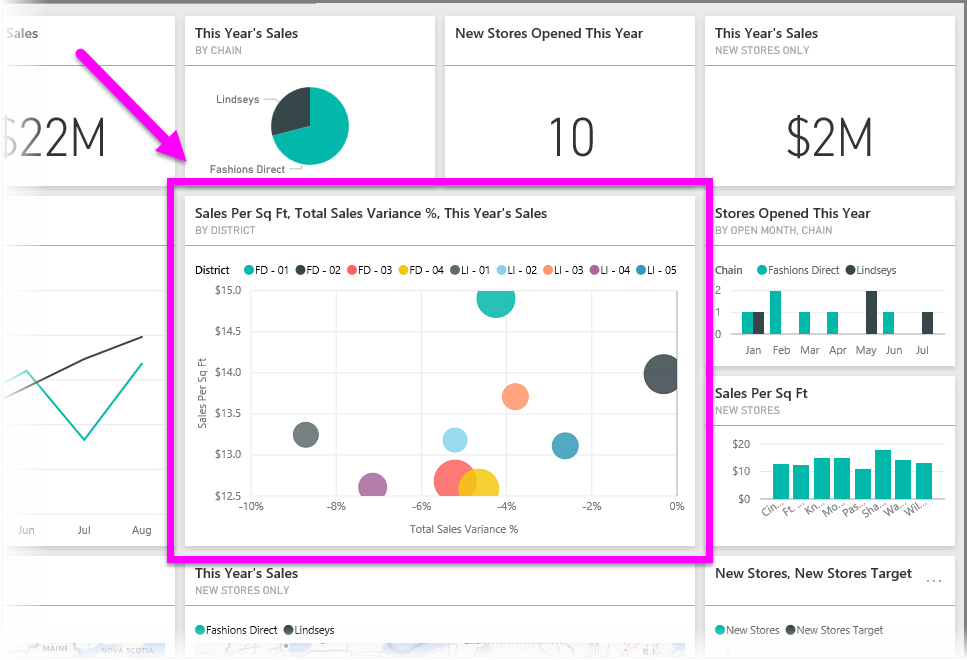

<properties
   pageTitle="Power BI 的建置組塊"
   description="請參閱建置組塊，Power BI 和它們之間的關係"
   services="powerbi"
   documentationCenter=""
   authors="davidiseminger"
   manager="mblythe"
   backup=""
   editor=""
   tags=""
   qualityFocus="no"
   qualityDate=""
   featuredVideoId=""
   courseDuration="6m"/>

<tags
   ms.service="powerbi"
   ms.devlang="NA"
   ms.topic="get-started-article"
   ms.tgt_pltfrm="NA"
   ms.workload="powerbi"
   ms.date="09/29/2016"
   ms.author="davidi"/>

# Power BI 的建置組塊
在 Power BI 中的所有項目可以分成幾個基本 **建置組塊**。 一旦您了解這些建置組塊，您可以展開每一項，並開始建立複雜且複雜的報表。 畢竟，即使看似複雜的項目所建置的基本建置組塊 – 建築物用來建立木材、 鋼鐵、 實體和半透明效果。 汽車都會從裸機、 網狀架構，以及拖放。 當然，建築物和汽車可以是基本或複雜 – 根據這些基本的建置組塊的排列方式。

讓我們看看這些基本的建置組塊，討論一些簡單的方法，可在建立它們，然後提供一窺到複雜的東西可以一併建立。

基本的建置組塊，在 Power BI 中如下所示︰

-   視覺效果
-   資料集
-   報告
-   儀表板
-   並排顯示

## 視覺效果

A **視覺化** (有時也稱為 **visual**) 是資料，例如圖表、 圖形、 色彩編碼的對應或其他有趣的事情，您可以建立以視覺方式表示資料的視覺表示法。 Power BI 提供各種不同的視覺效果類型，以及其他即將所有時間。 下圖顯示不同的視覺效果中的 Power BI 服務所建立的集合。

視覺效果可以很簡單 – 像是單一數字，代表發生重大 – 或可以是以視覺化方式複雜 – 例如漸層色彩圖可顯示投票者朝某個社會問題或考量的情感。 視覺效果的目標是提供內容和見解，這可能會難以分辨原始資料表中的數字或文字的方式顯示資料。

## 資料集

A **資料集** 是用來建立其視覺效果的 Power BI 資料的集合。

您可以從 Excel 活頁簿，類似下圖中顯示的內容的單一資料表為基礎的簡單資料集。

            **資料集** 也可以是許多不同的來源，您可以篩選和結合起來可提供用於 Power BI 中的唯一集合資料 （資料集） 的組合。

例如，您可以從三個不同的資料庫欄位，一個網站資料表、 Excel 資料表，而線上電子郵件行銷活動的結果來建立資料集。 唯一的組合仍會被視為單一 **資料集**, ，即使它一起提取從許多不同的來源。

篩選的資料之前帶入 Power BI 可讓您專注於您關切的資料。 比方說，您也可以讓來自行銷活動電子郵件的唯一客戶所包含的資料集篩選您連絡人的資料庫。 然後您可以建立根據該子集 （已篩選集合） 的客戶在活動中所包含的視覺效果。 篩選可協助您專注您的資料，以及您的努力。

Power BI 重要再啟用部分是資料的 **連接器** 會包含在內。 不論您想要的資料是在 Excel 或 SQL 資料庫，在 Azure 或 Oracle，或在服務中，如 Facebook、 Salesforce 或 MailChimp，Power BI 連接器可讓您輕鬆地連接到該資料的內建資料，請篩選，如有必要，及帶入您的資料集。

資料集之後，您可以開始建立視覺效果顯示不同部分，該資料集，以不同的方式，以及該做什麼的看，深入了解。 這是報表的地方。

## 報告

在 Power BI 中 **報表** 是一起出現在一或多個頁面的視覺效果的集合。 就像您的業務簡報，可能會建立任何其他報表或報表，您可以撰寫學校指派，在 Power BI 中的 **報表** 是彼此相關的項目集合。 下圖顯示 **報表** 在 Power BI Desktop – 在此情況下，它是六頁報表中的第五個頁面。 您也可以在 Power BI 服務中建立報表。

報表可讓您建立多個不同頁面，必要時，許多視覺效果，並可讓您將它們排列成最佳的方式會告訴您的故事。

您可能會有每季銷售量，相關產品成長特定區段中，報表的相關報表，或您可能建立的極座標圖床移轉模式的詳細報表。 無論您主題可能是，報表可讓您收集和組織到一個 （或多個） 網頁上的視覺效果。

## 儀表板

當您準備好要共用單一報表中，從頁面上，或共用的視覺效果集合，您需要建立 **儀表板**。 就像是一輛車，Power BI 的儀表板 **儀表板** 是分享給其他人的單一頁面從視覺物件的集合。 通常，它是所選的群組，提供快速深入了解資料或本文要呈現的視覺效果。

儀表板必須容納在單一頁面上，通常稱為的 canvas （畫布是空白的背景在 Power BI Desktop 或服務，您用來放置視覺效果）。 把它像畫布，演出者或複製] 會使用 – 其中建立、 結合及重做有趣和視覺效果令人讚嘆的工作區。
您可以與其他使用者或群組，接著與其互動儀表板在您的 Power BI 服務，或在其行動裝置上共用儀表板。

## 並排顯示

在 Power BI 中 **磚** 是位於報表或儀表板上的單一視覺效果。 它是矩形的方塊，其中包含每個個別 visual。 在下圖中，您會看到一個方塊 （以亮方塊反白顯示） 也會由其他牌括住它。

當你 *建立* Power BI 儀表板或報表，您可以移動或排列並排顯示，不過您想要呈現您的資訊。 您可以讓它們變大、 變更其高度或寬度，以及它們 snuggle 到其他牌，但您想。

當你 *檢視*, ，或 *耗用* 儀表板或報告 – 這表示您不建立者或擁有者，但已與您共用 – 您可以互動，但不是變更的區塊大小或變更它們的排列方式。

## 聚一堂

這些都是基本的 Power BI 和它的建置組塊。 讓我們花一點時間檢閱。

Power BI 是一組服務，應用程式和連接器，可讓您連接到您的資料 –，每當它正好位於 – 篩選，如有必要，然後將它加入 Power BI 讓您能夠建立吸引人分享給其他人的視覺效果。  

現在您已了解 Power BI 的基本建置組塊的很多，就不難看出，您可以建立有意義的資料集 *您*, ，並建立美觀的報告，告知您的故事。 這麼說 Power BI 的劇本沒有都很複雜，或很複雜，具有說服力。

對某些人來說，使用單一的 Excel 資料表中資料集，然後與小組，共用儀表板會使用 Power BI 的極具價值的方式。

其他人，使用即時的 Azure SQL 資料倉儲資料表結合與其他資料庫和即時來源，然後篩選在即時建立資料集，會監視目前的時間製造進度會他們所要尋找的 Power BI 中的值。

同時，處理方式相同︰ 建立資料集建置吸引人的視覺效果，並與他人分享。 同樣地，這兩者 （適用於每一個） 的結果會相同︰ 控管不斷管理所有的資料，並使其成為可行的洞察力。

深入解析資料是否需要簡單或複雜的資料集，Power BI 可協助您快速上手，而且可以展開與您的需求很複雜，例如管理所有資料的需要。 而且由於 Power BI 是一項 Microsoft 產品，您可以利用它穩固、 可擴充、 Office 用途，和企業。

現在，讓我們來看看其運作方式。 我們會先來看看 Power BI 服務。
