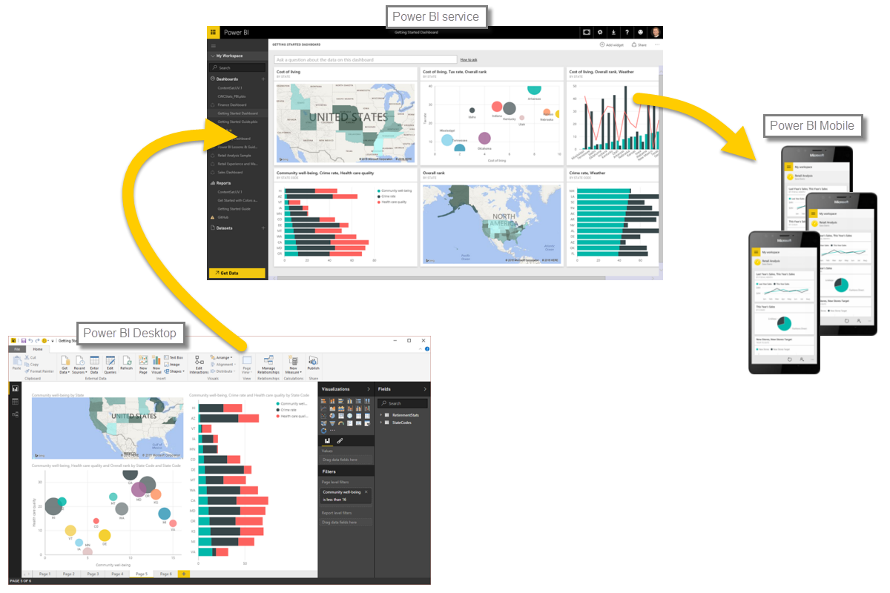

<properties
   pageTitle="使用 Power BI"
   description="了解常見的 Power BI 中的工作流程"
   services="powerbi"
   documentationCenter=""
   authors="davidiseminger"
   manager="mblythe"
   backup=""
   editor=""
   tags=""
   qualityFocus="no"
   qualityDate=""
   featuredVideoId="1c01r_pAZdk"
   courseDuration="4m"/>

<tags
   ms.service="powerbi"
   ms.devlang="NA"
   ms.topic="get-started-article"
   ms.tgt_pltfrm="NA"
   ms.workload="powerbi"
   ms.date="09/29/2016"
   ms.author="davidi"/>

# 使用 Power BI

您現在知道 Power BI 的基本概念，讓我們跳到一些實際操作的經驗和導覽。 視訊教學課程指南 **將 Thompson**, ，Microsoft Power BI 小組經理。 有幾個客體指南太，稍後在本課程。

將說明您可以使用 Power BI 做許多項目，請記住所有這些活動，以及如何使用 Power BI 的所有分析通常依照一般流程。  **一般流程** 的 Power BI 中的活動，如下所示︰

-   將資料送回 Power BI Desktop，並建立報表。
-   發行至 Power BI 服務，您建立新的視覺效果或組建儀表板
-   與其他人，特別是出門的人共用儀表板
-   檢視並與共用的儀表板和報表互動 Power BI 行動應用程式中

如先前所述，您可能需要花費在所有時間 **Power BI 服務**, 、 取得資料，以及建立儀表板 – 這沒有問題。 其他小組成員可能需要花費的時間中的所有 **Power BI Desktop**, ，這是沒問題。 為了協助您了解 Power BI，它可以做什麼的完整連續體中，我們將告訴您它的全部... 然後您可以決定如何使用功能。

因此，我們跳入，並讓將會引導我們的經驗。 第一件事是了解 Power BI，以了解 Power BI 將資料轉成酷炫的報表和視覺效果的方式提供穩固的基礎基本建置組塊。
