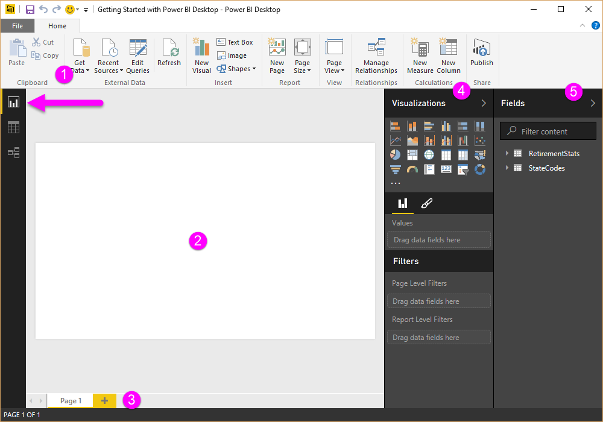
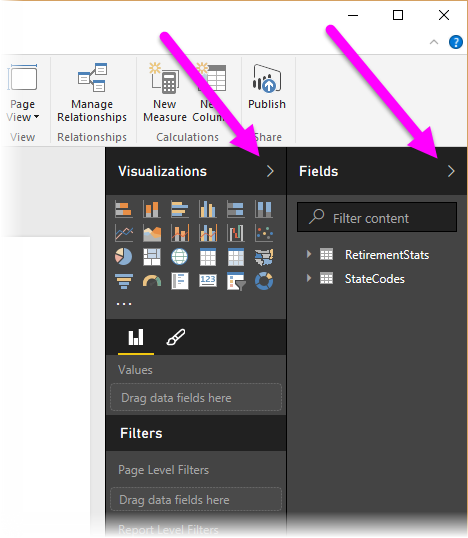
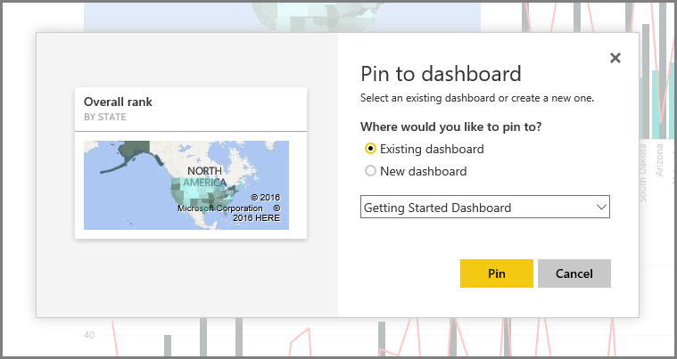

<properties
   pageTitle="開始使用 Power BI Desktop"
   description="快速瀏覽 Power BI Desktop"
   services="powerbi"
   documentationCenter=""
   authors="davidiseminger"
   manager="mblythe"
   backup=""
   editor=""
   tags=""
   qualityFocus="no"
   qualityDate=""
   featuredVideoId="meDUu1sFP3Q"
   courseDuration="9m"/>

<tags
   ms.service="powerbi"
   ms.devlang="NA"
   ms.topic="get-started-article"
   ms.tgt_pltfrm="NA"
   ms.workload="powerbi"
   ms.date="09/29/2016"
   ms.author="davidi"/>

# 開始使用 Power BI Desktop

本主題中，我們仔細看看 Power BI 的前兩個部分如何彼此搭配運作︰

-   中建立報表 **Power BI Desktop**
-   在報表發行 **Power BI 服務**

我們將會啟動 Power BI Desktop，並選取 **取得資料**。 此時會出現 [資料來源的集合，可讓您選擇的資料來源。 下圖顯示選取的來源，在影片中，將選取的網頁 **Excel** 活頁簿。

不論您選擇哪一個資料來源，Power BI 連接到該資料來源，並顯示您從該來源中可用的資料。 下圖是另一個範例中，從分析不同狀態，以及一些有趣的停用統計資料的網頁上，此種情況。

在 Power BI Desktop **報表** ] 檢視中，您可以開始建立報表。

 **報表** 檢視有五個主要區域︰

1.  功能區中，可顯示報表和視覺效果與相關聯的一般工作
2.   **報表** 檢視或畫布上，建立並排列視覺效果，
3.   **頁面** 索引標籤區域底部，可讓您選取或新增報表] 頁面
4.   **視覺效果** ] 窗格中，您可以在其中變更視覺效果，自訂色彩或軸、 套用篩選器、 拖曳欄位，
5.   **欄位** ] 窗格中，其中查詢項目和篩選器可以將它們拖曳至 **報表** 檢視，或拖曳至 **篩選** 區域 **視覺效果** 窗格

 **視覺效果** 和 **欄位** 窗格可摺疊選取邊緣，提供更多的空間中的小箭頭 **報表** 檢視，以建立酷炫的視覺效果。 修改時視覺效果，您也會看到這些箭號指向向上或向下，這表示您可以展開或摺疊該區段中，依此。

若要建立視覺效果，只需要將欄位從 **欄位** 清單拖曳至 **報表** 檢視。 在此情況下，我們將從 [狀態] 欄位 *RetirementStats*, ，並看看結果如何。

看看 …Power BI Desktop 自動建立地圖視覺效果，因為它會辨識 [狀態] 欄位包含地理位置資料。

現在讓我們快速一點，且之後建立報表具有少數的視覺效果，我們已經準備好發行至 Power BI 服務。 在 **首頁** 功能區中選取 Power BI Desktop **發行**。

將提示您登入 Power BI。

當您已登入並發佈程序已完成時，您會看到下列對話方塊。 您可以選取的連結 (如下 **成功 ！**) 即可移至 Power BI 服務，您可以在其中看到報表您剛剛發行。

當您登入 Power BI 時，您會看到 Power BI Desktop 檔案您剛發行服務中。 下圖中，在 Power BI Desktop 中建立的報表以顯示 **報表** 一節。

在該報表中，我可以選擇 **Pin** 圖示釘選視覺儀表板。 下圖顯示亮方塊與箭號以反白顯示的釘選圖示。

當我選取該項目時，會顯示下列對話方塊，好讓我釘選到現有的儀表板，或建立新的儀表板的視覺。

當我們可以從我們的報表釘選幾個視覺效果時，我們可以看到儀表板。

還有更多您可以透過 Power BI，當然，例如共用您所建立的儀表板。 我們將討論共用稍後在本課程。

接下來，我們可以自動建立儀表板，只是藉由連接到雲端服務，例如 Facebook、 Salesforce 和許多其他功能。
