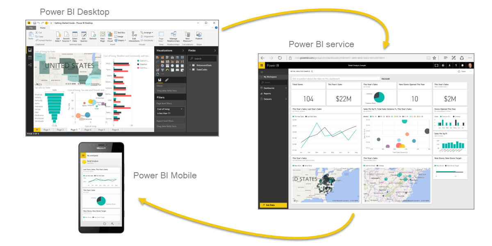

<properties
   pageTitle="檢閱和後續步驟"
   description="檢閱您在此介紹 Power BI 中了解"
   services="powerbi"
   documentationCenter=""
   authors="davidiseminger"
   manager="mblythe"
   backup=""
   editor=""
   tags=""
   qualityFocus="no"
   qualityDate=""
   featuredVideoId=""
   courseDuration="5m"/>

<tags
   ms.service="powerbi"
   ms.devlang="NA"
   ms.topic="get-started-article"
   ms.tgt_pltfrm="NA"
   ms.workload="powerbi"
   ms.date="09/29/2016"
   ms.author="davidi"/>

# 檢閱 「 引導式學習這個第一個區段

讓我們進行快速檢閱我們在第一節中所涵蓋的項目。

            **Power BI** 是軟體服務、 應用程式和連接器一起運作，將您資料轉換成互動式的深入資訊的集合。 您可以使用單一的基本來源，如 Excel 活頁簿，或是從多個資料庫中的提取資料，並定域機組來源，以建立複雜的資料集和報表。 Power BI 可直接，，或為企業需求為您的複雜全域商務需要。

Power BI 包含三個主要項目 – **Power BI Desktop**, 、 **Power BI 服務**, ，和 **行動 Power BI** – 共同，讓您建立、 互動、 分享及取用資料的所有工作要如何。

我們討論了基本的建置組塊，在 Power BI 中，哪些是︰

-   
            **視覺效果** – 資料，有時候稱為 [視覺效果的視覺表示法
-   
            **資料集** – 收集資料的 Power BI 使用來建立視覺效果
-   
            **報表** – 的視覺效果，從資料集，跨越一或多個頁面集合
-   
            **儀表板** – 視覺效果，從報表所建立的單一頁面集合
-   
            **磚** – 報表或儀表板中找到的單一視覺效果

在這裡，我們介紹了 Power BI 教學指南中，使用的視訊教學課程中 **將 Thompson**。 會提供給我們如何分析和視覺化 Power BI 資料的快速概觀。

<!---
In **Power BI Desktop**, we connected to a basic Excel file, created visualizations, then published those visualizations to the service. Even if you use Power BI only with your Excel workbooks, you can gain amazing visual insights with those Excel workbooks, and both interact and share it in ways never before possible.
-->
在 **Power BI 服務**, ，我們只要按幾下建立儀表板。 我們與我們初探續到 Power BI 服務，並使用 **Content Pack** – 現成的視覺效果和報告集合-且已連線到 **軟體服務** 填入內容的組件，並將該資料融入生活。

我們也使用自然語言查詢，稱為 **問與答**, ，以詢問的問題，我們所提供的解答，並讓 Power BI 建立根據這些問題的視覺效果。 最後，我們要設定 **重新整理排程** 我們的資料，讓我們知道當我們回到 Power BI 服務，該資料將設全新。

## 後續步驟

**恭喜！** 您已完成的第一個區段 **引導式學習** Power BI 的課程。 您現在擁有的知識，以移至下一節中，公司基礎 **擷取資料**, ，這是邏輯的 Power bi 的工作流程的下一個步驟。

提過，但值得 restating︰ 本課程遵循一般的 Power BI 中的工作流程建置您的知識︰

-   將資料插入 **Power BI Desktop**, ，並建立報表。
-   
            **發行** Power BI 服務，您建立新的視覺效果或組建儀表板
-   
            **共用** 儀表板與其他人，特別是人出門人員
-   檢視並與其互動共用儀表板和報表中 **行動 Power BI** 應用程式

您可能不會執行所有使用您自己的一些人只能檢視服務中的其他人所建立的儀表板。 很好，但是因為 *您將* 移完成本課程中的所有章節，您將 *了解* 如何建立這些儀表板，以及如何它們連線到 [資料]，並甚至可能決定建立您自己的其中一個。

下一節中見了 ！
