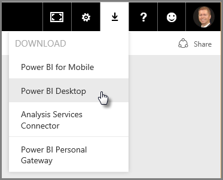
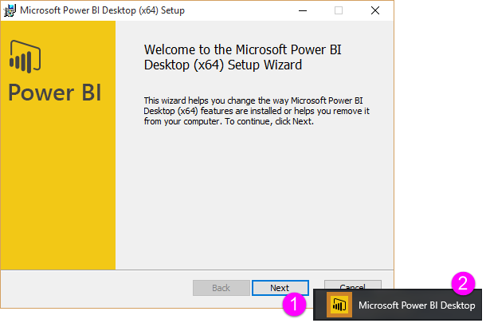
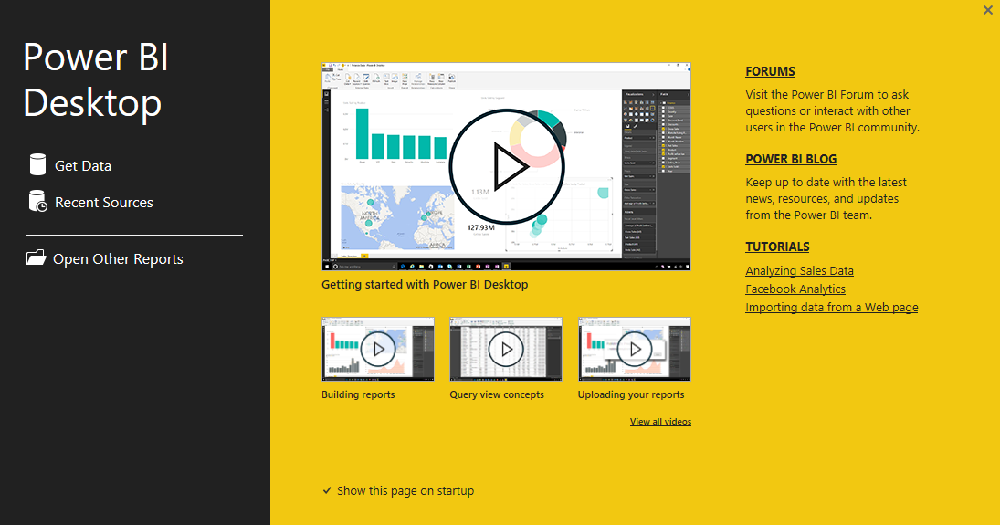

<properties
   pageTitle="Power BI Desktop 的概觀"
   description="了解 Power BI Desktop"
   services="powerbi"
   documentationCenter=""
   authors="davidiseminger"
   manager="mblythe"
   backup=""
   editor=""
   tags=""
   qualityFocus="no"
   qualityDate=""
   featuredVideoId="mdy-eRev6HM"
   courseDuration="4m"/>

<tags
   ms.service="powerbi"
   ms.devlang="NA"
   ms.topic="get-started-article"
   ms.tgt_pltfrm="NA"
   ms.workload="powerbi"
   ms.date="09/29/2016"
   ms.author="davidi"/>

# 取得資料

第二個區段，在此歡迎使用 **引導式學習** 課程 Power bi，稱為 **擷取資料**。 本節探討的許多資料中心的功能和工具，Power BI，將焦點放在 Power BI Desktop。 許多這些工具也適用於 Power BI 服務，讓您使用本節中的學習進行雙重用途。

當您取得資料時，有時候很不相當做為格式正確，或 *全新*, ，如您想要。 在本節中，您了解如何取得資料，因此如何清除 (有時稱為 *清理* 或 *轉換* 資料)，，並且學習一些進階的技巧，可以讓您的資料取得的生活更輕鬆。

一律在此課程中，您學習之旅，如下所示的 Power BI 中的工作流程和路徑相同。 因此，我們要簽出 **Power BI Desktop**, ，它通常開始的位置。

## 概略了解 Power BI Desktop

Power BI Desktop 是連接到、 清除及視覺化資料的工具。 使用 Power BI Desktop，您可以連接到資料，然後模型並將其視覺化不同的方式。 在使用商業智慧專案的大部分使用者將會花費大部分的時間使用 Power BI Desktop。

您可以下載 Power BI Desktop [從 web](http://go.microsoft.com/fwlink/?LinkID=521662), ，或從 Power BI 服務。 只選取在 Power BI 右上角的向下箭號按鈕，然後選取 [Power BI Desktop。

Power BI Desktop 會安裝為 Windows 電腦上的應用程式。

因此當您下載它，您將安裝 Power BI Desktop 和 Windows 上執行與其他應用程式一樣。 下圖顯示啟動螢幕的 Power BI Desktop，這會啟動應用程式時出現。

Power BI Desktop 會連線至各種資料來源中，從本機內部部署資料庫至雲端服務的 Excel 工作表。 它可協助您清理及格式化資料以使它更好用，包括分割並重新命名資料行、 變更資料類型，以及處理日期。 您也可以建立資料行之間的關聯性，讓您更輕鬆地建立模型和分析資料。
