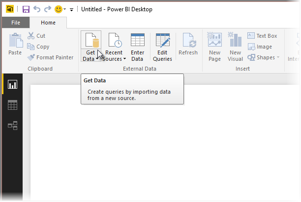
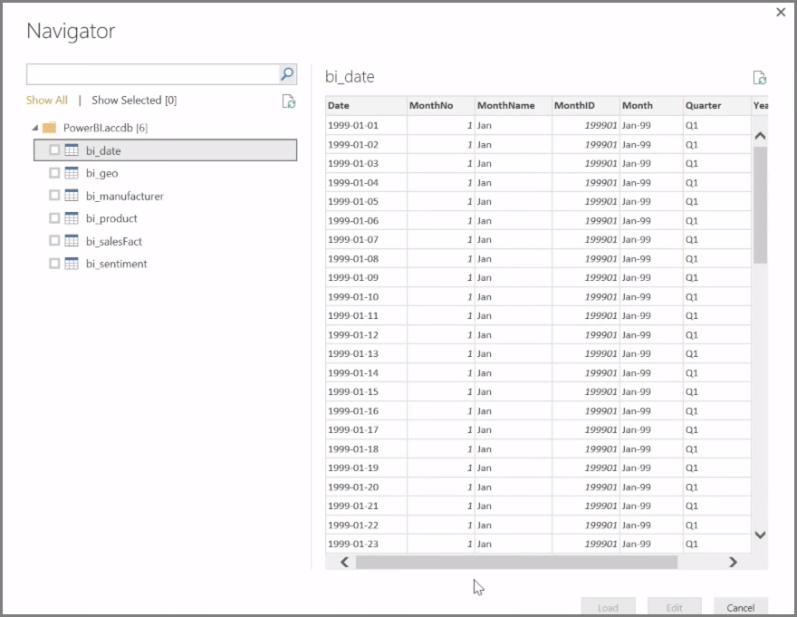

<properties
   pageTitle="連接至 Power BI Desktop 中的資料來源"
   description="了解如何使用 Power BI Desktop 連接到資料"
   services="powerbi"
   documentationCenter=""
   authors="davidiseminger"
   manager="mblythe"
   backup=""
   editor=""
   tags=""
   qualityFocus="no"
   qualityDate=""
   featuredVideoId="S6s0osmRCZ4"
   courseDuration="8m"/>

<tags
   ms.service="powerbi"
   ms.devlang="NA"
   ms.topic="get-started-article"
   ms.tgt_pltfrm="NA"
   ms.workload="powerbi"
   ms.date="10/12/2016"
   ms.author="davidi"/>

# 連接至 Power BI Desktop 中的資料來源

            **Power BI Desktop** 可以連接至各種資料來源，包括在內部資料庫，Excel 活頁簿，和雲端服務。 目前超過 59 的不同雲端服務，例如 GitHub 和 Marketo 有特定的連接器，您可以透過 XML、 CSV 及文字，而 ODBC 泛型的來源連接。 Power BI 甚至會消除直接從網站 URL 的表格式資料 ！ 但是，我們要從頭開始，開啟 Power BI Desktop 與連接至資料。

當您啟動 **Power BI Desktop** 和跳過 [開始] 畫面中，您可以選擇取得資料，從功能區上 **首頁** ] 索引標籤。

每月更新至 Power BI Desktop，且每個更新， **最新的 Power BI Desktop** 頁面取得更新的更新、 部落格、 連結和下載連結的相關資訊。

在 Power BI Desktop 中有可用的各種不同的資料來源。 選取要連接的來源。 根據您選取項目，您必須找不到您的電腦或網路上的來源，或提示您登入服務來驗證您的要求。

連線之後，您會看到第一個視窗是 **導覽**。 導覽會顯示資料表或實體的資料來源，並按一下其中一個提供您預覽的內容。 您可以匯入您所選取的資料表或實體，或選取 **編輯** 轉換並匯入之前清除資料。

一旦您已選取您想要帶入 Power BI Desktop 的資料表，您可以選擇選取 [將它們載入到 Power BI Desktop **載入** 右下角的按鈕 **導覽**。 有些時候，不過，您可能要您載入 Power BI Desktop 之前進行這些資料表的變更。 您可能會想只有一群的客戶，或是篩選只發生特定國家/地區的銷售資料。 您可以在這些情況下，選取 [編輯] 按鈕及篩選器，或將資料轉換之前將它放置在 Power BI Desktop。

我們將挑選，並編輯資料下, 一節。
