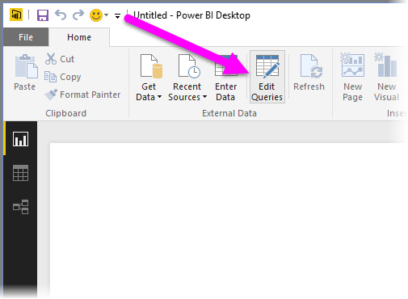
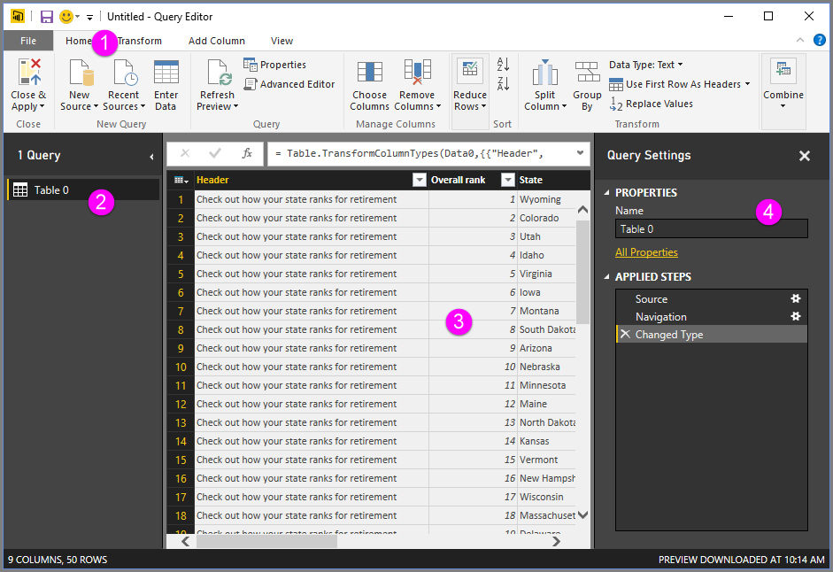
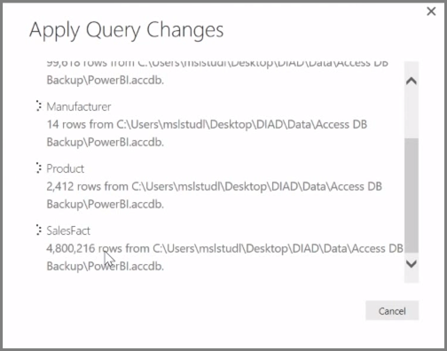

<properties
   pageTitle="清除和轉換資料以查詢編輯器"
   description="取得資料 」 圖形中使用 Power bi"
   services="powerbi"
   documentationCenter=""
   authors="davidiseminger"
   manager="mblythe"
   backup=""
   editor=""
   tags=""
   qualityFocus="no"
   qualityDate=""
   featuredVideoId="o-sinon5JYY"
   courseDuration="8m"/>

<tags
   ms.service="powerbi"
   ms.devlang="NA"
   ms.topic="get-started-article"
   ms.tgt_pltfrm="NA"
   ms.workload="powerbi"
   ms.date="09/29/2016"
   ms.author="davidi"/>

# 清除和轉換資料以查詢編輯器

            **Power BI Desktop** 包含 **查詢編輯器**, ，功能強大的工具來塑造和轉換資料，以便準備您的模型和視覺效果。 當您選取從 [導覽] 中，將會啟動查詢編輯器中編輯，並填入資料表或是您所選取資料來源的其他實體。

您也可以啟動 **查詢編輯器** 直接從 **Power BI Desktop**, ，並使用 **編輯查詢** 按鈕 **首頁** 功能區。

查詢編輯器載入後已圖形可供您的資料，您會看到少數幾個區段︰

1.  在功能區中，許多按鈕現在是使用中，在查詢中的資料互動
2.  在左窗格中，查詢 （一個用於每個資料表或實體） 會列出與選取檢視，與塑造
3.  在中央窗格中，選取查詢的資料會顯示且能塑造
4.  查詢設定] 視窗隨即出現，列出查詢的屬性，並套用步驟

在中央窗格中，以滑鼠右鍵按一下資料行上會顯示一些不同的可用轉換，例如從資料表移除資料行、 重複的資料行，以新名稱，以及取代值。 從這個功能表您可以將文字資料行分割成常用的分隔符號的倍數。

 **查詢編輯器** 功能區包含其他工具，例如變更資料行的資料類型、 加入科學記號標記法，或擷取項目開始日期，例如一週天數。

套用轉換時，每個步驟就會顯示在 **套用步驟** 中列出 **查詢設定** 在右側窗格 **查詢編輯器**。 您可以使用這份清單，若要復原或檢視特定的變更，或甚至變更步驟的名稱。 若要儲存您的轉換，請選取 **關閉及套用** 上 **首頁** ] 索引標籤。

一旦您選取 **關閉及套用**, ，查詢編輯器套用查詢您的變更，將它們套用到 Power BI Desktop。

有各式各樣的轉換中的資料時，您可以做的事情 **查詢編輯器**, ，包括進階轉換。 在下一個區段中，我們可以看看幾個進階轉換，您可以將轉換與資料，讓您在幾乎 immeasurable 方面的意義上 **查詢編輯器**。
