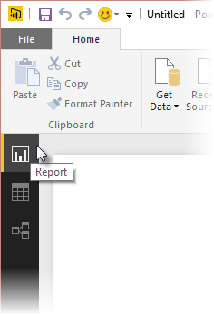
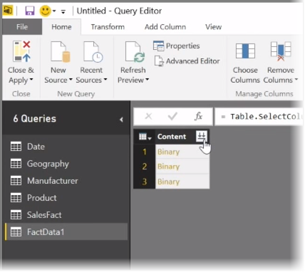
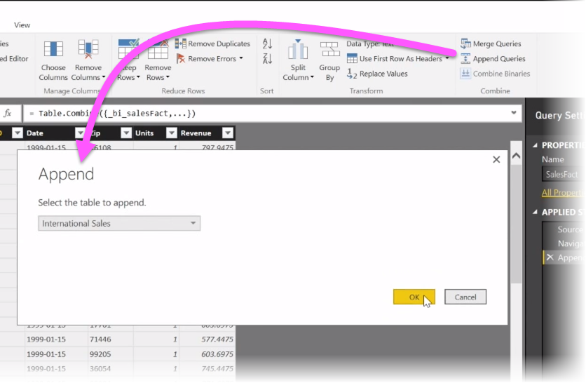
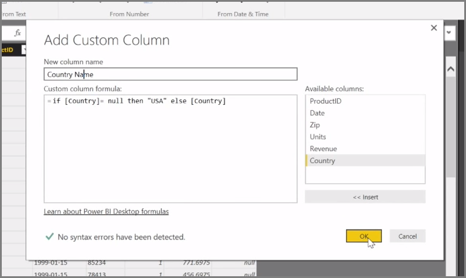

<properties
   pageTitle="更進階的資料來源和轉換"
   description="-連接，並結合兩個資料來源可輕鬆"
   services="powerbi"
   documentationCenter=""
   authors="davidiseminger"
   manager="mblythe"
   backup=""
   editor=""
   tags=""
   qualityFocus="no"
   qualityDate=""
   featuredVideoId="8WsY0R2V_bw"
   courseDuration="8m"/>

<tags
   ms.service="powerbi"
   ms.devlang="NA"
   ms.topic="get-started-article"
   ms.tgt_pltfrm="NA"
   ms.workload="powerbi"
   ms.date="09/29/2016"
   ms.author="davidi"/>

# 更進階的資料來源和轉換

在本文中，我們介紹一些進階資料匯入以及清潔技術 **Power BI Desktop**。 一旦您已成形的 **查詢編輯器** 和帶到 **Power BI Desktop**, ，幾個不同的方式查看它。 Power BI Desktop 中有三種檢視︰ **報表** ] 檢視中， **資料** ] 檢視中，和 **關聯性** 檢視。 您可以看到每個檢視的畫布的左上角中選取它的圖示。 下圖中，在 **報表** 選取檢視。 圖示旁的黃色列表示作用中的檢視。

若要變更檢視，只選取其中一個其他兩個圖示。 圖示旁的黃色列表示作用中的檢視。

Power BI Desktop 可以結合到單一報表中，從多個來源的資料模型化程序期間。 若要將其他來源新增到現有的報表中，選取 **編輯查詢** 中 **首頁** 功能區，然後選取 [ **新來源** 中 **查詢編輯器**。

有許多不同的可能資料來源中，您可以使用 **Power BI Desktop**, ，包括資料夾。 藉由連接到資料夾，您可以匯入多個檔案中的資料，例如一系列的 CSV 檔案的 Excel 檔案。 您選取的資料夾中包含的檔案會出現在 **查詢編輯器** 做為二進位內容，並按一下頂端的雙箭頭圖示 **內容** 資料行載入它們的值。

Power BI 最有用的工具之一是其 *篩選*。 例如，選取之資料行旁邊的下拉式箭號會開啟文字和篩選可讓您從模型移除值的檢查清單。

您也可以合併和新增查詢，和將多個資料表 （或從資料夾中的各種檔案資料） 轉換成單一資料表，其中包含您要的資料。 您可以使用 **附加查詢** 工具將資料從新資料表新增至現有的查詢。 Power BI Desktop 嘗試比對中您的查詢，您可以依需要來調整中的資料行向上 **查詢編輯器**。

最後， **加入自訂資料行** 工具可讓進階的使用者選擇使用功能強大的 M 語言從頭撰寫查詢運算式。 您可以加入自訂的資料行，根據 M 查詢語言陳述式，並想辦法取得您的資料。

