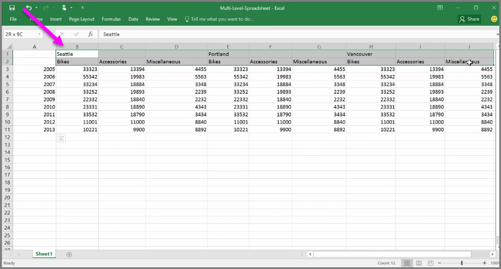
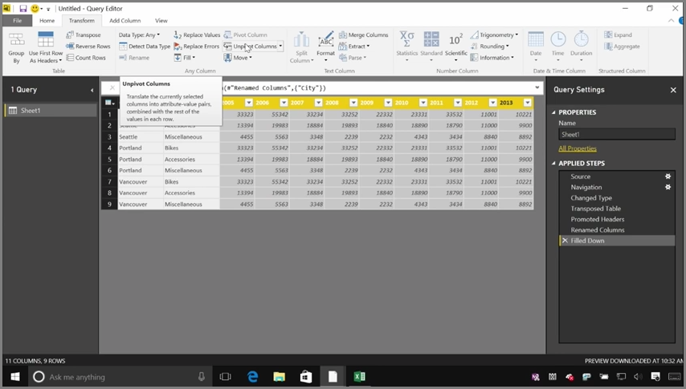

<properties
   pageTitle="清除不規則格式化的資料"
   description="您可以處理雜亂 Power BI 資料...請參閱 < 如何"
   services="powerbi"
   documentationCenter=""
   authors="davidiseminger"
   manager="mblythe"
   backup=""
   editor=""
   tags=""
   qualityFocus="no"
   qualityDate=""
   featuredVideoId="74KQmzdvFV8"
   featuredVideoThumb=""
   courseDuration="8m"/>

<tags
   ms.service="powerbi"
   ms.devlang="NA"
   ms.topic="get-started-article"
   ms.tgt_pltfrm="NA"
   ms.workload="powerbi"
   ms.date="09/29/2016"
   ms.author="davidi"/>

# 清除不規則格式化的資料

Power BI 可以幾乎任何來源匯入資料，而其視覺化和模型工具適合單欄式資料。 有時候您的資料則不會格式化以簡單的資料行通常是與 Excel 試算表，人類的眼睛喜歡表格版面配置不一定適合自動化的查詢。 例如，下列的試算表具有跨越多個資料行的標頭。

幸運的是，Power BI 提供工具，快速將多重資料行資料表轉換成資料集，您可以使用。

## 轉置的資料
比方說，使用 **轉置** 中 **查詢編輯器**, ，您可以反轉的資料 （會變成使用資料列和資料列的資料行的資料行），您可以細分資料格式，您可以操作。

一旦您的數次，視訊所述，您的資料表開始圖形轉換成 Power BI 可以更輕鬆地使用。

## 將資料格式化
您也可能需要格式化資料，讓 Power BI 可以正確分類及它匯入之後，識別該資料。

使用少數幾個轉換，包括 *升級成標頭資料列* 到中斷標頭，使用 **填滿** 開啟 *null* 中的值高於或低於指定的資料行的值和 **取消樞紐資料行**, ，您可以清理資料至資料集，您可以使用 Power BI 中。

透過 Power BI，可以在您的資料上進行試驗這些轉換，並判斷哪些型別為可讓它使用 Power BI 的單欄式格式取得您的資料。 而且，記得，所有您採取的動作會記錄套用的步驟一節的查詢編輯器中，因此，如果轉換無法運作的方式，您要的您可以只按一下 **x** 旁邊步驟中，並將它復原。

## 建立視覺效果
在您資料的格式，可以使用 Power BI，轉換並清理資料之後, 您就可以開始建立視覺效果。

## 後續步驟

**恭喜！** 您已完成的這一節 **引導式學習** Power BI 的課程。 現在您已經知道如何 **取得資料** 到 Power BI Desktop，以及如何 *圖形* 或 *轉換* 該資料，因此您可以建立吸引人的視覺效果。

下一個步驟中學習 Power BI 的運作方式，以及如何讓它運作 *您*, ，是了解放在哪個 **模型**。 您知道 **資料集** Power BI 的基本建置區塊，但某些資料集可以是複雜且根據許多不同的資料來源。 有時候，您需要新增您自己的特殊觸控和 (或 *欄位*) 至您建立資料集。

您將了解 **模型**, ，和還有許多下一節中的其他功能。 到時候見 ！
