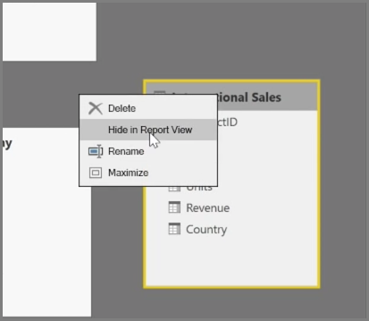

<properties
   pageTitle="如何管理您的資料關聯性"
   description="檢視及管理在 Power BI 中的資料關聯性"
   services="powerbi"
   documentationCenter=""
   authors="davidiseminger"
   manager="mblythe"
   backup=""
   editor=""
   tags=""
   qualityFocus="no"
   qualityDate=""
   featuredVideoId="MqNX5olPGGI"
   featuredVideoThumb=""
   courseDuration="9m"/>

<tags
   ms.service="powerbi"
   ms.devlang="NA"
   ms.topic="get-started-article"
   ms.tgt_pltfrm="NA"
   ms.workload="powerbi"
   ms.date="09/29/2016"
   ms.author="davidi"/>

# 如何管理您的資料關聯性

Power BI 可讓您以視覺化方式設定資料表或項目之間的關聯性。 若要查看資料的圖表檢視，請使用 **關係檢視**, 最左側報表畫布旁螢幕上找到。

從 **關聯性** ] 檢視中，您可以看到代表每個資料表及其資料行，而行它們表示關聯性之間的區塊。

加入和移除關聯性很簡單。 若要移除的關聯性，以滑鼠右鍵按一下它，然後選取 **刪除**。 若要建立關聯性，拖放您要連結的資料表之間的欄位。

若要隱藏資料表或報表中的個別資料行，以滑鼠右鍵按一下 [關聯性] 檢視中，然後選取 **在報表檢視中隱藏**。

您的資料關聯性的更詳細檢視，請選取 **管理關聯性** 中 **首頁** ] 索引標籤。 這會開啟 **管理關聯性** ] 對話方塊，其中顯示您的關聯性而不是視覺化圖表的清單。 您可以從這裡選取 **自動偵測** 來尋找新的或更新資料的關聯性。 選取 **編輯** 中 **管理關聯性** 手動編輯您的關聯性] 對話方塊。 這也是您可以在哪裡找到設定進階的選項 *基數* 和 *交叉篩選* 您的關聯性的方向。

您可以選擇針對基數 *多對一*, ，和 *一對一*。 
            *多對一* 是事實維度類型關聯性，例如 sales 資料表與每個資料表，其中列出自己的唯一資料列中的產品與正在對產品的多個資料列。 
            *一對一* 常用的連結參考資料表中的單一項目。

根據預設，關聯性將回到雙向交叉篩選。 交叉篩選只往一個方向有限的關聯性中的模型化功能。

設定正確的資料之間的關聯性，可讓您跨多個資料元素建立複雜的計算。
