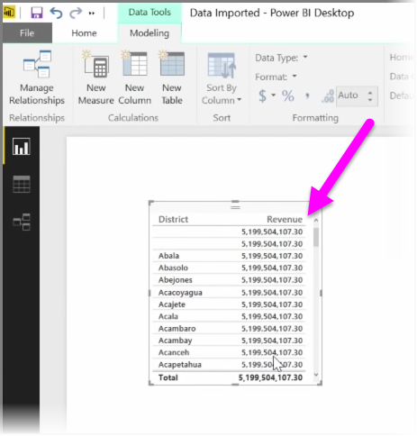
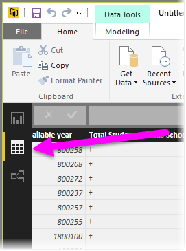
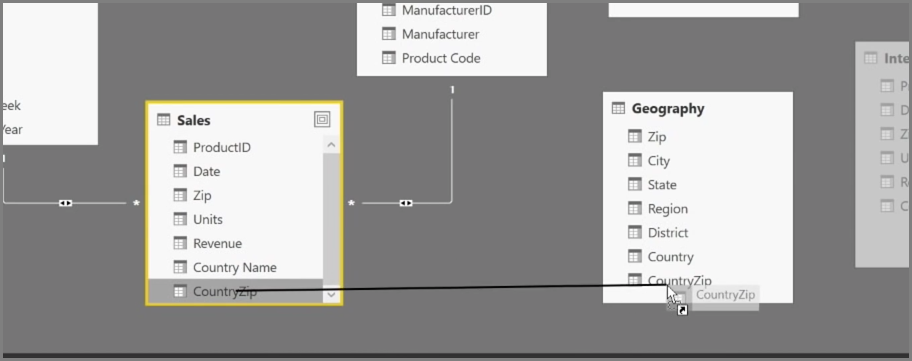
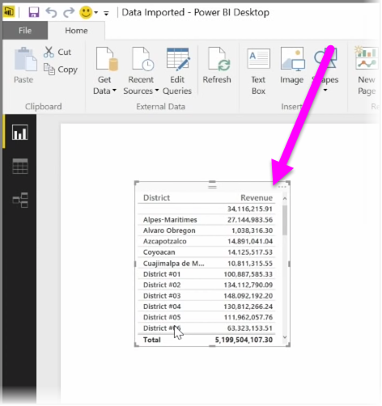

<properties
   pageTitle="建立導出資料行"
   description="導出資料行可讓您建立唯一索引鍵，以及其他"
   services="powerbi"
   documentationCenter=""
   authors="davidiseminger"
   manager="mblythe"
   backup=""
   editor=""
   tags=""
   qualityFocus="no"
   qualityDate=""
   featuredVideoId="GarBXef0Vew"
   featuredVideoThumb=""
   courseDuration="9m"/>

<tags
   ms.service="powerbi"
   ms.devlang="NA"
   ms.topic="get-started-article"
   ms.tgt_pltfrm="NA"
   ms.workload="powerbi"
   ms.date="09/29/2016"
   ms.author="davidi"/>

# 建立導出資料行

建立導出資料行是簡單的方式來擴充和增強您的資料。 A **導出資料行** 是您定義的轉換，或將現有資料的兩個或多個項目結合的計算以建立新資料行。 例如，您可以將兩個資料行結合成一個建立新的資料行。

建立導出資料行很有用的原因是沒有唯一的欄位出現時的資料表之間建立關係，可以用來建立關聯性。 當您取得相同的值的所有項目，但您知道基礎資料是不同並建立簡單的資料表在 Power BI Desktop，visual 顯而易見的缺少的關聯性。

若要建立關聯性資料中唯一的欄位，您可以比方說，建立新導出資料行的 「 完整的電話號碼 」 結合的值從 「 區域的程式碼 」 和 「 本機數字 」 資料行這些值存在於您的資料。 導出資料行是一個有用的工具，讓您迅速建立模型和視覺效果。

若要建立導出資料行，請選取 **資料檢視** Power BI Desktop 從左邊算起的報表畫布中。

從 [模型] 索引標籤中，選取 **新的資料行**。 這可讓您可以在此輸入使用 DAX (Data Analysis Expressions) 語言的計算公式列。 DAX 是功能強大的公式語言，也會發現在 Excel 中，可讓您建立穩固的計算。 當您輸入公式時，Power BI Desktop 顯示相符的公式或協助，並加速您的公式建立的資料元素。

Power BI 資料編輯列將會建議特定 DAX 函數，並輸入您的運算式的相關資料行。

一旦建立導出資料行中每個資料表，它們可用來當做唯一索引鍵來建立它們之間的關聯性。 移至 **關聯性** ] 檢視中，然後您可以將欄位從一個資料表之間建立關聯性。

回到 **報表** 檢視中，您現在看到各學區不同的值。

有各種藉由建立導出資料行，也可以執行其他作業。
