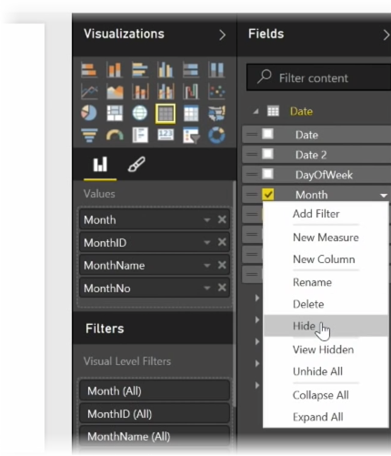
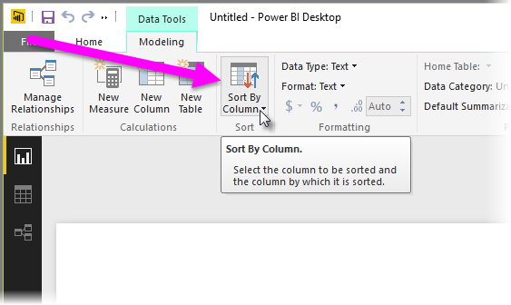
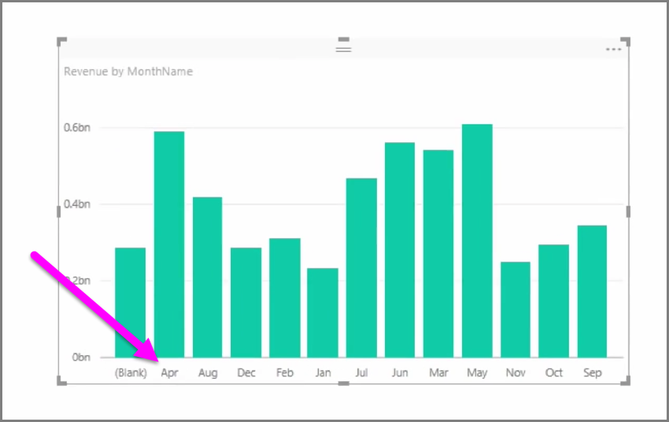
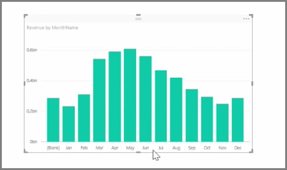

<properties
   pageTitle="最佳化資料模型"
   description="請建立和檢視視覺效果更容易，因為最佳化模型"
   services="powerbi"
   documentationCenter=""
   authors="davidiseminger"
   manager="mblythe"
   backup=""
   editor=""
   tags=""
   qualityFocus="no"
   qualityDate=""
   featuredVideoId="tDcrfnjjlgk"
   featuredVideoThumb=""
   courseDuration="8m"/>

<tags
   ms.service="powerbi"
   ms.devlang="NA"
   ms.topic="get-started-article"
   ms.tgt_pltfrm="NA"
   ms.workload="powerbi"
   ms.date="09/29/2016"
   ms.author="davidi"/>

# 最佳化資料模型的更佳的視覺效果

匯入的資料通常包含您實際上不需要為您報告和視覺化的工作，因為它是額外的資訊，或是因為該資料已經在另一個資料行的欄位。 Power BI Desktop 有工具以最佳化您的資料，並讓它成為更可讓您建立報表和視覺效果，以及檢視共用的報表。

## 隱藏欄位

若要隱藏的資料行中 **欄位** 窗格中的 Power BI Desktop，以滑鼠右鍵按一下它，然後選取 **隱藏**。 請注意，不會刪除隱藏的資料行。如果您使用現有的視覺效果中的欄位，資料仍然位於該視覺、 而且您仍然可以使用該資料中其他視覺效果太，隱藏的欄位就不顯示在 **欄位** 窗格。

如果您在檢視中的資料表 **關聯性** 檢視中，隱藏欄位會指示所要呈現灰色。 同樣地，其資料仍然可用，然後仍然是模型的一部分，它們只檢視中隱藏起來。 您永遠可以取消隱藏已隱藏欄位，以滑鼠右鍵按一下並選取任何欄位 **取消隱藏**。

## 排序依據另一個欄位的視覺化資料

 **依資料行排序** 中所提供工具 **模型** 索引標籤上，以確保您的資料會顯示您想要的順序非常有用。

常見的範例中，依預設依字母順序排序資料，其中包含月份名稱，比方說，「 月 」 會出現在 「 月 」 之前。

在此情況下，選取 [欄位] 清單中的欄位，然後選取 **依資料行排序** 從 **模型** ] 索引標籤，然後選擇 [欄位來排序可以更正問題。 在此情況下，「 MonthNo 」 類別目錄排序順序選項如預期般的月數。

設定資料欄位的型別是另一種方式來最佳化您的資訊，以便正確處理。 若要變更資料類型從報表畫布上，選取中的資料行 **欄位** ] 窗格，然後再使用 **格式** 下拉式選單中選取其中一個格式化選項。 任何顯示該欄位的視覺效果已建立會自動更新。
