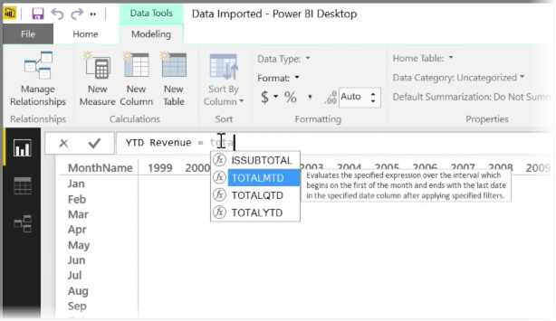
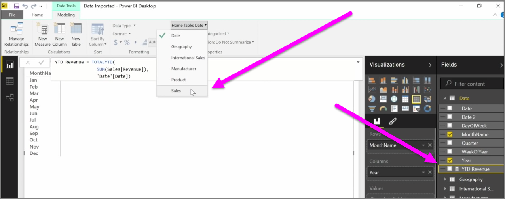

<properties
   pageTitle="建立導出量值"
   description="定義自訂計算來評估時間為基礎的函式"
   services="powerbi"
   documentationCenter=""
   authors="davidiseminger"
   manager="mblythe"
   backup=""
   editor=""
   tags=""
   qualityFocus="no"
   qualityDate=""
   featuredVideoId="yn2bXVQJLx8"
   featuredVideoThumb=""
   courseDuration="14m"/>

<tags
   ms.service="powerbi"
   ms.devlang="NA"
   ms.topic="get-started-article"
   ms.tgt_pltfrm="NA"
   ms.workload="powerbi"
   ms.date="09/29/2016"
   ms.author="davidi"/>

# 建立量值，並使用以時間為基礎的函式

A *量值* 是存在於 Power BI 資料模型中的計算。 若要建立量值，在 **報表** 檢視選取 **新量值** 從 **模型** ] 索引標籤。

DAX，Power BI 中的資料分析運算式語言最大的好處之一是它有很多有用的功能，特別是有關時間為基礎的計算方面例如 *年初至今* 或 *年透過年*。 使用 DAX 中，您可以定義一次，時間量值，然後依不同的欄位數目要從您的資料模型配量。

在 Power BI 中定義的計算稱為 *量值*。 若要建立 *量值*, ，請選取 **新增量值** 從 **首頁** ] 索引標籤。 這會開啟可在此輸入定義量值的 DAX 運算式的公式列。 當您輸入時，Power BI 建議相關的 DAX 函數和資料欄位輸入您的計算，而且您也會說明一些語法和函式參數的工具提示。

如果您的計算是特別長，您可以加入額外的分行符號在 [運算式編輯器] 中輸入 **ALT 輸入**。

建立新的量值之後，它會顯示在其中一個資料表在 **欄位** ] 窗格中，位於螢幕右邊。 Power BI 您目前已選取，不論資料表中插入新的量值和時並不重要完全其中之量值是在您的資料，您可以輕鬆地移動它選取量值，然後使用 **首頁資料表** 下拉式選單。

您可以使用像任何其他資料表資料行的量值︰ 只要拖放到報表畫布或視覺效果的欄位。 量值也會緊密整合交叉分析篩選器，切割您的資料作業，這表示您可以將量值定義一次，並將它用於許多不同的視覺效果。

 **計算** DAX 函數是功能強大的函數，可讓各種實用的計算，這特別適用於金融報告和視覺效果。
