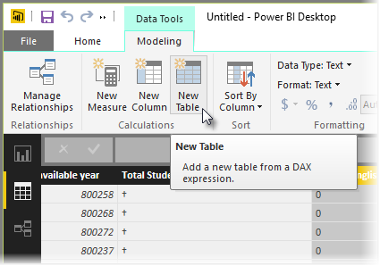

<properties
   pageTitle="建立計算結果欄"
   description="建置計算的 DAX 公式和運算式為基礎的資料表"
   services="powerbi"
   documentationCenter=""
   authors="davidiseminger"
   manager="mblythe"
   backup=""
   editor=""
   tags=""
   qualityFocus="no"
   qualityDate=""
   featuredVideoId="aKX1E3krl4I"
   featuredVideoThumb=""
   courseDuration="4m"/>

<tags
   ms.service="powerbi"
   ms.devlang="NA"
   ms.topic="get-started-article"
   ms.tgt_pltfrm="NA"
   ms.workload="powerbi"
   ms.date="09/29/2016"
   ms.author="davidi"/>

# 建立計算結果欄

導出的資料表是可讓您表達一套完整的模型功能，新的 DAX 中的函式。 例如，如果您想要執行不同類型的合併聯結，或根據功能公式的結果，在作業中建立新的資料表，計算結果欄，方式來達到此目的。

若要建立導出的資料表，請移至 **資料檢視** 在 Power BI Desktop，您可以啟用從報表畫布的左側。

選取 **新資料表** 從 [模型] 索引標籤以開啟資料編輯列。

輸入新的資料表名稱左邊的等號，以及您想要用來形成該資料表在右邊的計算。 完成您的計算後，新的資料表會出現在模型中的 [欄位] 窗格中。

一旦建立之後，您可以使用導出的資料表，如同任何其他資料表中的關聯性、 公式及報表。
