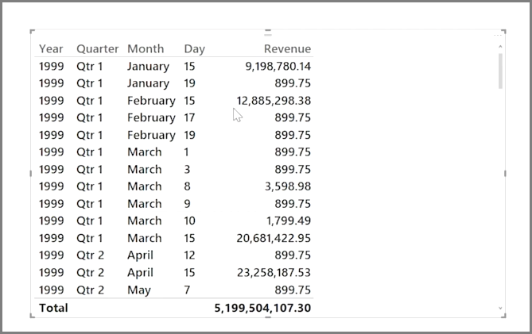

<properties
   pageTitle="瀏覽以時間為基礎的資料"
   description="探索日期欄位的階層式向下鑽研工具"
   services="powerbi"
   documentationCenter=""
   authors="davidiseminger"
   manager="mblythe"
   backup=""
   editor=""
   tags=""
   qualityFocus="no"
   qualityDate=""
   featuredVideoId="MNAaHw4PxzE"
   featuredVideoThumb=""
   courseDuration="6m"/>

<tags
   ms.service="powerbi"
   ms.devlang="NA"
   ms.topic="get-started-article"
   ms.tgt_pltfrm="NA"
   ms.workload="powerbi"
   ms.date="09/29/2016"
   ms.author="davidi"/>

# 瀏覽以時間為基礎的資料

很容易分析 Power bi 以時間為基礎的資料。 模型化工具，在 Power BI Desktop 中的自動包含產生的欄位，可讓您透過年、 季、 月和日只要按一下向下鑽研。  

當您使用 [日期] 欄位在報表中建立資料表的視覺效果時，Power BI Desktop 自動依時間週期包括細項。 在單一日期的欄位，例如 **日期** 資料表已自動分成年、 季、 月和日的 Power BI，如下圖所示。

視覺效果顯示資料在 *年* 層級的預設值，但是您可以變更，方法是開啟 **向下切入** 中視覺效果的右上角。

現在當您按一下的橫條或線條在圖表中，它切入下一個層級的時間階層中，例如從 *年* 至 *季*。 您可以繼續向下切入，直到您到達最細微的層級的階層，在此範例中是 *天*。 若要向上移動到的時間階層，按一下 **向上切入** 左上角的視覺效果中。

您也可以切入所有視覺效果，在所顯示的資料，而不是一段期間，使用選取的 **所有向下切入** 雙箭頭圖示，也在視覺效果的右上角。

只要您的模型有日期欄位，Power BI 會自動產生不同的檢視不同的時間階層。

## 後續步驟

**恭喜！** 您已完成的這一節 **引導式學習** Power BI 的課程。 既然您了解 *模型* 資料，您準備好要深入了解有趣等候下一節中的項目︰ **視覺效果**。

之前有提到，本課程會遵循一般的 Power BI 中的工作流程建置您的知識︰

-   將資料插入 **Power BI Desktop**, ，並建立報表。
-   發行至 Power BI 服務，讓您建立新 **視覺效果** 和組建儀表板
-   
            **共用** 儀表板與其他人，特別是人出門人員
-   檢視並與其互動共用儀表板和報表中 **行動 Power BI** 應用程式

雖然您可能不會執行所有該工作自行，您將 *了解* 如何建立這些儀表板，以及它們連線到 [資料]，當您完成本課程，您就能夠建立自己的其中一個。

下一節中見了 ！
