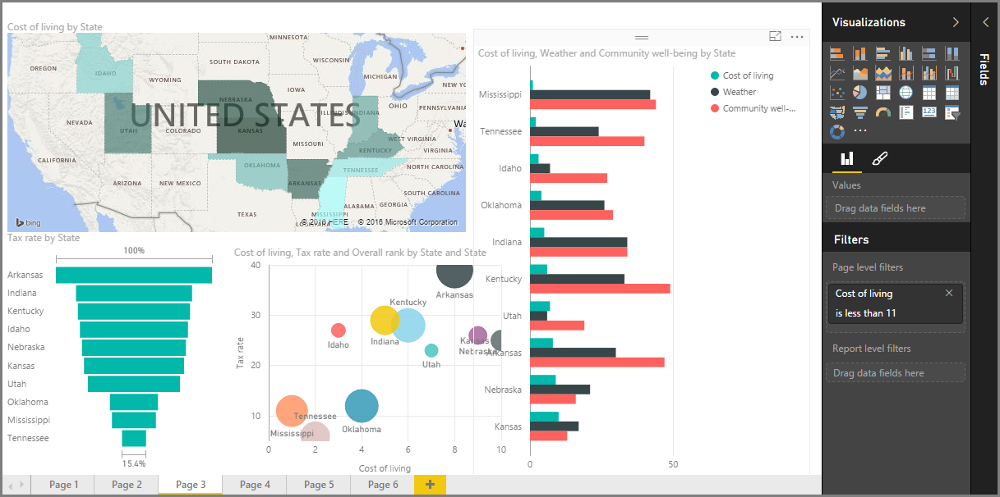

<properties
   pageTitle="在 Power BI 中的視覺效果的簡介"
   description="視覺效果是 Power BI 的核心"
   services="powerbi"
   documentationCenter=""
   authors="davidiseminger"
   manager="mblythe"
   backup=""
   editor=""
   tags=""
   qualityFocus="no"
   qualityDate=""
   featuredVideoId="SYk_gWrtKvM"
   featuredVideoThumb=""
   courseDuration="2m"/>

<tags
   ms.service="powerbi"
   ms.devlang="NA"
   ms.topic="get-started-article"
   ms.tgt_pltfrm="NA"
   ms.workload="powerbi"
   ms.date="09/29/2016"
   ms.author="davidi"/>

# 視覺效果

歡迎使用 **視覺效果** 區段 **引導式學習** Power BI 的課程。 準備一種有趣又有趣，和 enlightening Power BI 所提供的許多視覺效果的教學課程。 並不是全部都-有更多的視覺效果即將隨時 ！

當然，視覺效果都是我們想要取得資料，以吸引人且內容豐富的方式呈現...承擔任何商業智慧的最終結果和 *顯示* 什麼凸顯出來。 與 Power BI 提供各式各樣的吸引人的視覺效果-和幾乎沒有限制的方式，來自訂這些-這是在重要區段 ！

看起來像是有很多主題，本節中，不過別擔心︰ 每個主題會簡短、 填滿以 （您猜猜看） 視覺效果，而且容易吸收。 您可能會發現自己巡航本節中，透過和想像如何您要使這些視覺效果呈現自己的資料。

我們將開始的視覺效果的簡單視覺效果我們已經很熟悉-mainstays，請確定您知道的優缺點。 然後我們會取得更多進階，或至少稍微小於通用，並填滿報表建立工具箱。

盡情享受樂趣，有很多，若要在這裡 ！

## 在 Power BI 中的視覺效果的簡介

視覺化資料屬於 Power BI 的基本建置組塊的核心部分按照我們稍早在本課程中的定義，建立視覺效果是最簡單的方法來尋找及分享您的見解。

Power BI 有一套完整的視覺效果可根據預設，從簡單的橫條圖，來對應和甚至更難理解的供應項目，例如瀑布、 漏斗、 量測計，以及多個圓形圖。 Power BI Desktop 也提供廣泛的網頁格式化工具，例如圖形及影像，可協助讓報表更生動。
