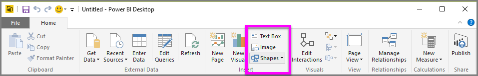

<properties
   pageTitle="圖形、 文字方塊和影像"
   description="新增個人風格及公司標誌、 報表和儀表板"
   services="powerbi"
   documentationCenter=""
   authors="davidiseminger"
   manager="mblythe"
   backup=""
   editor=""
   tags=""
   qualityFocus="no"
   qualityDate=""
   featuredVideoId="_3q6VEBhGew"
   featuredVideoThumb=""
   courseDuration="6m"/>

<tags
   ms.service="powerbi"
   ms.devlang="NA"
   ms.topic="get-started-article"
   ms.tgt_pltfrm="NA"
   ms.workload="powerbi"
   ms.date="09/29/2016"
   ms.author="davidi"/>

# 設定您的報表使用圖形、 文字方塊和影像的樣式

資料繫結的視覺效果，以及您也可以加入靜態項目，例如文字方塊、 影像和圖形，來改善您的報表視覺化設計。 若要新增的視覺元素，請選取 **文字方塊**, ，**映像**, ，或 **圖形** 從 **首頁** ] 索引標籤。

            **文字方塊** 會顯示大型標題、 標題或簡短段資訊以及視覺效果的理想方式。 文字方塊可以包括透過撰寫的 URL，或反白顯示錨點片語，並選取 [文字] 方塊中的選項列上的連結符號的連結。 您可以在文字方塊中，包含 Url 及 Power BI 會自動偵測該連結，並可讓 live。

選取 **映像** 會開啟檔案瀏覽器，您可以在其中選取從您的電腦或其他網路的來源映像。 根據預設，調整您的報表中的映像都會保留長寬比，但這可以視覺化格式選項中停用。

            **圖形** 有五個不同的格式，包括矩形和箭號的選項。 圖形可以是不透明，或不透明使用彩色的框線。 （後者是適用於建立視覺效果群組周圍的框線）。

