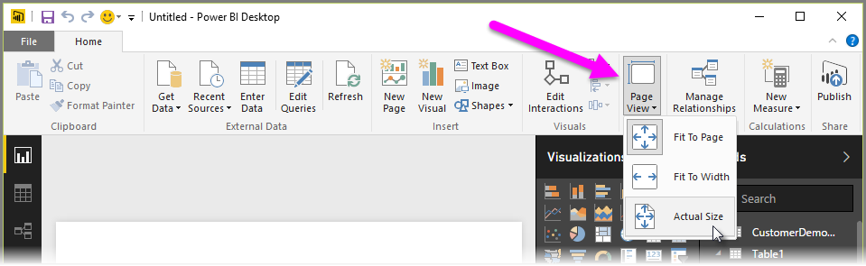

<properties
   pageTitle="頁面配置和格式設定"
   description="顯示您的報表和儀表板在您要的方式"
   services="powerbi"
   documentationCenter=""
   authors="davidiseminger"
   manager="mblythe"
   backup=""
   editor=""
   tags=""
   qualityFocus="no"
   qualityDate=""
   featuredVideoId="5tg-OXzxe2g"
   featuredVideoThumb=""
   courseDuration="5m"/>

<tags
   ms.service="powerbi"
   ms.devlang="NA"
   ms.topic="get-started-article"
   ms.tgt_pltfrm="NA"
   ms.workload="powerbi"
   ms.date="09/29/2016"
   ms.author="davidi"/>

# 設定您報表的頁面配置和格式樣式

Power BI Desktop 可讓您控制配置和格式的報表頁面，例如大小和方向。

使用 **頁面檢視** ] 功能表上，從 [首頁] 索引標籤，變更您的報表頁面的小數位數的方式。 可用的選項包括 **依頁面** （預設）、 **符合寬度**, ，和 **實際大小**。

您也可以變更本身的頁面大小。 根據預設，報表頁面是 16:9。 若要變更頁面大小，請確定沒有視覺效果都已選取，然後在視覺效果] 窗格中，選取 [小畫家] 圖示，然後選取 [ **頁面大小** 以展開該區段。

頁面大小的選項包括 4 x 3 （詳細正方形外觀比例），以及動態 （頁面就會伸展以填滿可用空間）。 沒有報告以及標準的字母大小。 請記住，您可能需要調整視覺效果大小之後變更頁面大小，以確保它們完全在畫布上。

您也可以指定自訂的頁面大小，英吋的像素為單位，將大小設定，並變更整份報表的背景色彩。

另一個選項是選取 Cortana，調整報表大小，使其可用於結果使用 Cortana 的搜尋。
