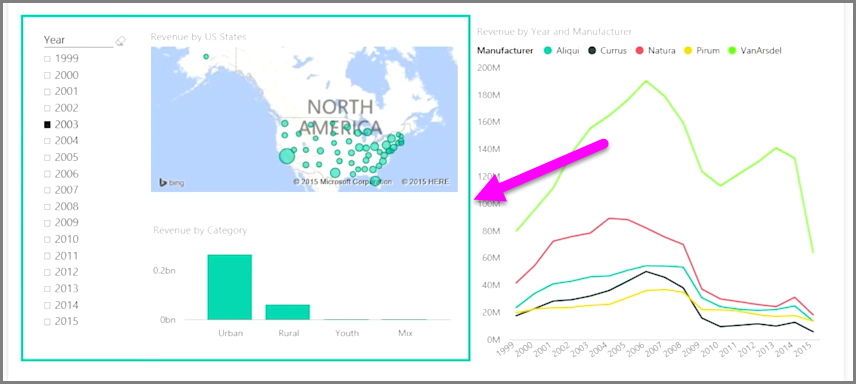

<properties
   pageTitle="群組互動視覺效果"
   description="指定儀表板上的視覺效果互動，哪些則否"
   services="powerbi"
   documentationCenter=""
   authors="davidiseminger"
   manager="mblythe"
   backup=""
   editor=""
   tags=""
   qualityFocus="no"
   qualityDate=""
   featuredVideoId="N_xYsCbyHPw"
   featuredVideoThumb=""
   courseDuration="9m"/>

<tags
   ms.service="powerbi"
   ms.devlang="NA"
   ms.topic="get-started-article"
   ms.tgt_pltfrm="NA"
   ms.workload="powerbi"
   ms.date="09/29/2016"
   ms.author="davidi"/>

# 建立複雜的互動視覺效果之間

當您有多個視覺效果相同的報表頁面上時，按一下，或使用交叉分析篩選器以選取特定的區段將會影響該頁面上的所有視覺效果。 不過，在某些情況下，您可能想配量只在特定視覺效果。 特別是當使用散佈圖等項目位置限制的特定區段的資料將會移除重要的意義。 幸運的是，Power BI Desktop 可讓您控制的互動視覺效果之間流動的方式。

若要變更的互動視覺效果，請選取 **編輯** 從視覺效果的區段 **首頁** 功能區切換 **編輯模式** 上。

> 注意︰ **編輯互動** Power BI Desktop 中的圖示已變更，因為視訊錄製。

當您選取視覺效果報表畫布上，您會看到小型的不透明 *篩選* 中將會影響每個其他 visual 右上角的圖示。 若要排除的互動視覺效果，請按一下 [ *無* 符號右上角附近 *篩選* 圖示。

在某些情況下，您可以調整視覺效果之間的篩選器互動的型別。 使用 **編輯模式** 切換上，選取您用來篩選視覺效果。 如果您可以變更的互動視覺物件，另一個類型 *圓形圖* 圖示會出現在右上角中的篩選圖示旁邊。

按一下 [ *圓形圖* 圖示，以反白顯示分割的資料。 否則，篩選的資料。 如之前，您可以按一下 *無* 圖示，以移除所有互動。

實用的設計秘訣是透明的圖形周圍彼此互動，這樣就能向使用者他們有互動式的關聯性的視覺效果。

