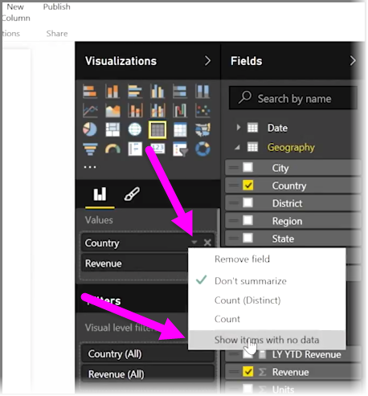
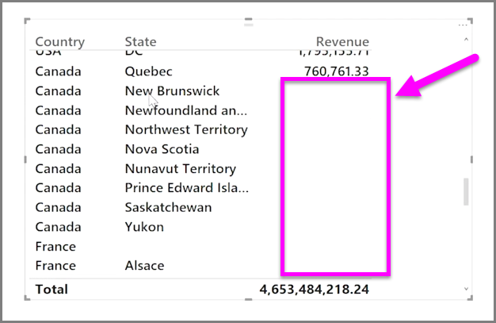

<properties
   pageTitle="顯示沒有資料的類別目錄"
   description="了解如何在視覺效果中顯示空白資料行"
   services="powerbi"
   documentationCenter=""
   authors="davidiseminger"
   manager="mblythe"
   backup=""
   editor=""
   tags=""
   qualityFocus="no"
   qualityDate=""
   featuredVideoId="rsUMVJAIH00"
   featuredVideoThumb=""
   courseDuration="3m"/>

<tags
   ms.service="powerbi"
   ms.devlang="NA"
   ms.topic="get-started-article"
   ms.tgt_pltfrm="NA"
   ms.workload="powerbi"
   ms.date="09/29/2016"
   ms.author="davidi"/>

# 顯示沒有資料的類別目錄

根據預設，資料行標題是才顯示在報表中包含的資料。 例如，如果您已顯示依國家/地區的營收，並沒有挪威中的沒有銷售額，然後挪威不會出現任何地方在您的視覺效果。

若要顯示空的類別，按一下您想要變更的欄位中向下箭號  **視覺效果** 窗格，然後選取 **顯示沒有資料的項目**。

任何空的資料行現在顯示在 visual studio 會以空白值。

一旦您選取 **顯示沒有資料的項目** 中的任何欄位 **視覺效果** ] 窗格中，它會套用至所有視覺效果] 窗格中顯示的欄位。 因此如果您加入另一個欄位，不會有資料的任何項目也會顯示，而不必再次造訪下拉式選單。

