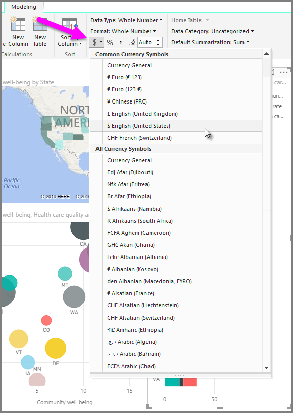
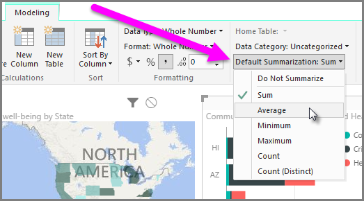

<properties
   pageTitle="摘要和類別選項"
   description="定義視覺效果如何彙總其資料"
   services="powerbi"
   documentationCenter=""
   authors="davidiseminger"
   manager="mblythe"
   backup=""
   editor=""
   tags=""
   qualityFocus="no"
   qualityDate=""
   featuredVideoId="Co2z9b-s_yM"
   featuredVideoThumb=""
   courseDuration="9m"/>

<tags
   ms.service="powerbi"
   ms.devlang="NA"
   ms.topic="get-started-article"
   ms.tgt_pltfrm="NA"
   ms.workload="powerbi"
   ms.date="09/29/2016"
   ms.author="davidi"/>

# 自訂摘要與分類選項的視覺效果

Power BI 都有自己的模型，可以指派欄位可幫助報表和視覺化並提供比較明瞭的方式呈現資料的屬性。 比方說，有時候您想要平均的數字清單，但 Power BI 自動加總清單。 透過 Power BI，您可以調整這些數字清單摘要的方式。

## 摘要的數字控制

讓我們來看一個範例中，並示範如何控制 Power BI 摘要數值資料欄位的方式。

選取在您的報表畫布上，視覺效果，然後選取中的欄位 **欄位** 窗格。  **模型** 索引標籤會出現在功能區，並顯示格式化資料，以及資料屬性的選項。

您可以選取使用的貨幣符號的類型、 藉由選取的貨幣符號] 下拉式清單，如下圖所示。

有許多不同的選項來格式化欄位。 例如，您可以變更貨幣格式的百分比。

您可以變更如何 Powwer BI 摘要資料，太。 選取 **預設摘要** 圖示以變更如何欄位的摘要，包括顯示總和、 計數或平均。

## 管理並釐清您位置的資料

繪製在地圖上的位置時，您可以進行類似的變更。 選取您的對應，然後選取 [在欄位 **欄位** 窗格，可用於 *位置* 值。 在 **模型** 索引標籤上，選取 **資料類別** ，然後選擇代表您位置的資料，從下拉式選單的分類。 例如，選取州、 郡而言或城市。

