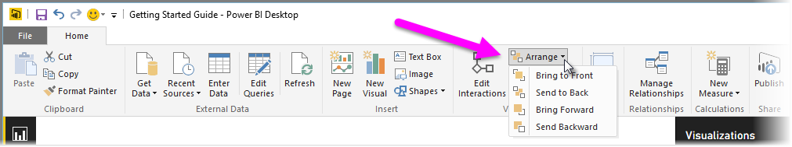

<properties
   pageTitle="疊置順序"
   description="控制您的報表項目彼此重疊的方式"
   services="powerbi"
   documentationCenter=""
   authors="davidiseminger"
   manager="mblythe"
   backup=""
   editor=""
   tags=""
   qualityFocus="no"
   qualityDate=""
   featuredVideoId="MkiiNFI2Ve0"
   courseDuration="3m"/>

<tags
   ms.service="powerbi"
   ms.devlang="NA"
   ms.topic="get-started-article"
   ms.tgt_pltfrm="NA"
   ms.workload="powerbi"
   ms.date="09/29/2016"
   ms.author="davidi"/>

# 排列報表項目的 Z 順序

當您在報表上有許多項目時，Power BI 可讓您管理如何彼此重疊。 項目層級，或在彼此之上排列通常稱為疊置順序。

若要管理報表中的項目疊置順序，選取一個項目，並使用 **排列** 按鈕 **首頁** 來變更它的疊置順序的功能區] 索引標籤。

使用中的選項 **排列** 按鈕功能表上，您可以取得您想要的方式排序您的報表上的項目。 您可以移動 visual 一層，向前或向後，或將它傳送到前面的順序的後面。

使用圖形為裝飾的背景或框線，或反白顯示個別的圖表或圖形的特定區段時，使用 [排列] 按鈕會特別有用。 您也可以使用它們來建立的背景，例如用於報表標題背景下列 light 藍色矩形。

