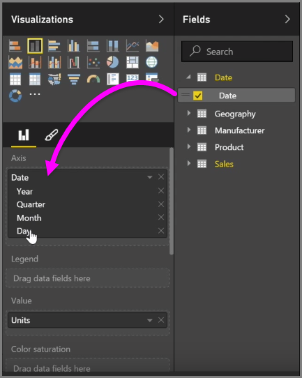
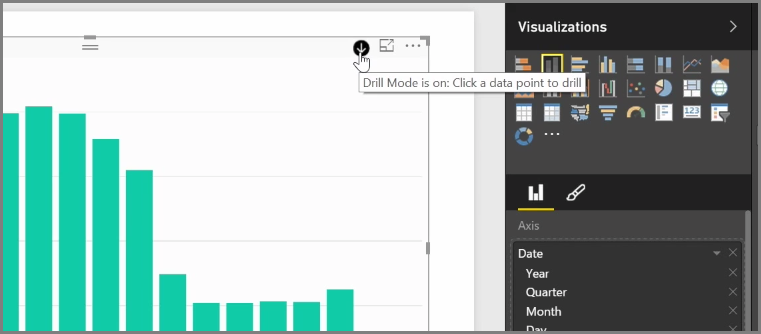
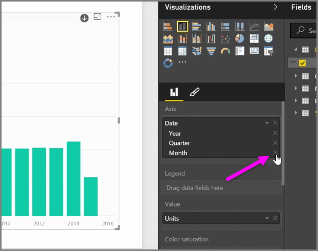
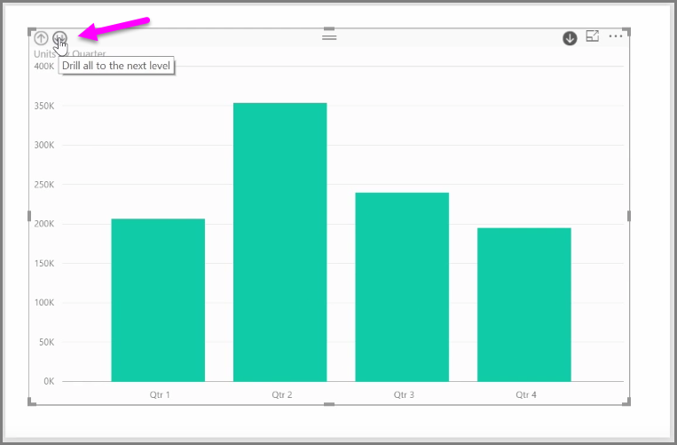

<properties
   pageTitle="視覺階層和向下鑽研"
   description="了解如何向下切入的階層，及管理共用層級的方式"
   services="powerbi"
   documentationCenter=""
   authors="davidiseminger"
   manager="mblythe"
   backup=""
   editor=""
   tags=""
   qualityFocus="no"
   qualityDate=""
   featuredVideoId="Fuhe0wo4gUI"
   courseDuration="5m"/>

<tags
   ms.service="powerbi"
   ms.devlang="NA"
   ms.topic="get-started-article"
   ms.tgt_pltfrm="NA"
   ms.workload="powerbi"
   ms.date="09/29/2016"
   ms.author="davidi"/>

# 視覺階層和向下鑽研行為

當您將加入 *日期* 欄位至視覺效果中 *軸* 欄位的值區，Power BI 會自動加入包含的時間階層 *年*, ，*季*, ，*月* 和 *天*。 如此一來，Power BI 可讓您有時間為基礎的互動，以檢視您的報表，讓使用者向下切入到這些不同的時間層級的視覺效果。

就地階層中，您可以開始向下切入時間階層。 例如，在此情況下按一下圖表向下切入，在階層中，下一個層級中的之年 *季*, ，它接著會顯示在視覺效果。

自動建立階層架構中，您也可以管理層級共用的報表可讓使用者向下切入。 若要這樣做，請在 [視覺效果] 窗格中，只要按一下您想要移除之階層旁的 X。 已刪除的層級已經移除了報表，並深入探索不會再顯示的層級。

如果您需要取得的層級之階層後，只會移除 *日期* 欄位，然後再加入一次從 **欄位** ] 窗格中，與階層會再一次為您自動建立。

有時候可能會當您不想要用於視覺階層。 您可以選取旁邊的向下箭號按鈕來控制， *日期* 欄位 （當您新增至視覺效果），然後選取 **日期** 而 **日期階層**。 會提示 Power BI 視覺效果中顯示的原始日期值。

您也可以展開目前可見，而不是選取單一季或每年的所有資料元素。 若要這樣做，請選取 *向下切入所有* 左上角的圖示方的視覺效果，也就是雙向下箭號圖示。

