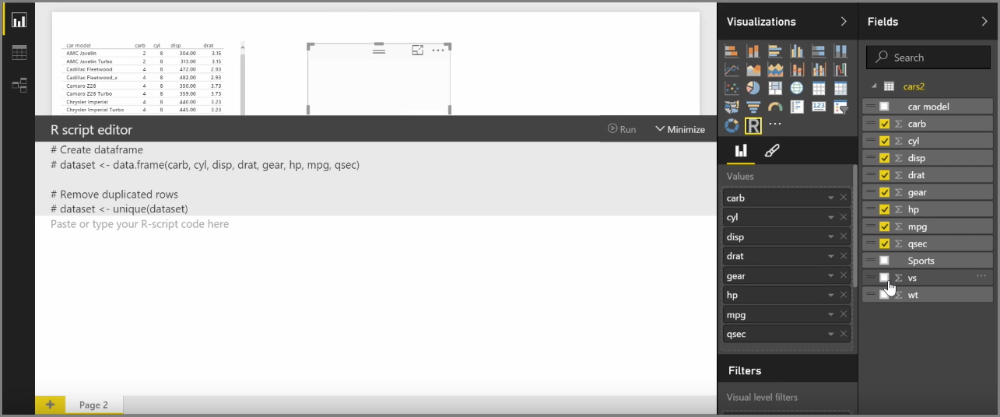
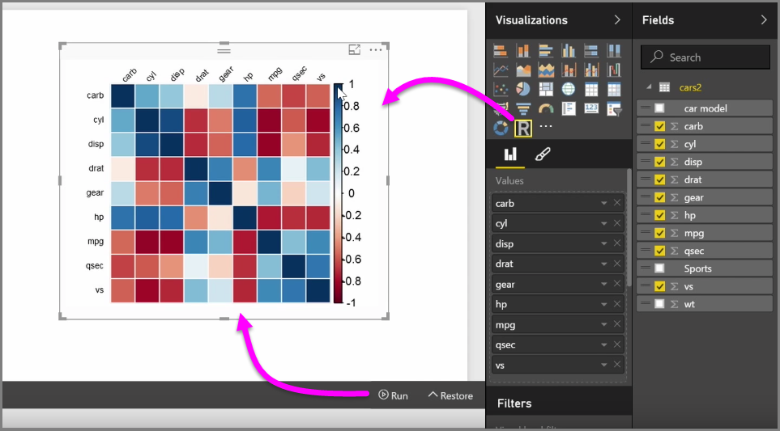

<properties
   pageTitle="Power BI Desktop 中的 R 整合"
   description="了解如何使用 Power BI Desktop 中的 R 視覺效果"
   services="powerbi"
   documentationCenter=""
   authors="davidiseminger"
   manager="mblythe"
   backup=""
   editor=""
   tags=""
   qualityFocus="no"
   qualityDate=""
   featuredVideoId="pV78e9aYHXk"
   courseDuration="9m"/>

<tags
   ms.service="powerbi"
   ms.devlang="NA"
   ms.topic="get-started-article"
   ms.tgt_pltfrm="NA"
   ms.workload="powerbi"
   ms.date="09/29/2016"
   ms.author="davidi"/>

# 在 Power BI 中的 R 視覺效果

使用 Power BI Desktop，可以執行分析與統計分析並建立吸引人的視覺效果，藉由整合與。您可以裝載在 Power BI Desktop 報表內的 R 視覺效果。

當您選取 **R visual** 圖示從 **視覺效果** ] 窗格中，Power BI 建立預留位置來裝載 R visual studio，在畫布上，然後提供 [R 指令碼編輯器，您可以使用在畫布上的權限。 您可以將欄位加入 visual，Power BI Desktop 會將它們加入至 R 指令碼編輯器窗格中。

以下什麼 Power BI 會產生在 R 指令碼編輯器中，您可以開始建立您的 R 指令碼，以產生視覺效果。 您的指令碼完成之後，選取 **執行** ，會發生下列狀況︰

1.  新增視覺效果的資料 (從 **欄位** 窗格) 會從 Power BI Desktop 傳送至本機安裝的 R
2.  R 的本機安裝上執行建立 Power BI Desktop R 指令碼編輯器中的指令碼
3.  然後 Power BI Desktop 取得視覺效果回從 R 安裝，並將它顯示在畫布上

是相當快速，而且結果會出現在 **R visual** 在畫布上的視覺效果。

您可以變更的 R 視覺方式調整的 R 指令碼，然後選取 **執行** 一次。 在下圖中，我們會變更視覺效果，顯示圓形，而不是正方形。

而且由於 R visual 就像任何其他 visual Power BI Desktop 中，您可以與它互動並以其他視覺效果的連線也在畫布上。 當您在畫布上，透過篩選或反白顯示其他視覺效果與互動 visual R 自動反應就像 visual，任何其他 Power BI 而不需要調整的 R 指令碼。

它是使用 R 的威力，Power BI Desktop 中由左至右的好方法。

## 後續步驟

**恭喜！** 完成這項工作 **視覺效果** 區段 **引導式學習** Power BI 的課程。 您可以考慮自己完善部分 Power BI 中提供的許多視覺效果中，也了解如何使用、 修改及自訂它們。 還有一個好消息︰ 視覺效果是基本上是相同的 Power BI Desktop 與 Power BI 服務，讓您了解適用於兩者。

您現在準備好前往定域機組，並取得 immersed 在 Power BI 服務中，您可以在其中 **瀏覽資料**。 如您所知的工作流程看起來像下面這樣︰

-   將資料插入 **Power BI Desktop**, ，並建立報表。
-   發行至 Power BI 服務，讓您建立新 **視覺效果** 和組建儀表板
-   
            **共用** 儀表板與其他人，特別是人員是在旅途
-   檢視並與其互動共用儀表板和報表中 **行動 Power BI** 應用程式

是否建立報表或只檢視並與之互動，現在您已經知道如何建立所有這些酷炫的視覺效果，以及如何它們連接至資料。 接下來，我們會看到這些視覺效果和動作中的報表。

下一節中見了 ！
