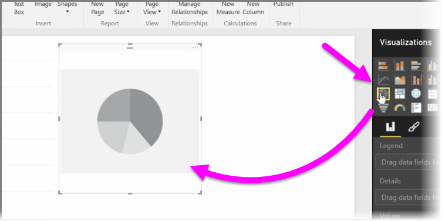
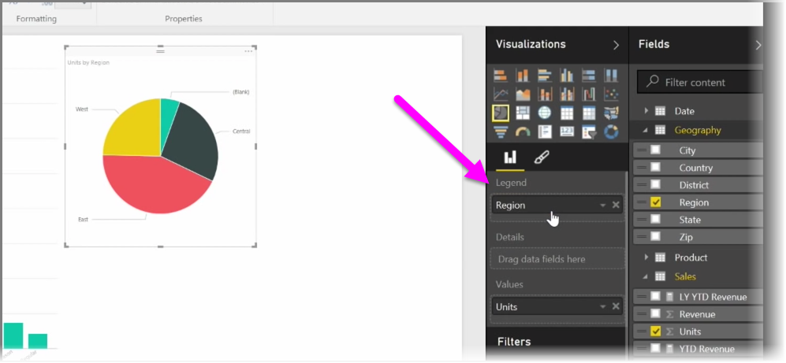
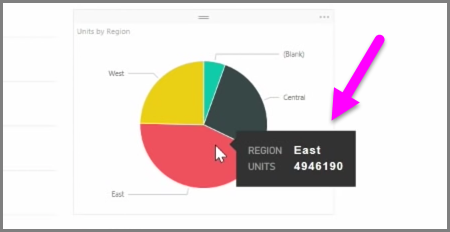
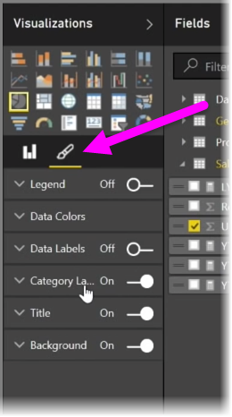

<properties
   pageTitle="建立和自訂簡單的視覺效果"
   description="自訂視覺效果的三種一般類型"
   services="powerbi"
   documentationCenter=""
   authors="davidiseminger"
   manager="mblythe"
   backup=""
   editor=""
   tags=""
   qualityFocus="no"
   qualityDate=""
   featuredVideoId="rnMyiA6Nt6Y"
   featuredVideoThumb=""
   courseDuration="8m"/>

<tags
   ms.service="powerbi"
   ms.devlang="NA"
   ms.topic="get-started-article"
   ms.tgt_pltfrm="NA"
   ms.workload="powerbi"
   ms.date="10/12/2016"
   ms.author="davidi"/>

# 建立和自訂簡單的視覺效果

在這篇文章中，您學會如何建立新的橫條圖、 圓形圖和 treemaps，以及自訂它們以符合您的報表。

有兩種不同的方式，在 Power BI Desktop 中建立新的視覺效果︰

-   您可以拖曳欄位名稱，從 **欄位** ] 窗格中，並將它們放置在報表畫布。 預設的視覺顯示資料的資料表。

    

-   您也可以按一下您要建立視覺效果中的型別 **視覺效果** 窗格。 使用此方法，預設 visual 會是空白的預留位置，類似的 visual 您選取的型別。

    

一旦您建立圖表、 地圖或圖表時，就可以開始資料欄位拖曳到底部 **視覺化** 窗格來建立與組織 visual studio。 可用的欄位會根據您選取的視覺效果類型而有所不同。 拖放資料欄位，您的視覺效果會自動更新以反映變更。

您可以選取它，然後拖曳控點，或縮小調整您的視覺效果。 您也可以移動的視覺任何地方在畫布上按一下並拖曳它。 如果您想要的視覺效果的不同類型之間轉換時，選取您想要變更，並只選取不同的視覺效果中圖示的視覺 **視覺化** 窗格。 Power BI 會嘗試儘可能密集地將選取的欄位轉換成新的視覺效果類型。

當您暫留在組件的視覺效果，您將會包含有關該區段，例如，標籤和總計值的詳細資料的工具提示。

選取 **小畫家** 圖示 **視覺效果** ] 窗格進行色彩變更為視覺效果，例如背景對齊、 標題文字和資料的色彩。

表面變更 visual studio 的可用選項視 visual 您所選取的類型而有所不同。
