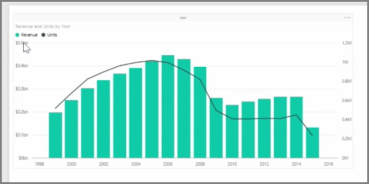
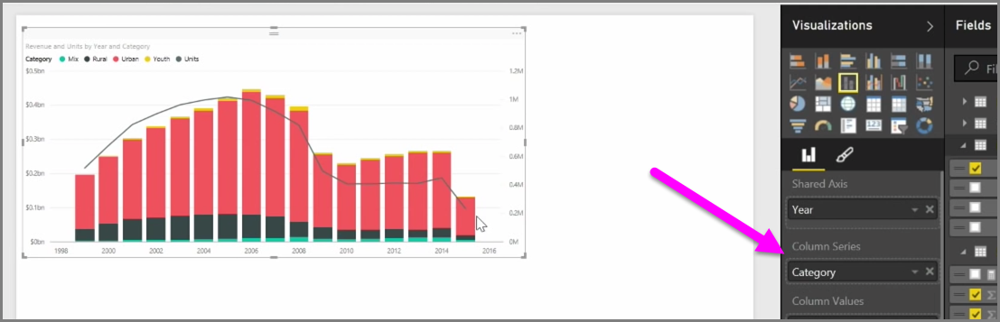

<properties
   pageTitle="組合圖"
   description="建立第一個的組合圖"
   services="powerbi"
   documentationCenter=""
   authors="davidiseminger"
   manager="mblythe"
   backup=""
   editor=""
   tags=""
   qualityFocus="no"
   qualityDate=""
   featuredVideoId="lnv66cTZ5ho"
   featuredVideoThumb=""
   courseDuration="5m"/>

<tags
   ms.service="powerbi"
   ms.devlang="NA"
   ms.topic="get-started-article"
   ms.tgt_pltfrm="NA"
   ms.workload="powerbi"
   ms.date="09/29/2016"
   ms.author="davidi"/>

# 如何使用組合圖

當您想要以視覺化方式檢視兩個量值有非常不同的縮放比例，營收和單位，例如 **組合式圖表** ，顯示一條線並具有不同的軸刻度的列會很有幫助。 Power BI 支援許多不同類型的組合圖，根據預設，包括常用 **列** 和 **堆疊中的資料行** 圖表。

當您建立為組合式圖表時，您會有的欄位 **共用軸** （x 軸），然後您兩個欄位值，在此案例中的資料行和行。 兩個 y 軸圖例會出現在左邊或右邊視覺效果。

也可以依類別、 分割每個資料行拖曳到資料行系列中的欄位 [視覺效果] 窗格的類別。 當您這麼做，每個橫條的色彩為按比例會根據每個分類內的值。

組合圖是以視覺化方式檢視有非常不同的多個量值的有效方式調整在單一的視覺效果。
