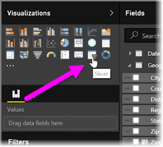
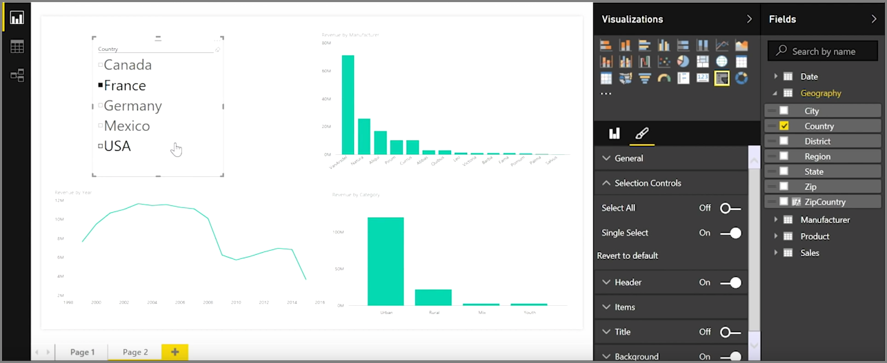
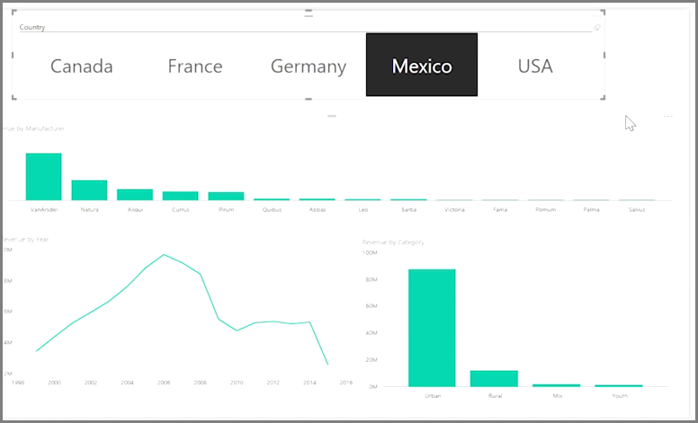

<properties
   pageTitle="交叉分析篩選器"
   description="使用交叉分析篩選器，以視覺化方式分割您的資料"
   services="powerbi"
   documentationCenter=""
   authors="davidiseminger"
   manager="mblythe"
   backup=""
   editor=""
   tags=""
   qualityFocus="no"
   qualityDate=""
   featuredVideoId="7rrvpa6KUto"
   featuredVideoThumb=""
   courseDuration="7m"/>

<tags
   ms.service="powerbi"
   ms.devlang="NA"
   ms.topic="get-started-article"
   ms.tgt_pltfrm="NA"
   ms.workload="powerbi"
   ms.date="09/29/2016"
   ms.author="davidi"/>

# 建立和格式化交叉分析篩選器

交叉分析篩選器是報表的其中一種最強大的視覺效果，特別忙碌的一部分。 A **交叉分析篩選器** 是在畫布上視覺化篩選 **Power BI Desktop** ，可讓任何人查看報表區段的資料依特定的值，例如依年份或地理位置。

若要將交叉分析篩選器加入至報表中，選取 **交叉分析篩選器** 從 **視覺效果** 窗格。

將您想要配量並將它放頂端的交叉分析篩選器預留位置所用的欄位。 視覺效果會變成一份具有核取方塊的項目。 這些項目是篩選器-選取其中一個區段，並在相同的報表] 頁面上的所有視覺效果旁邊的方塊已經過篩選，或 *切割*, ，依您的選取範圍。

有幾個不同的選項可用來格式化您的交叉分析篩選器。 您可以將它設定為接受多個輸入，或切換 **單一選取** 模式，才能使用一次。 您也可以加入 **全選** 選項您交叉分析篩選器的項目，這是很有幫助，就是特別長的清單。 您交叉分析篩選器的方向變更為水平、 垂直預設，它會變成選取列，而不是一份檢查清單。

