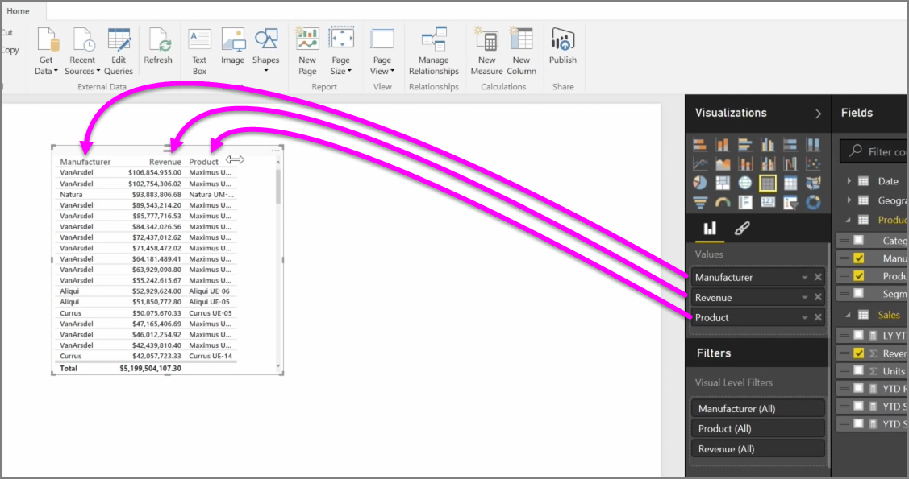

<properties
   pageTitle="矩陣和資料表"
   description="矩陣或資料表有時候是您需要的視覺效果"
   services="powerbi"
   documentationCenter=""
   authors="davidiseminger"
   manager="mblythe"
   backup=""
   editor=""
   tags=""
   qualityFocus="no"
   qualityDate=""
   featuredVideoId="9xkErXYZQkU"
   featuredVideoThumb=""
   courseDuration="8m"/>

<tags
   ms.service="powerbi"
   ms.devlang="NA"
   ms.topic="get-started-article"
   ms.tgt_pltfrm="NA"
   ms.workload="powerbi"
   ms.date="09/29/2016"
   ms.author="davidi"/>

# 如何使用資料表和矩陣

除了豐富的圖表，Power BI Desktop 還支援多個表格式視覺效果。 事實上，當您抓取類別欄位或文字欄位，並將它拖曳到報表畫布上，預設會取得資料表的結果。 您可以向上或向下捲動到資料表，和一開始它將會依字母順序排序。

如果您有數字的資訊，在資料表中，例如營收，總計的總和會出現在底部。 您可以手動排序每個資料行的標頭來切換遞增或遞減順序，即可。 如果資料行不是寬度不足以顯示所有內容，按一下並拖曳側邊的標頭將它展開。

中的欄位順序 *值* 貯體中 **視覺效果** 窗格決定資料表中出現的順序。

A **矩陣** 類似於資料表，但有不同的類別上的資料行和資料列的標頭。 在使用資料表時，數字資訊將會自動總計下方以及右側的矩陣。

有許多表面的選項適用於矩陣，例如自動調整大小資料行，切換資料列和資料行總計、 設定色彩等等。 當建立矩陣，請確定您類別的資料 （非數字資料） 左邊的矩陣中，而且以確保水平捲軸右邊的數值檔案隨即出現，而且以確定該捲動行為可正常運作。
