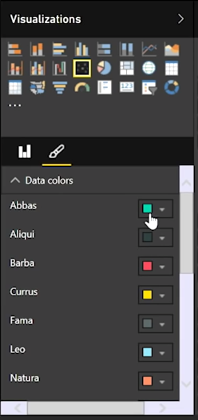

<properties
   pageTitle="散佈圖"
   description="長時間 live 泡泡-作用中的散佈圖，請參閱"
   services="powerbi"
   documentationCenter=""
   authors="davidiseminger"
   manager="mblythe"
   backup=""
   editor=""
   tags=""
   qualityFocus="no"
   qualityDate=""
   featuredVideoId="xLQ_ZVScI60"
   featuredVideoThumb=""
   courseDuration="9m"/>

<tags
   ms.service="powerbi"
   ms.devlang="NA"
   ms.topic="get-started-article"
   ms.tgt_pltfrm="NA"
   ms.workload="powerbi"
   ms.date="09/29/2016"
   ms.author="davidi"/>

# 如何使用散佈圖

如果您想要比較兩個不同的量值，例如單位銷售與營收，若要使用一般的視覺效果就是散佈圖。

若要建立空白的圖表，請選取 **散佈圖** 從 **視覺效果** 窗格。 您想要比較的兩個欄位拖放 **欄位** 窗格 *X 軸* 和 *Y 軸* 選項值區。 此時，散佈圖可能有小泡泡視覺效果的中心-您需要的量值加入至 *詳細資料* 值區，以指出您想要分割您的資料的方式。 比方說，如果要比較的項目業績和營收，或許您想要依類別或製造商或每月的銷售資料分割。

加入額外的欄位，來 *圖例* bucket color-codes 您泡泡根據欄位的值。 您也可以加入欄位以 *大小* 更改泡泡大小根據該值的值區。

散佈圖有許多視覺格式設定選項，例如開啟每個泡泡，彩色的外框和切換個別的標籤。 您可以變更其他圖表類型，以及為資料的色彩。

您可以建立您的泡泡圖的動畫變更圖表的一段時間加入以時間為基礎的欄位來 *播放軸* 值區。 若要查看追蹤，其路徑動畫期間按一下泡泡。

>注意︰ 請記住，是否您只會看到一個泡泡散佈圖中，這是因為 Power BI 彙總資料，這是預設行為。 新增類別 *詳細資料* 貯體，在 **視覺效果** ] 窗格中，以取得更多的泡泡。
