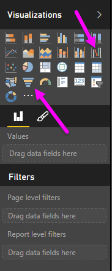
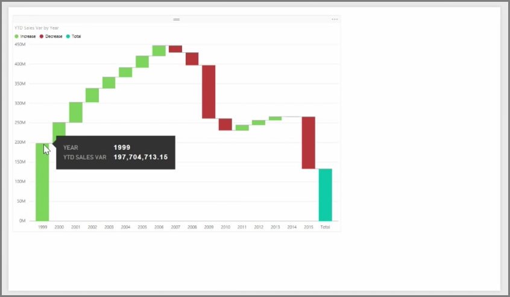

<properties
   pageTitle="瀑布和漏斗圖"
   description="深入了解進階漏斗圖和瀑布圖"
   services="powerbi"
   documentationCenter=""
   authors="davidiseminger"
   manager="mblythe"
   backup=""
   editor=""
   tags=""
   qualityFocus="no"
   qualityDate=""
   featuredVideoId="maTzOJSRB3g"
   featuredVideoThumb=""
   courseDuration="5m"/>

<tags
   ms.service="powerbi"
   ms.devlang="NA"
   ms.topic="get-started-article"
   ms.tgt_pltfrm="NA"
   ms.workload="powerbi"
   ms.date="09/29/2016"
   ms.author="davidi"/>

# 如何使用瀑布式 」 與 「 漏斗圖

瀑布和漏斗圖是兩個更有趣 （和或許不常見） 標準視覺效果隨附的 Power BI。 若要建立這兩種類型的空白圖表，選取 [從] 圖示 **視覺效果** 窗格。

            **瀑布圖** 通常用來顯示特定值的變化，經過一段時間。

瀑布只能有兩個值區選項︰ *類別* 和 *Y 軸*。 將以時間為基礎的欄位拖曳例如 *年* 至 *類別* 值區，以及您想要追蹤的值 *Y 軸* 值區。 時間週期已經增加值都會以綠色顯示根據預設，雖然期間，以降低值將以紅色顯示。

            **漏斗圖** 通常用來顯示特定的處理程序，例如銷售的管線或網站維繫的變化。

同時 **瀑布** 和 **漏斗** 可以切割和以視覺化方式自訂圖表。
