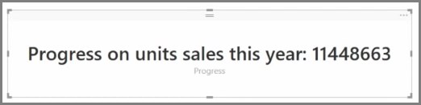

<properties
   pageTitle="量測計和單一數字的卡片"
   description="磁碟機快速的儀表板 insights 與量測計和數字"
   services="powerbi"
   documentationCenter=""
   authors="davidiseminger"
   manager="mblythe"
   backup=""
   editor=""
   tags=""
   qualityFocus="no"
   qualityDate=""
   featuredVideoId="xmja6EpqaO0"   
   featuredVideoThumb=""
   courseDuration="7m"/>

<tags
   ms.service="powerbi"
   ms.devlang="NA"
   ms.topic="get-started-article"
   ms.tgt_pltfrm="NA"
   ms.workload="powerbi"
   ms.date="09/29/2016"
   ms.author="davidi"/>

# 如何使用量測計和單一數字的卡片

一般而言，視覺效果用來比較兩個或多個不同的值。 不過，某些情況下建立報表，您可能要追蹤一段時間是只是單一關鍵效能指標 (KPI) 或公制。 在 Power BI Desktop 執行此動作的方法是使用 **量測計** 或 **單一數字** 卡 visual。 若要建立這兩種類型的空白圖表，選取 [從] 圖示 **視覺效果** 窗格。

當您要建置的儀表板，而且想要顯示特定目標的進度，量測計會特別有用。 若要建立量測計，選取 [從] 圖示 **視覺效果** ] 窗格中，然後拖曳您想要追蹤的欄位 *值* 值區。

量測計會出現在 50%或雙預設 *值*, ，而且有兩種方式可以調整此設定。 若要以動態方式設定值，將欄位拖曳至 *最小值*, ，*最大*, ，和 *目標* 值的值區。 或者，使用 visual 的格式化選項，以手動方式自訂您的量測計的範圍。

卡片視覺效果只是要顯示欄位的數值表示法。 預設卡片視覺效果所使用的顯示單位越短，例如顯示 「 $5bn 」 而不是"$5,000,000,000 」。 使用 visual 的格式選項來變更所使用的單位，或完全停用。

一個有趣的應用程式的卡是將它們顯示您已與文字串連的自訂量值。 先前範例中，使用您的卡片可能包括進階的 DAX 函數和像是，顯示在自訂量值 」 本年度的總收益: $5bn 」 或 「 銷售單位今年的進度:"，然後加入代表進度的數字。

