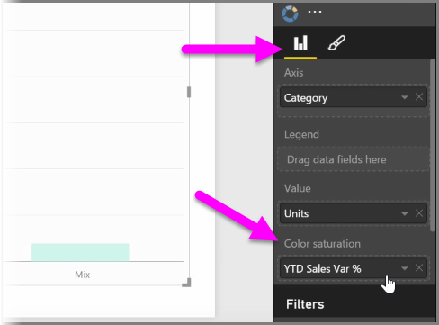
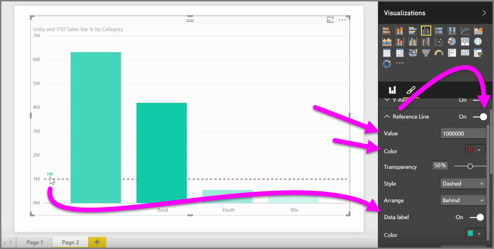

<properties
   pageTitle="修改圖表和視覺效果中的色彩"
   description="色彩色彩、 網底和調整您 visual 的世界"
   services="powerbi"
   documentationCenter=""
   authors="davidiseminger"
   manager="mblythe"
   backup=""
   editor=""
   tags=""
   qualityFocus="no"
   qualityDate=""
   featuredVideoId="oNME83EAvLw"   
   featuredVideoThumb=""
   courseDuration="5m"/>

<tags
   ms.service="powerbi"
   ms.devlang="NA"
   ms.topic="get-started-article"
   ms.tgt_pltfrm="NA"
   ms.workload="powerbi"
   ms.date="09/29/2016"
   ms.author="davidi"/>

# 如何修改圖表和視覺效果中的色彩

您可能想要修改圖表] 或 [視覺效果中使用的色彩，有許多次。 Power BI 可讓您充分掌控色彩的顯示方式。 若要開始，選取 [視覺效果然後中的 **視覺效果** ] 窗格中，按一下 [ **小畫家** 圖示。

有許多選項來變更色彩或視覺效果的格式設定。 您可以選取旁邊的色彩選擇器，以變更視覺項目的所有橫條的色彩 **預設色彩**, ，然後選取您所選擇的色彩。

您也可以變更每個列 （或其他項目，視您選取的視覺類型而定） 的色彩切換 **全部顯示** 的滑桿。 當您這樣做時，色彩選取器會顯示每個項目。

您也可以變更基礎值或量值的色彩。 若要這樣做，請拖曳到欄位 **色彩飽和度** 視覺效果] 窗格中的值區 (請注意，這是用於 **欄位以及** 區段中，不 **小畫家** 一節)。

此外，您可以變更小數位數和資料元素的色彩填滿時所使用的色彩。 您也可以選取叉開的小數位數切換 Diverging 滑桿，以讓之間三種色彩的色階。 您也可以設定和 *最小值*, ，*Center*, ，和 *Maxumum* 您在圖表上顯示的值。

若要建立規則，例如，特定色彩與以下的值設定高於零值到另一種色彩，您也可以使用這些值。

另一個好用的工具使用的色彩會設定 *參考行*。 您可以參考列的值設定、 設定其色彩，以及甚至需要包含標籤參考線。

最後，您可以建立個別的視覺效果，框線，而且如同其他控制項，您可以指定也該框線的色彩。
