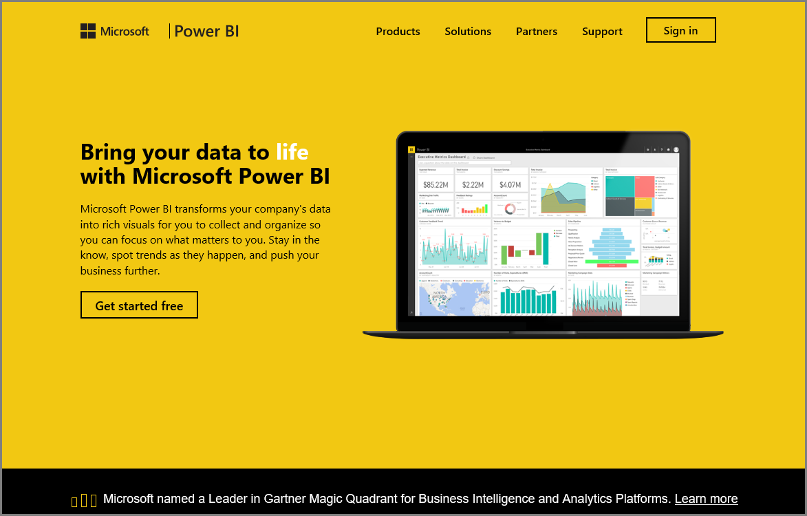

<properties
   pageTitle="Power BI 服務簡介"
   description="瀏覽資料並與 Power BI 服務的共同作業"
   services="powerbi"
   documentationCenter=""
   authors="davidiseminger"
   manager="mblythe"
   backup=""
   editor=""
   tags=""
   qualityFocus="no"
   qualityDate=""
   featuredVideoId="Wz9f7VjXGdE"
   featuredVideoThumb=""
   courseDuration="2m"/>

<tags
   ms.service="powerbi"
   ms.devlang="NA"
   ms.topic="get-started-article"
   ms.tgt_pltfrm="NA"
   ms.workload="powerbi"
   ms.date="09/29/2016"
   ms.author="davidi"/>

# 瀏覽資料

歡迎使用 **瀏覽資料** 區段 **引導式學習** Power BI 的課程。 既然您了解 Power BI Desktop，以及如何取得和視覺化資料，就可以準備好來探索 Power BI 服務中的資料。

有各種用途，在這一節，了解和令人讚嘆的互動和分享 Power BI 搭配這裡。 因此做好更吸引人且有趣的區段。

## Power BI 服務簡介

*了解 Power BI 服務為您的組織*

Power BI 服務是自然延伸 **Power BI Desktop**, ，和其功能包括上傳報表、 建立儀表板，並詢問您的資料使用自然語言問題。 您可以使用服務來設定資料重新整理時間、 共用資料，您的組織，以及建立自訂的 service pack。

在下列主題中，我們將探索 Power BI 服務，並顯示它如何開啟您的商務智慧資料到資料見解和決策驅動的共同作業環境。

