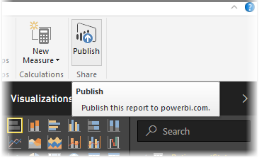

<properties
   pageTitle="發行 Power BI Desktop 報表"
   description="輕鬆地取得您的 Power BI Desktop 報表服務"
   services="powerbi"
   documentationCenter=""
   authors="davidiseminger"
   manager="mblythe"
   backup=""
   editor=""
   tags=""
   qualityFocus="no"
   qualityDate=""
   featuredVideoId="i0zAvCRLScI"
   featuredVideoThumb=""
   courseDuration="2m"/>

<tags
   ms.service="powerbi"
   ms.devlang="NA"
   ms.topic="get-started-article"
   ms.tgt_pltfrm="NA"
   ms.workload="powerbi"
   ms.date="09/29/2016"
   ms.author="davidi"/>

# 將報表發行從 Power BI Desktop 至 Power BI 服務

您的報表發行至 Power BI 服務既快速又簡單。

當您完成撰寫您的報表中 **Power BI Desktop**, ，只選取 **發行** 按鈕 **首頁** 在 Power BI Desktop 和程序] 索引標籤開始。

您的報表和資料，包括視覺效果、 查詢和自訂量值會封裝在一起，並上傳至 Power BI 服務。

>注意︰ 通常會做為 Power BI Desktop 報表，請參閱 **.pbix** 檔案，它們會獲得 Windows 中的擴充功能。

上傳完成之後，對話方塊會告訴您發行程序成功，會在該對話方塊，您直接帶到您在 Power BI 服務，在網頁瀏覽器中的報表中提供的連結。

然後就這麼容易-很容易就能將報表發行從 Power BI Desktop 至 Power BI 服務。

