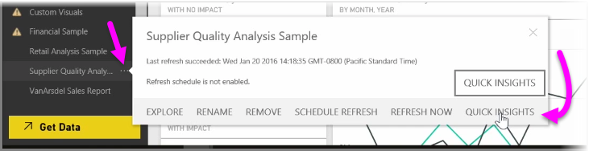
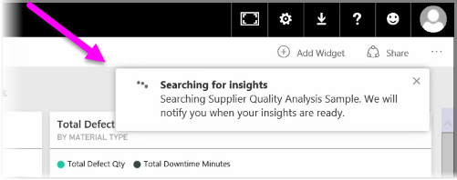
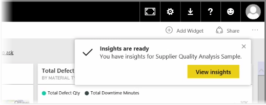
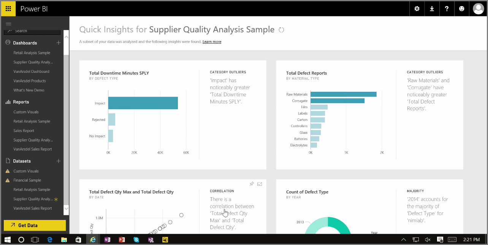

<properties
   pageTitle="在 Power BI 中的即時掌握所有資訊"
   description="了解如何取得快速與視覺效果中按幾下"
   services="powerbi"
   documentationCenter=""
   authors="davidiseminger"
   manager="mblythe"
   backup=""
   editor=""
   tags=""
   qualityFocus="no"
   qualityDate=""
   featuredVideoId="bk_TSwIzVnI"
   featuredVideoThumb=""
   courseDuration="5m"/>

<tags
   ms.service="powerbi"
   ms.devlang="NA"
   ms.topic="get-started-article"
   ms.tgt_pltfrm="NA"
   ms.workload="powerbi"
   ms.date="09/29/2016"
   ms.author="davidi"/>

# 使用 Power BI 服務中的即時掌握所有資訊

當您正在使用儀表板、 報表或 Power BI 服務中的資料集時，您可以尋找快速了解資料的 Power BI。 在 Power BI 中從 **資料集** 一節中的左窗格中選取 *橢圓形* （三個點） 旁邊您感興趣的資料集。 選項的功能表隨即出現，並在最右邊，您會看到一個名為選項 **即時掌握所有資訊**。

當您選取即時掌握所有資訊時，Power BI 會執行某些機器學習和搜尋資料，分析該查詢以尋找即時掌握所有資訊。 您會看到右上角中的通知，指出 Power BI 服務的努力尋找見解。

15 秒約後，請通知變更讓您了解 Power BI 找到一些見解。

當您選取 **檢視 insights** 按鈕會顯示一頁顯示 insights 發現，類似您在下圖中看到該 Power BI 的視覺效果，通知。 有一大堆見解，您可以向下捲動頁面，即可檢視和考量。

您可以像任何其他 visual 互動視覺效果中即時掌握所有資訊] 頁面上，並且您也可以釘選儀表板可能遇到的其中任何或進一步篩選一或多個這些 （或是您越多），來搜尋可能會等候您的好奇心，以發現的其他見解。

使用 **快速 Insights**, ，您可以讓 Power BI 執行工作，在您的資料中找出極端值和趨勢，然後在您的儀表板中，使用這些結果，或進一步改善並加以篩選來取得對您而言最重要的深入資訊。
