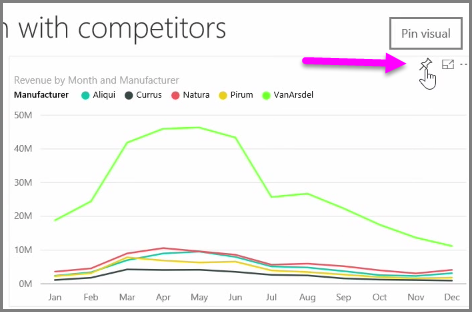
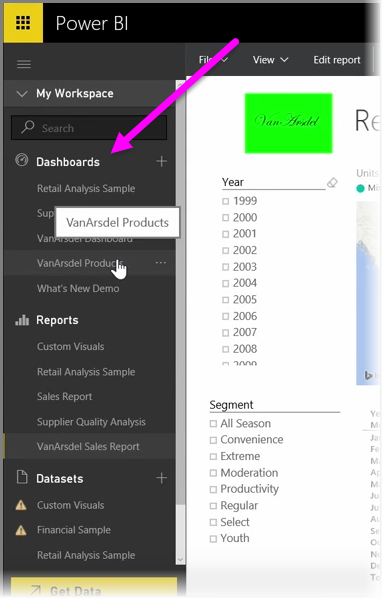

<properties
   pageTitle="建立及設定儀表板"
   description="自訂 Power bi 儀表板"
   services="powerbi"
   documentationCenter=""
   authors="davidiseminger"
   manager="mblythe"
   backup=""
   editor=""
   tags=""
   qualityFocus="no"
   qualityDate=""
   featuredVideoId="lJKgWnvl6bQ"
   featuredVideoThumb=""
   courseDuration="6m"/>

<tags
   ms.service="powerbi"
   ms.devlang="NA"
   ms.topic="get-started-article"
   ms.tgt_pltfrm="NA"
   ms.workload="powerbi"
   ms.date="09/29/2016"
   ms.author="davidi"/>

# 建立及設定儀表板

            **儀表板** Power BI 中都是一頁的集合都從建立 Power BI 服務中的視覺效果。 建立儀表板由 **固定** 視覺效果，從您撰寫和使用 Power BI Desktop 發行或視覺效果 Power BI 中建立服務本身的報表。 
            **釘選** 視覺效果的儀表板，很像固定在牆上的圖片給 corkboard-就會那里視覺化，在特定的位置，讓其他人看見。 若要釘選視覺效果，請開啟它的報表上的 Power BI 服務。 將滑鼠停留在您想要釘選，選取 [視覺效果 **pin** 圖示。

對話方塊隨即出現，其中您選取視覺效果的目的地儀表板，從下拉式功能表中，或者您可以建立新的儀表板。 您也可以取得預覽的儀表板的釘選的視覺外觀。 您可以釘選視覺效果從多個報表和網頁的單一儀表板，可讓您深入探討的單一頁面中結合不同資料集和來源。

在 **儀表板**, ，您可以新增任何類型的視覺效果包括圖表、 地圖、 影像和圖形，由 「 固定 」 它們。 一旦視覺效果已釘選到儀表板，它會呼叫 **磚**。

儀表板，包括任何新的區段中顯示儀表板左邊 Power BI 服務。 從清單檢視中選取儀表板。

不過，您想要您可以變更儀表板上的視覺效果的版面配置。 若要調整並排顯示，請拖曳其控點，或縮小。 若要移動的並排顯示，只要按一下，然後將它拖曳到不同的位置在儀表板。 將滑鼠停留在方塊中，按一下 [ **鉛筆** 圖示以開啟 **並排顯示詳細資料**, ，您可以在其中變更 **標題** 或 **副標題**。

按一下儀表板] 磚來檢視的報表的來源。 這可讓您快速檢視下方視覺效果的基礎資料。 您也可以藉由變更該連結 **組自訂連結** 欄位 **並排顯示詳細資料**。

您可以釘選到另一個，例如，如果您有儀表板的集合，而且想要建立一個摘要面板的並排顯示一個儀表板。 處理方式相同︰ 停留在該方塊，然後選取 **釘選圖示**。 儀表板也可輕鬆建立，並將變更。 而且您可以自訂它們進行完全什麼它應該會顯示一個頁面儀表板。
