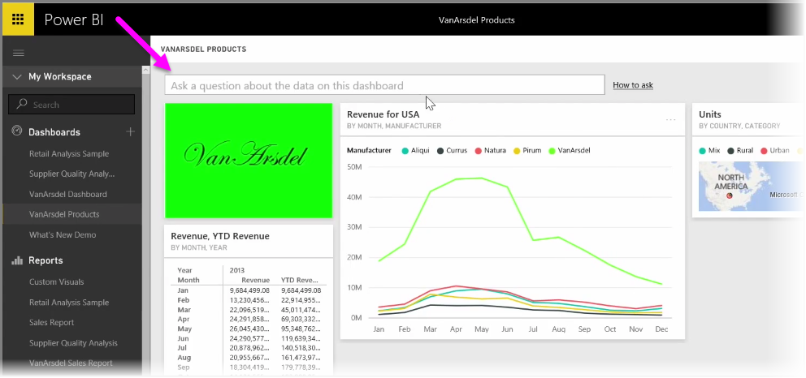

<properties
   pageTitle="提出您的資料，使用自然語言問題"
   description="若要取得輕量快速與視覺效果使用問與答"
   services="powerbi"
   documentationCenter=""
   authors="davidiseminger"
   manager="mblythe"
   backup=""
   editor=""
   tags=""
   qualityFocus="no"
   qualityDate=""
   featuredVideoId="qMf7OLJfCz8"
   featuredVideoThumb=""
   courseDuration="9m"/>

<tags
   ms.service="powerbi"
   ms.devlang="NA"
   ms.topic="get-started-article"
   ms.tgt_pltfrm="NA"
   ms.workload="powerbi"
   ms.date="09/29/2016"
   ms.author="davidi"/>

# 提出您的資料，使用自然語言問題

Power BI 隨附功能強大的語言辨識引擎，可讓您要求使用電子資料的問題以及相關問題。 因此以及建置報表和使用 Power BI 視覺效果，您可以建立圖表和圖形只要詢問簡單的問題。

若要提出您的資料的問題，Power BI 中開啟儀表板和螢幕的頂端，您會看到輸入的方塊中，您可以在其中要求顯示資料的相關問題。 這項功能有時稱為 *的問題與解答*, ，或頻率，這項功能就稱為 **問與答**。

當您按一下方塊中時，Power BI 會顯示與一些建議的詞彙，根據您的資料，例如 「 年初迄今營收 」 的提示。 您可以按一下建議的詞彙，以查看結果，通常顯示為簡單的資料表或卡片。 當您選取其中一個建議的片語時，Power BI 會自動建立根據即時的您選取視覺效果。

您也可以要求使用自然語言，例如 「 那是我們營收去年？ 」 或者 「 哪些產品銷售量最高 2014 年 3 月中嗎？ 」。 Power BI 會顯示您的問題，其解譯，並選擇最佳的視覺表示回應類型。 就像任何其他 visual Power BI 中，您可以 **pin** 以您選擇所選取的儀表板 **pin** 圖示。

在任何時間點過程中，您可以編輯建立您的自然語言問題或片語的視覺效果。 只要使用 **視覺效果** 和 **欄位** 螢幕右邊的窗格。 像任何其他 visual Power BI 中，您可以修改配置、 調整篩選器，並變更欄位輸入。

若要儲存視覺效果的儀表板，一旦您已建立完美的視覺效果，只要選取 **pin** [問題] 輸入方塊旁邊的圖示。
