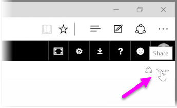
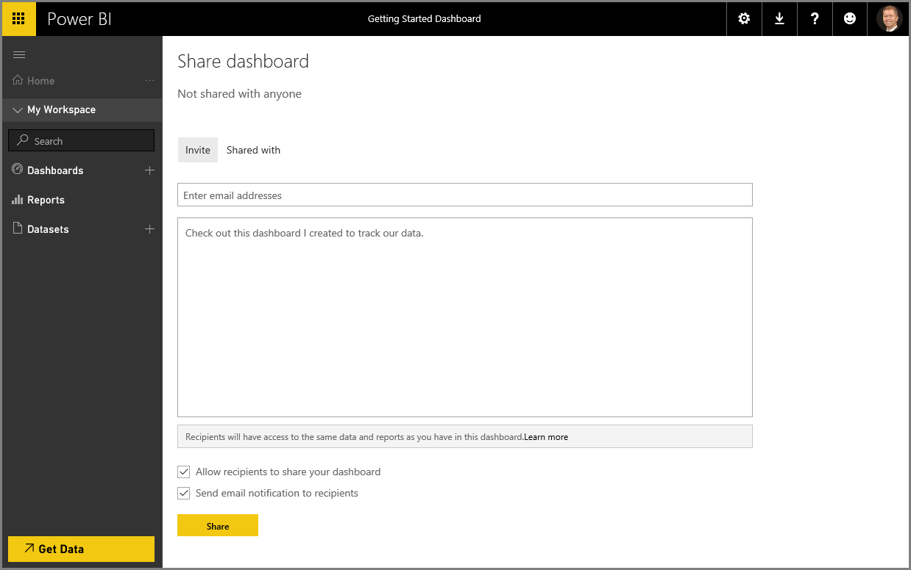

<properties
   pageTitle="與您的組織共用儀表板"
   description="讓其他人輕鬆地看到您令人讚嘆的儀表板"
   services="powerbi"
   documentationCenter=""
   authors="davidiseminger"
   manager="mblythe"
   backup=""
   editor=""
   tags=""
   qualityFocus="no"
   qualityDate=""
   featuredVideoId="0tUwn8DHo3s"
   featuredVideoThumb=""
   courseDuration="7m"/>

<tags
   ms.service="powerbi"
   ms.devlang="NA"
   ms.topic="get-started-article"
   ms.tgt_pltfrm="NA"
   ms.workload="powerbi"
   ms.date="09/29/2016"
   ms.author="davidi"/>

# 與您的組織共用儀表板

我們已經知道如何 Power BI 可協助您尋找資料、 收集在資料模型中，並建立報表和視覺效果上使用該資料。 我們也已了解如何將這些報表發行至 Power BI 服務，和建立儀表板，幫助您監視您經過一段時間的資訊。 當您與其他人共用您的見解貴組織中，所有這些功能是更強大。 幸運的是，共用您的儀表板很簡單。

若要共用的儀表板，在 Power BI 服務中開啟它，然後選取 **共用** 右上角中的連結。

 **共用儀表板** 頁面出現時，您可以在其中選取 **邀請** 區段，然後填寫 **電子郵件地址** 輸入的方塊，以您想要授與您的儀表板的存取權的人員。 Power BI 會檢查電子郵件地址，當您輸入與您的網域和 Office 365 網域帳戶並盡可能自動完成。 也可以複製並貼入此方塊中，電子郵件地址或一次連線到多人使用的通訊群組清單、 安全性群組或 Office 365 群組。

如果您選取此核取方塊 （靠近底部） *傳送電子郵件通知給收件者*, ，則您的收件者會收到一封電子郵件，讓他們知道您共用儀表板，使用，其中包括與儀表板的連結。 您可以新增附註，他們會接收或傳送的附註 （它是直接在下列方塊中，您會輸入他們的電子郵件地址），建立該 Power BI 的電子郵件。

> 附註︰ 如果沒有現有的 Power BI 帳戶的收件者會被引導完成註冊程序之前檢視儀表板。

與您共用儀表板的任何人都可以看到，並與其互動一樣。 不過，有 *唯讀* 報表基礎的存取權，以及擁有 *沒有存取* 基礎的資料集。

您也可以選取 **共用與** 共用儀表板頁面，以查看與您先前已經共用此儀表板的人員] 索引標籤。
