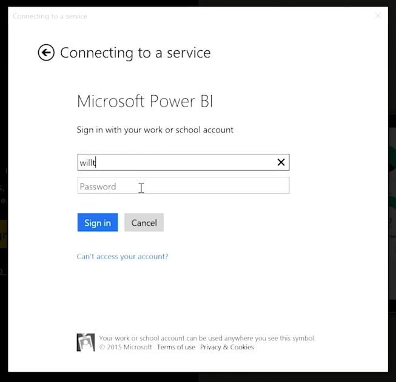

<properties
   pageTitle="介紹 Power BI 行動"
   description="Power BI 行動應用程式幾乎任何裝置上顯示 insights"
   services="powerbi"
   documentationCenter=""
   authors="davidiseminger"
   manager="mblythe"
   backup=""
   editor=""
   tags=""
   qualityFocus="no"
   qualityDate=""
   featuredVideoId="Sfb_vDIb6Dc"
   featuredVideoThumb=""
   courseDuration="7m"/>

<tags
   ms.service="powerbi"
   ms.devlang="NA"
   ms.topic="get-started-article"
   ms.tgt_pltfrm="NA"
   ms.workload="powerbi"
   ms.date="09/29/2016"
   ms.author="davidi"/>

# 介紹 Power BI 行動

如果您想要追蹤的資料移動時，您可以使用 Power BI 行動應用程式的其中一個用於 iOS、 Android 和 Windows 裝置。

當使用 Power BI 應用程式，第一次登入您的帳戶使用您的 Power BI 服務帳戶資訊。 在 Windows 行動裝置上 （在此情況下平板電腦），登入所示，下例所示。

您會看到的第一個畫面會顯示所有您具有存取權，包括報表、 儀表板，以及群組的內容。 也有一些您可用來激發靈感，或只想查看 Power BI 功能的範例儀表板。 應用程式設計為易於︰ 點選儀表板上或全螢幕，並使用您的手指捲動檢視報表。

您可以開啟任何儀表板上點選。 在儀表板中，您可以將重點放在它以大圖示檢視儀表板] 磚上點選。

您也可以加上註解依序點選您發現任何深入解析 **註解** 在右上角的按鈕。 這可讓您在具有焦點的方塊，使其反白顯示感興趣的特定區域上繪製。 標註工具位於螢幕底部。

依序點選共用您的註解的方塊 **共用** 右上角中的連結。

點選 **報表** 檢視基礎報表中的方塊右上角中的連結。 這會顯示完全相同的視覺效果，您會看到，在網頁瀏覽器或 Power BI Desktop，而且也包含由點選列上，向下切入，或使用交叉分析篩選器與報表互動的能力。
