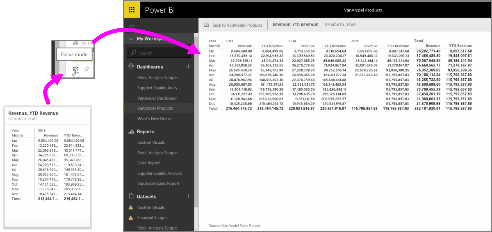

<properties
   pageTitle="顯示視覺效果和並排顯示全螢幕"
   description="取得選取的報表視覺效果和儀表板] 磚的大檢視"
   services="powerbi"
   documentationCenter=""
   authors="davidiseminger"
   manager="mblythe"
   backup=""
   editor=""
   tags=""
   qualityFocus="no"
   qualityDate=""
   featuredVideoId="LoApjhwTse0"
   featuredVideoThumb=""
   courseDuration="4m"/>

<tags
   ms.service="powerbi"
   ms.devlang="NA"
   ms.topic="get-started-article"
   ms.tgt_pltfrm="NA"
   ms.workload="powerbi"
   ms.date="10/12/2016"
   ms.author="davidi"/>

# 顯示視覺效果和磚全螢幕

當您想要在 Power BI 儀表板或在服務中的報表，有時候很有幫助將重點放在個別的圖表或視覺效果。 您可以在兩種不同方式來這麼做。

當您在儀表板時，上方磚以查看在右上角中的幾個不同的圖示選項。 當您選取省略符號 （三個點） 您看到圖示表示您可以在磚採取的動作的集合。

最左邊的圖示標記 **聚焦模式**。 選取該圖示以展開以包含完整儀表板空間磚。

            **焦點模式** 可讓您查看更多詳細資料視覺效果和圖例上。 比方說，當您調整 Power BI 中的並排顯示，某些資料行可能由於不會顯示方塊中的可用空間。

在 **聚焦模式**, ，您可以看到所有資料。 您也可以固定至不同的儀表板的視覺直接從聚焦模式選取 **Pin** 圖示。 若要結束 **聚焦模式**, ，請選取 **...回到** 左上角的圖示 **聚焦模式**。

檢視報表時，此處理序類似。 將滑鼠停留在視覺效果，請參閱右上角的三個圖示，然後選取 **聚焦模式** 圖示。 選取這個展開您要包含完整的報表畫布的視覺效果。 雖然您暫時失去任何視覺效果之間的交叉篩選效果，視覺效果是在此模式中，仍然可互動。

將滑鼠停駐並排展開或報表，然後選取 **回...** 左上角，若要返回上一個檢視中的左側插入號圖示。
