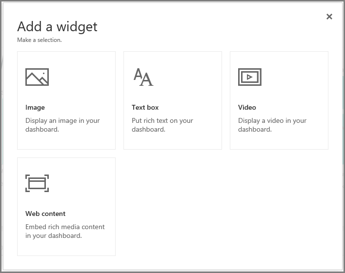
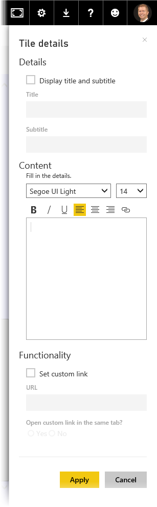

<properties
   pageTitle="編輯方塊詳細資料和新增 widget"
   description="變更標題和連結的行為，並新增 widget"
   services="powerbi"
   documentationCenter=""
   authors="davidiseminger"
   manager="mblythe"
   backup=""
   editor=""
   tags=""
   qualityFocus="no"
   qualityDate=""
   featuredVideoId="XhqVbHqd5jQ"
   featuredVideoThumb=""
   courseDuration="6m"/>

<tags
   ms.service="powerbi"
   ms.devlang="NA"
   ms.topic="get-started-article"
   ms.tgt_pltfrm="NA"
   ms.workload="powerbi"
   ms.date="09/29/2016"
   ms.author="davidi"/>

# 編輯方塊詳細資料

一旦建置儀表板，您可以編輯其 **磚* 在 Power BI 服務，讓設定格式化的幾個變更。

若要變更方塊，將滑鼠停留在該方塊並選擇省略符號 （三個點） 顯示的圖示，可讓您進行的變更集合磚。

選取 **畫筆** 圖示以開啟 **並排顯示詳細資料** 窗格。 從這裡您可以變更方塊的 **標題**, ，**副標題**, ，包括其上次重新整理時間和日期，以及其他詳細資料，例如建立自訂的連結。

根據預設，當您按一下儀表板] 磚上即會進入其產生的報表。 若要變更此行為，請使用 **組自訂連結** 欄位 **並排顯示詳細資料** 窗格。 按一下標誌影像時，才會組織首頁的使用者是一個受歡迎使用此功能。

## 將 Widget 加入儀表板

您也可以將 Widget 加入儀表板中。 A **widget** 為特殊的儀表板並排顯示，而不是包含視覺化效果，其中包含其他項目例如影像、 線上影片、 文字方塊中或豐富的 web 內容。

當您在右上角的 [儀表板中，選取新增 Widget 連結 **新增 widget** ] 對話方塊隨即出現。

當您新增的文字方塊，例如， **並排顯示詳細資料** 窗格會顯示在右側，您可以在此編輯詳細資料的類似功能時，使用編輯任一個磚的詳細資料。 但與 widget，還有定義或修改的 widget 內容，例如文字方塊 rich text editor 的區段。

Widget 和編輯方塊詳細資料的能力，您可以自訂儀表板，並讓它看起來只是您要如何為。
