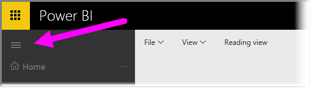

<properties
   pageTitle="取得更多的空間，您的儀表板上"
   description="若要更有效率地管理您的儀表板空間使用全螢幕模式"
   services="powerbi"
   documentationCenter=""
   authors="davidiseminger"
   manager="mblythe"
   backup=""
   editor=""
   tags=""
   qualityFocus="no"
   qualityDate=""
   featuredVideoId="c31gZkyvC54"
   featuredVideoThumb=""
   courseDuration="5m"/>

<tags
   ms.service="powerbi"
   ms.devlang="NA"
   ms.topic="get-started-article"
   ms.tgt_pltfrm="NA"
   ms.workload="powerbi"
   ms.date="09/29/2016"
   ms.author="davidi"/>

# 取得更多的空間，您的儀表板上

您可能會發現偶爾當您建立儀表板，您有更多的內容比哪些可以容納在畫布上。 有幾個解決方案，幫助您管理儀表板空間的顯示方式，所以您可以取得您的儀表板內容的完整檢視。

在一個畫面中顯示整個儀表板，最簡單方法選取 **全螢幕模式** 儀表板右上角的按鈕。

選取 **全螢幕模式** 按鈕讓您的瀏覽器進入全螢幕模式，移除所有 chrome 周圍項目從儀表板，並藉此增加可檢視的空間數量。

從 **全螢幕模式**, ，您可以選取 **全螢幕** 壓縮所有您磚，讓它們符合單一畫面，而不需要捲軸上的選項。 這通常稱為 *電視模式*, ，和簡報儀表板，或是在走廊監視器上顯示儀表板會很有用。

另一種方式管理儀表板空間隱藏在左手邊的頁面上，瀏覽窗格選取漢堡圖示。 若要展開瀏覽窗格，請再次按一下圖示。

您可以確保，儀表板永遠會摺疊的導覽列 URL 的結尾附加下列︰

>？ collapseNavigation = true

該連結的使用者將會摺疊的導覽列開啟儀表板。
