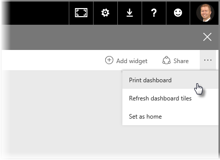
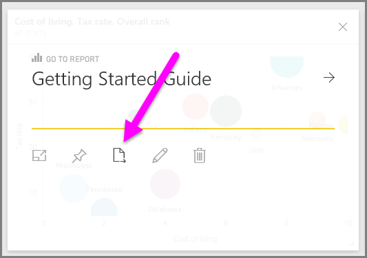

<properties
   pageTitle="列印和匯出儀表板和報表"
   description="取得您手上列印的報表和儀表板"
   services="powerbi"
   documentationCenter=""
   authors="davidiseminger"
   manager="mblythe"
   backup=""
   editor=""
   tags=""
   qualityFocus="no"
   qualityDate=""
   featuredVideoId="gauDt5ZV74I"
   featuredVideoThumb=""
   courseDuration="4m"/>

<tags
   ms.service="powerbi"
   ms.devlang="NA"
   ms.topic="get-started-article"
   ms.tgt_pltfrm="NA"
   ms.workload="powerbi"
   ms.date="09/29/2016"
   ms.author="davidi"/>

# 列印和匯出 Power BI 儀表板

有時候您可能想要列印的報表或儀表板帶入會議，因此您可以與其他人共用它。 透過 Power BI，有幾天，您可以讓列印成品的視覺效果。

在 Power BI 服務中，選取省略符號 （三個點） 右上角的服務，然後選取 **列印儀表板**。

A **列印** 對話方塊隨即出現，您可以在其中選取您要傳送的儀表板，以及標準列印選項這類的印表機 *直向* 或 *橫向* 方向。

## 從視覺效果匯出資料

您也可以從任何 visual Power BI 服務中匯出資料。 只要選取任何視覺、 上的省略符號，然後選取 **匯出資料** 按鈕 （中間按鈕）。 當您這樣做時，。建立 CSV 檔並將其下載到本機電腦，且訊息會出現您的瀏覽器 （如同任何其他瀏覽器起始下載） 可讓您知道下載已完成。

您也可以列印或直接從報表匯出。 當檢視報表，Power BI 服務中，選取 **檔案 > 列印** 若要開啟 [列印] 對話方塊。

就像使用儀表板中，您可以匯出視覺效果中的資料，藉由選取 [匯出] 按鈕，視覺效果。
