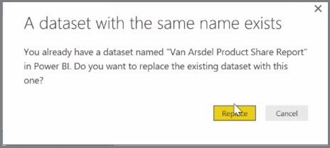

<properties
   pageTitle="手動重新發行和重新整理您的資料"
   description="手動更新您的資料集和報表"
   services="powerbi"
   documentationCenter=""
   authors="davidiseminger"
   manager="mblythe"
   backup=""
   editor=""
   tags=""
   qualityFocus="no"
   qualityDate=""
   featuredVideoId="O60a1Acdpkc"
   featuredVideoThumb=""
   courseDuration="5m"/>

<tags
   ms.service="powerbi"
   ms.devlang="NA"
   ms.topic="get-started-article"
   ms.tgt_pltfrm="NA"
   ms.workload="powerbi"
   ms.date="09/29/2016"
   ms.author="davidi"/>

# 手動重新發行和重新整理資料

您可以更新報表和資料集已經發佈從 Power BI Desktop Power BI 服務。 若要這樣做，請選取 **發行** 從 **首頁** 在功能區] 索引標籤。

當您發行的報表已經存在，在 Power BI 服務時，您會提示您確認您想要以編輯您剛剛選擇更新的版本來取代先前的資料集和報表。

當您選取 **取代**, ，資料集和報表中的 Power BI 服務都會與資料集和報表檔案的最新的 Power BI Desktop 版本中覆寫。

如同任何其他 **發行** 從 Power BI Desktop 事件，您會看到一個對話方塊，告訴您發佈事件成功，和您在 Power BI 服務取得報表的連結。

這是手動重新整理資料的方式。 您也會自動更新資料集和報表。其他學習主題涵蓋該程序。
